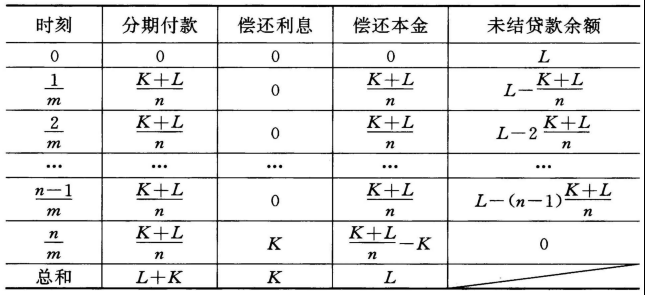
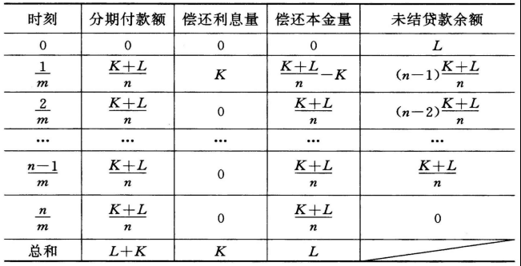
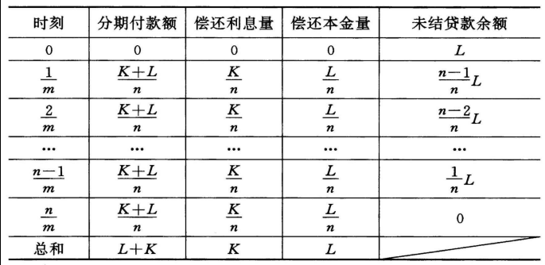
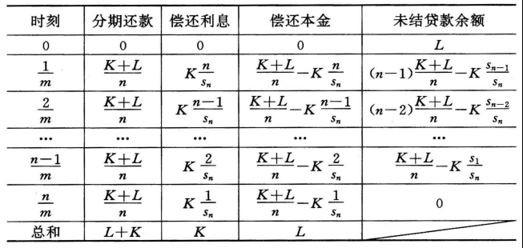

# 第六章 实际应用

## 6.1 抵押贷款分析

### 6.1.1 诚实贷款原则

引入下面的记号：

- $L$ 贷款金额；
- $K$ 融资费用；
- $R$ 每次分期付款金额；
- $m$ 每年的付款次数；
- $n$ 贷款期限内总的付款次数；
- $i$ APR；
- $j$ 每个付款周期的实际利率。

**结论 6.1** 在一般的贷款业务中，下列的关系式成立：
$$
R a_{\left.{\overline{\,n\,}}\!\right|j} = L \\
i = mj \\
K = nR - L 或 \frac{K + L}{n} a_{\left.{\overline{\,n\,}}\!\right|j} = L
$$

### 6.1.2 不动产抵押贷款

引入下面的记号：

- $Q$ 必须摊入APR中的贷款费用；
- $L^{*}$ 由诚实贷款法案确定的实际融资金额；
- $i'$ 市场贷款年利率（月换算名利率）；
- $j'$ 市场贷款月利率。

根据上述记号的定义，有：
$$
i' = 12j', L^{*} = L - Q
$$
每月应还金额为：
$$
R = \frac{1}{\ddot a_{\left.{\overline{\,n\,}}\!\right|ij'}} \qquad (6.1.1)
$$
融资费用为：
$$
K = nR - L^{*} \qquad (6.1.2)
$$
实际的月利率满足：
$$
R \ddot a_{\left.{\overline{\,n\,}}\!\right|j} = L^{*} \qquad (6.1.3)
$$
即：
$$
\frac{K + L^{*}}{n} \ddot a_{\left.{\overline{\,n\,}}\!\right|j} = L^{*} \qquad (6.1.4)
$$
根据上述公式得到，年百分率$i = 12j$大于市场贷款利率$i'$。

### 6.1.3 APR的近似计算

对于一般的贷款APR的精确方程为：
$$
\frac{K + L}{n} a_{\left.{\overline{\,n\,}}\!\right|j} = L \left( j = \frac{APR}{m} \right), \qquad (6.1.5)
$$
其中$L$表示实际融资金额，$K$表示融资费用，$n$表示总的付款次数，$m$表示每年的付款次数。

设每年分为$m$个时间段，APR用$i$表示，则每个时间段内的实际利率为$\frac{i}{m}$。用$B_{t/m}$表示在时刻$\frac{t}{m}$的未结贷款余额，于是有对融资费用（近似）的另外一种计算思路：
$$
\frac{i}{m} \sum B_{t/m} = K
$$
即融资费用$K$等于每个时间段内未结贷款余额的应计利息（依$i = APR$计算）之和。因此，APR可以表示为：
$$
i = \frac{mK}{\sum B_{t/m}} \qquad (6.1.6)
$$
从公式$(6.1.6)$出发得出四种近似计算APR的方法：

1. 最大收益法。这种方法的结果从数值上看比其他结果都大，记为$i^{max}$。它的基本思想是：每次的分期付款首先用于偿还本金，只有当本金全部还清后，再开始偿还利息。若假定融资费用小于每次的付款金额，即$K < \frac{K + L}{n}$，则这种方法的修正摊还表所示：

   

   根据上表可以得到未结贷款余额（表中的最后一列）的和为：
   $$
   \sum B_{t/m} = Ln - \left( \frac{K + L}{n} \right) \left[ \frac{n(n - 1)}{2} \right]
   $$
   所以，有：
   $$
   i^{min} = \frac{2mK}{L(n+1) + K(n-1)} \qquad (6.1.8)
   $$

2. 最小收益法。这种方法的结果从数值上看比其他结果都小，记为$i^{min}$。它的基本思想是：每次的分期付款首先用于偿还利息。只有当利息全部还清后，再开始偿还本金。若假定融资费用小于每次的付款金额，即$K < \frac{K + L}{n}$，则第一次的还款至少要等于全部利息，则这种方法的摊还表所示：

   

   根据上表可以得到未结贷款余额的和为：
   $$
   \sum B_{t/m} = \left( \frac{K + L}{n} \right)\left[ \frac{n(n + 1)}{2} \right] - K
   $$
   所以，有：
   $$
   i^{min} = \frac{2mK}{L(n+1)+K(n-1)}\qquad (6.1.8)
   $$

3. 固定比率法。这种方法的结果记为$i^{cr}$。它的基本思想是：每次付款中按一定比例偿还本金和利息。若假定偿还本金与利息之比为$L : K$，则可以得到这种方法的修正摊还表所示：

   

   可以得到未结贷款余额的和为：
   $$
   \sum B_{t/m} = L\left[ \frac{(n + 1)}{2} \right]
   $$
   所以，有：
   $$
   i^{cr} = \frac{2mK}{L(n + 1)} \qquad (6.1.9)
   $$

4. 直接比率法。这种方法的结果记为$i^{dr}$。它的摊还表中的本金量和利息量非常接近精算方法的结果，且利息量随着时间的推移而递减，本金量随着时间的推移而递增，则可以得到这种方法的修正摊还表所示：

   

   可以得到未结贷款余额的和为：
   $$
   \sum B_{t/m} = \left( \frac{K+L}{n} \right) \left[ \frac{n(n+1)}{2} \right] - K\frac{n(n+1)(n+2)}{6} \div \left[ \frac{n(n+1)}{2} \right]
   $$
   所以，有：
   $$
   i^{dr} = \frac{2mK}{L(n+1)+K\frac{n-1}{3}} \qquad (6.1.10)
   $$

### 6.1.4 抵押贷款债务的证券化

抵押贷款的基本原理：抵押按揭的贷款方（也可以是另外的发起人）将一定量的按揭合约汇集在一起，从资本市场（投资者）为这些债务合约进行融资，同时承诺按一定的方式回报投资者。

## 6.2 固定资产折旧分析

固定资产是指可供长期使用，并在其使用过程中保持原有物质形态的劳动资料和生产资料。

定义描述固定资产折旧的一些量：

- $n$ 计算期间的利息转换次数（常常就是固定资产的使用寿命）；
- $A$ 资产的起始价值（通常为最初的买价或称原始成本）；
- $S$ 资产在计算结束时的残值（S可以为负数或零）；
- $R$ 资产在扣除支出后的定期收益；
- $B_t$ 在$t(t = 0, 1, 2, \cdots, n)$时刻投资者账面上该资产的价值（简称账面价值）；
- $D_t$ 从$t-1$时刻到$t(t=1, 2, \cdots, n)$时刻的折旧费；
- $i$ 资产在每个利息换算期内的预期收益率。

这些变量之间有以下关系：
$$
\begin{align}
B_0 &= A, B_n = S \qquad &(6.2.1) \\
D_t &= B_{t-1} - B_t \ (t=1, 2, \cdots, n)\qquad &(6.2.2)\\
B_t &= A - \sum_{r=1}^t D_r \qquad &(6.2.3) \\
&= S + \sum_{r=t+1}^{n}D_r (t = 1, 2, \cdots, n - 1) \qquad &(6.2.4) \\
i &= \frac{R}{A} \qquad &(6.2.5) \\
\end{align} 
$$

四种常见的计算折旧费和账面价值的方法：

1. 偿债基金法

   将回报$R$分解为两个部分：

   - 原始资产价值$A$的自然增长（考虑通胀因素）部分，可以用$iA$表示；
   - 剩余部分，它的数值恰好可以用于建立累积金额为$A-S$的偿债基金，以补偿折旧造成的损失。

   如果偿债基金的利用率用$j$表示，则有：
   $$
   R = iA + \frac{A-S}{s_{\left.{\overline{\,n\,}}\!\right|j}} \qquad (6.2.6)
   $$
   即：
   $$
   A = \frac{Ra_{\left.{\overline{\,n\,}}\!\right|j} + Sv^n}{1 + (i - j)a_{\left.{\overline{\,n\,}}\!\right|j}},\ v=(1+j)^{-1} \qquad (6.2.7)
   $$
   如果$i = j$，则公式(6.2.7)变为：
   $$
   A = R a_{\left.{\overline{\,n\,}}\!\right|i} + Sv^n,\ v=(1+i)^{-1}
   $$
   若假设$A = P, R = Fr, S = C$，则上式与债券价格的基本计算公式相同。因此，在$t(t=1, 2, \cdots, n)$时刻的账面价值为：
   $$
   B_t = A - \frac{A - S}{s_{\left.{\overline{\,n\,}}\!\right|j}} s_{\left.{\overline{\,t\,}}\!\right|j} \qquad (6.2.8)
   $$
   或
   $$
   B_t = S + \frac{A - S}{a_{\left.{\overline{\,n\,}}\!\right|j}} a_{\left.{\overline{\,n-t\,}}\!\right|j}
   $$
   折旧费为：
   $$
   \begin{align}
   D_t &= \left( \frac{A-S}{s_{\left.{\overline{\,n\,}}\!\right|j}} \right)(s_{\left.{\overline{\,t\,}}\!\right|j} - s_{\left.{\overline{\,t-1\,}}\!\right|j}) \\
   &= \left( \frac{A-S}{s_{\left.{\overline{\,n\,}}\!\right|j}} \right)(1 + j)^{t-1} \qquad (6.2.9)
   \end{align}
   $$

2. 直线法

   直线法的出发点：将资产的全部贬值量$A-S$按时间平均得到每个时刻的折旧费。按这种方法有：
   $$
   D_t = \frac{A-S}{n}\ (t=1, 2, \cdots, n) \qquad &(6.2.10)\\
   B_t = \left( 1-\frac{t}{n} \right)A + \frac{t}{n}S\ (t=1, 2, \cdots, n) \qquad &(6.2.11) \\
   R = iA + \frac{A-S}{n} &(6.2.12)
   $$

3. 余额递减法

   余额递减法的出发点：每段时间的折旧费按当时的资产账面价值比例计算，其中比例系数（也称折旧因子，记为$d$）根据具体情况给出。按这种方法有：
   $$
   \begin{align}
   D_t = d \times B_{t-1}\ (t=1, 2, \cdots, n)\qquad &(6.2.13) \\
   B_t = (1-d)B_{t-1} = (1 - d)^tA\ (t=1, 2, \cdots, n)\qquad &(6.2.14)\\
   D_t = d(1-d)^{t-1}A\ (t=1, 2, \cdots, n)\qquad &(6.2.15)
   \end{align}
   $$
   在$S, A和n$已知的情况下，可取：
   $$
   d = 1 - \left(\frac{S}{A}\right)^{\frac{1}{n}}\qquad (6.2.16)
   $$
   这种方法的折旧费随着时间的推移而逐渐减少，它要求$S$为正数。常常将$d$取为$\frac{1}{n}$的倍数，即：
   $$
   d = \frac{k}{n}\qquad (k为常数)\qquad (6.2.17)
   $$

4. 年限总和折旧法

   年限总和折旧法是一种加速折旧的方法，在实际问题中常称之为加速折旧法。它是将固定资产的原始价值扣除残值后的余额，按逐年递减（折旧比例为固定资产的剩余使用年限与资产寿命年限总和之比）计算折旧费的方法。按这种方法有：
   $$
   D_t = \frac{n - t + 1}{s_n}(A - S)\ (t = 1, 2, \cdots, n), &(6.2.18) \\
   B_t = S + \frac{s_{n-t}}{s_n}(A - S)\ (t = 1, 2, \cdots, n) &(6.2.19)
   $$
   
5. 

## 6.3 资本化成本计算

对固定资产的投资成本有如下三项：

1. 买入固定资产的原始投资在每年的利息损失；
2. 折旧费用；
3. 保养费用。

定义变量：

- $H$ 每期的定期费用；

- $M$ 定期保养费用；

- $n$ 计算期间的利息转换次数（常常就是固定资产的使用寿命）；

- $A$ 资产的起始价值（通常为最初的买价或称原始成本）；

- $S$ 资产在计算结束时的残值（S可以为负数或零）；

- $i$ 资产在每个利息换算期内的预期收益率；

- $K$ 单位资产$H$永久运转下去（相当于永久年金）的现值；

则每期的费用由应计利息，折旧费用和保养费用构成（现金流组成），可表示为：
$$
H = Ai + \frac{A - S}{s_{\left.{\overline{\,n\,}}\!\right|j}} + M \qquad &(6.3.1) \\

K = H a_{\left.{\overline{\,\infty\,}}\!\right|i} = \frac{H}{i} = A + \frac{A-S}{i s_{\left.{\overline{\,n\,}}\!\right|j}} + \frac{M}{i} \qquad &(6.3.2)
$$

## 6.4 实例分析

### 6.4.1 其他投资产品的套期保值产品

买空：先买后卖；

卖空：先卖后买。

### 6.4.2 衍生金融产品

1. 远期合约

   在某个时刻$t$生效的一种合约，这种合约对未来某个时刻$T(T > t)$发生的交易进行规定，包括对交易货物本身和具体交易的细节的规定。

   远期价格与即期价格之间的持有成本关系式：
   $$
   F(t, T) = S_te^{(T-t)r}-D(t, T)\qquad (6.4.1)
   $$

2. 期货

   期货合约与远期合约类似，都是规定了未来发生的交易的价格。但是有以下不同：

   | 比较的内容 | 远期合约       | 期货合约 |
   | ---------- | -------------- | -------- |
   | 交易方式   | 代理人或经纪人 | 交易所   |
   | 流动性     | 低             | 高       |
   | 合约形式   | 专门定制的     | 标准的   |

### 6.4.3 其他实例

  
