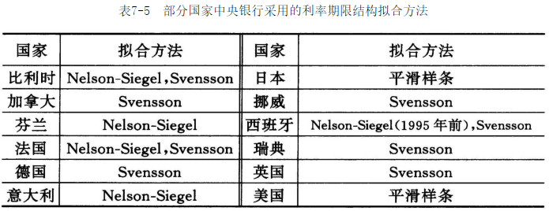

# 第七章 利率风险分析

## 7.1 利率风险的一般分析

利率水平从某种意义上讲是一种价格，应该由供求平衡来决定它的取值。如果借款的需求

很大，利率将上升；反之，如果这种需求不是很强，利率将下降。

影响利率水平的因素：

1. 内在纯利率。
2. 通货膨胀率。
3. 风险。
4. 投资期限。
5. 信息的容量。
6. 法律的约束。
7. 政府的政策。

在实际业务中表示利率变动的术语：

- 基点（简称bp）：计算利率变动的计量单位，100个基点表示1%。
- 利差：用于比较两种利率的差。

### 7.1.1 通货膨胀与利率

定义如下变量：

- $i'$ 扣除了通货膨胀影响后所得的利率（即实际利率）。
- $i$ 市场中的现行利率（即名义利率）。
- $r$ 通货膨胀率。

上述变量有以下关系：
$$
1 + i = (1 + i')(1 + r) \qquad &(7.1.1) \\
i = i' + r + i'r \qquad &(7.1.2) \\
i = i' + r \qquad &(7.1.3) \\
i' = \frac{1-r}{1+r} 或 1+i' = \frac{1+i}{1+r} \qquad &(7.1.4)
$$
考虑到通货膨胀，关于价值计算会有一些变化。下面具体分析：

1. 现值计算
   $$
   R[(1+r)v + (1+r)^2v^2 + \cdots + (1+r)^nv^n] = R(1+r)\frac{1-\left( \frac{1+r}{1+i} \right)^n}{i-r} \qquad (7.1.5) \\
   
   R[(1+i')^{-1} + (1+i')^{-2} + \cdots + (1+i')^{-n}] = R a_{\left.{\overline{\,n\,}}\!\right|i'} \qquad (7.1.6)
   $$

2. 终值计算

   假设某投资者以利率$i$投资$A$，投资时间共$n$期，理论上到期收益为$A(1+i)^n$；考虑到通货膨胀的因素，到期实际收益为$A \frac{(1+i)^n}{(1+r)^n} = A(1+i')$。

### 7.1.2 风险与利率

影响投资市场价值的主要风险：

1. 市场风险：指金融市场的变化（表现为不同的到期收益率）引起现金流价值的变化；
2. 信用风险：金融产品本身的风险行为。

**定义 7.1** 除违约风险外其他条件不变时，某资产的风险收益率与无违约风险的收益率的差，被称为风险报酬或风险溢价。

考虑如下情形：在$1, 2, \cdots, n$时刻的预计收益现金流分别为$R_1, R_2, \cdots, R_n$；实际（随机）现金流分别为$X_1, X_2, \cdots, X_n$；能够正常得到这些收益的概率（且相互独立）分别为$p_1, p_2, \cdots, p_n$，其中$p_n$表示可以得到收益$R_t$的可能性，用概率论的语言可表示为：
$$
p_t = Pr(X_t = R_t) = 1-Pr(X_t = 0),\ t=1, 2, \cdots, n
$$
如果市场的无风险利率为$i$，那么这组收益现值的数学期望为：
$$
EPV = \sum_{t=1}^{n}R_t(1+i)^{-t}p_t \qquad (7.1.7)
$$
这时候，对应的风险投资收益率$i_p$为满足下面的方程的解：
$$
\sum_{t=1}^{n}R_t(1+i)^{-t}P_t = \sum_{t=1}^{n}R_t(1+i_p)^{-t}
$$
显然有$i_p > i$。

**结论 7.1** 如果概率$p_t = p^t(t = 1, 2, \cdots, n)$，则有公式（7.1.7）的特殊表达：
$$
EPV = \sum_{t=1}^{n}R_t \left( \frac{p}{1+i} \right)^t = \sum_{t=1}^{n}R_t(v_{p,i})^t
$$
其中$v_{p,i} = \frac{p}{(1+i)} < v = \frac{1}{(1+i)}$，为某种修正后的新的贴现因子。

**结论 7.2** 在结论7.1的条件下，对应的风险溢价为：
$$
\frac{1-p}{p}(1+i)
$$
当给定风险溢价水平，可以反解出单位时间的风险不发生概率：
$$
p = \frac{1+i}{风险溢价 + (1+i)}
$$

## 7.2 利率期限结构

### 7.2.1 利率期限结构的定义

**定义 7.2** 因投资期限的不同而形成的投资到期收益率的变化结构被称为利率的期限结构。

**定义 7.3** 在当前时刻的（利率表）收益率曲线上给出的利率称为即期利率，与之对应的是所谓的远期利率，它表示在未来某个时刻的利率曲线上给出的利率。

利率的期限结构：

1. 在固定时点的利率模型。
2. 利率的整体期限结构。
3. 即期利率与远期利率

在以贴现现金流方法计算IRR时，如果用即期利率进行计算，那么净现值公式为：
$$
NPV = \sum_{t=1}^{n}R_t(1+i_t)^{-t} \qquad (7.2.1)
$$
其中$i_t$表示期限为$t$的即期利率。

### 7.2.2 期限结构的理论

1. 理性预期理论

   理性预期理论认为利率的期限结构反映了市场对未来利率走势的看法。该理论的一般形式为：长期债券的平均年收益率$y$是远期利率$f_t$的几何平均。实际上，因为收益率$y$与远期利率$f_t$满足：
   $$
   \begin{align}
   (1+y)^n &= (1+f_1)(1+f_2) \cdots (1+f_n) \\
   &= \prod_{t=1}^{n}(1+f_t) \qquad (7.2.2)
   \end{align}
   $$
   所以有：
   $$
   y = \sqrt[n]{\prod_{t=1}^{n}(1 + f_t)} - 1
   $$
   如果用$S_n(S_0 = 1)$表示$n$期单位零息票债券的到期总收益，则远期利率可以表示为：
   $$
   f_t = \frac{S_t}{S_{t-1}} - 1, t = 1, 2, \cdots, n \qquad (7.2.3)
   $$

2. 流动性偏好理论

   流动性偏好理论认为长期利率是预期短期利率与对流动性的补偿之和。所谓的流动性补偿是指：大多数投资者偏好持有短期债券，为了吸引投资者持有期限较长的债券，必须给他们一定的补偿。

3. 通货膨胀风险报酬理论

   通货膨胀风险报酬理论认为一般情况下投资者对未来的通胀情况下的不确定性会有所担忧，需要更高的长期利率来弥补这种风险。

### 7.2.3 期限结构的模型

基准收益率曲线用来反映市场上的利率期限结构信息，构造该曲线模型需要满足以下5点要求：

1. 曲线处处连续光滑；
2. 能够由该曲线方便地计算出任一时刻的贴现函数；
3. 模型能够适应不同形状的曲线模式；
4. 不要过分依赖数据；
5. 具有一定的稳定性。

用市场上交易的带系债券的价格估计出市场上的收益率曲线的框架为：

1. 首先假设收益率曲线具有某个特定的函数形式（通常是一种参数模型）；
2. 如果将带息债券未来不同时刻的利息和本金看作在不同时刻到期的一系列零息债券，那么该带息债券的价格就应当是这些零息债券在收益率曲线基础上的贴现价格之和；
3. 模型参数的估计原则是，使得以估计的收益率曲线为基础所计算得到的债券价格与市场交易价格误差的平方和最小。

考虑完全连续的情形，记当前时刻为0时刻，并用$f(t)$表示$t$时刻的远期利率，那么$t$时刻的即期利率为：
$$
r(t) = \frac{1}{t} \int_{0}^{t} f(s) ds
$$
于是，面值为1，在$s$时刻到期的零息债券的当前价格应为：
$$
P(t) = e^{-\int_{0}^{t}f(s)ds} = e^{-tr(t)}
$$
设市场上目前有$N$个债券，其中第$i$个债券的未来$n_i$期现金流和对应的现金流所发生的时刻分别为$(C_1^i, C_2^i, \cdots, C_{n_i}^{i})$和$(t_1^i, t_2^i, \cdots, t_{n_i}^{i})(i = 1, 2, \cdots, N)$，则债券的当前价格为：
$$
P^i = \sum_{j=1}^{n_i}C_j^i exp\{-\int_{0}^{t_j^i}f(s)ds\}\qquad (i=1, 2, \cdots, N)
$$
为了找到债券市场的收益率曲线，我们需要估计$f(t)$。考虑这样的模型：
$$
P^i = \hat{P}^i + \epsilon_{i} = \sum_{j=1}^{n_i}C_j^i exp\{-\int_{0}^{t_j^i}\hat{f}(s)ds\} + \epsilon_{i} \qquad (i=1, 2, \cdots, N)
$$
其中残差项$e_i \sim N(0, \delta^2)(i = 1, 2, \cdots, N)$，且相互独立；$\hat {f}(t)$是$f(t)$的最优估计，通常采用极小化残差项平方和来得到，即通过$min\{\sum_{i=1}^N \epsilon_{i}^{2}\}$来得到收益率曲线的估计。

由于剩余期限长的债券价格比剩余期限短的债券价格有着更高的波动率（这也被称为波动率的期限结构），我们可以进一步将公式（7.2.4）的残差项满足的条件修改为异方差假设：
$$
E(\epsilon_{i}^{2}) = \delta^{2} \left( \frac{\partial P^i}{\partial y} \right)^2 \qquad (i = 1, 2, \cdots, N)
$$
其中$y$为债券的内部收益率。

$\hat{f}(t)$函数形式的选取基本上都是参数模型，目前国际上使用比较广泛的选取方法有如下几种：

1. 逐段拼接的样条函数法

   逐段拼接的样条函数法所要估计的收益率曲线的时间$[0, T]$分为$k$段，在每一个区间$[t_{j-1}, t_j](0 < t_1 < t_2 < \cdots < t_{k-1} < T)$内假设函数的形式，然后再将这些分段函数逐段拼接起来，并且在节点处保证连续性和光滑性甚至进一步平滑。

2. N-S法

   该方法假设远期利率具有如下函数形式：
   $$
   f(t) = \beta_0 + \beta_1 exp(-\frac{t}{\tau}) + \beta_2 \times \frac{t}{\tau}exp(-\frac{t}{\tau})
   $$
   按N-S法有：
   $$
   \begin{align}
   r(t) &= \frac{1}{t}\int_{0}^{t}f(s)ds \\
   &= \beta_0 + (\beta_1 + \beta_2) \frac{[1 - exp(-\frac{t}{\tau})]}{\frac{t}{\tau}} - \beta_2 exp(-\frac{t}{\tau})
   \end{align}
   $$
   N-S使用较少的参数（只有四个：$\beta_0, \beta_1, \beta_2, r$），但能够适应绝大部分收益率曲线的形态。而且N-S法很简洁地用下面三个“因素”构建出了收益率曲线的基本形态：

   1. $\beta_0$项代表了远期利率曲线的总体水平；
   2. $\beta_1 exp(-\frac{t}{\tau})$代表了远期利率曲线倾斜的程度；
   3. $\beta_2 \times \frac{t}{\tau} exp(-\frac{t}{\tau})$代表了远期利率曲线扭曲的程度。

   在实际使用中，N-S模型非常灵活，对于数据拟合情况较好，但如果在样本较少的情形下，仍然会出现过度拟合数据的现象。

3. Svensson法

   Svensson在1994年对N-S法进行了推广，使其能更好地适应更加复杂的收益率曲线的形状。推广后的N-S法即Svensson法，假设远期利率具有如下的函数形式：
   $$
   \begin{align}
   f(t) &= \beta_0 + \beta_1 exp(-\frac{t}{\tau_1}) + \beta_2 \times \frac{t}{\tau_1}exp(-\frac{t}{\tau_{1}}) + \beta_3 \times \frac{t}{\tau_2} exp(-\frac{t}{\tau_2})\\
   \end{align}
   $$
   Svensson模型比N-S模型多了两个参数，也就是增加了一项用来刻画收益率曲线扭曲的情形，所以该模型具有更好的灵活性。

   

### 7.2.4 利率风险的度量

利率风险一般指因市场利率变化而产生损失的可能性，具体分为：

- 因利率上升而产生的资产贬值风险；
- 因利率下降而产生的再投资风险。

使用以下变量表示现金流的时间变化性质：

1. 等价时间

   等价时间法的基本思想是：将现金流的发生时刻以流量为权重进行加权平均，得到一个等价时间$t$。设$R_1, R_2, \cdots, R_n$分别为$1, 2, \cdots, n$时刻的一组同方向的现金流，则这一组现金流的等价时间为：
   $$
   \overline {t} = \frac{\sum_{t=1}^{n}tR_t}{\sum_{t=1}^{n}R_t} \qquad (7.2.5)
   $$
   从上述公式看：$t$既是对时间的一种加权平均（权重为每个时刻的现金流金额），也是对投资期限的一种刻画，它必然小于最后一次现金流发生的期限，而且现金流越大的时刻对这个等价时间的贡献越大。

2. 久期

   久期的基本思想是以投资期限的某种加权平均来刻画投资的内在时间长短。有各种关于久期的定义，最常见的是Macaulay久期，记作$\overline{d}$，且定义：
   $$
   \overline{d} = \frac{\sum_{t=1}^{n}tR_t v^t}{\sum_{t=1}^{n}R_t v^t},\ v=(1+i)^{-1} \qquad (7.2.6)
   $$
   显然$\overline{d}$是实利率$i$的函数，故也通常用符号$\overline{d}(i)$来表示久期。而且，基于投资期限越短，利率风险越小的基本理念，$\overline{d}(i)$越小说明对利率风险越不敏感。

3. 净现值波动率

   引入净现值波动率用于观察利率变化对净现值的影响。用$\overline{v}$表示净现值波动率，得到：
   $$
   \overline{v} = -\frac{P'(i)}{P(i)} \qquad (7.2.9)
   $$
   因为$P'(i)$是对利率变化造成的净现值变化的度量，而$\frac{P'(i)}{P(i)}$将这个度量相对化和单位化。所以，$\overline{v}$类似于连续贴现力的概念，是对累积值的变化的一种相对度量。通过公式推导，得出：
   $$
   \overline{v} = \frac{\overline{d}}{1+i} \qquad (7.2.10)
   $$

**结论 7.3** (1) 若$i = 0$，则有$\overline{d}(i) = \overline{t}$，即$\overline{d}(i)$退化为等价时间；(2)如果$R_k = 0 (0 < k N), R_n \neq 0$，即现金流只有一次发生，则$\overline{d}(i)$退化为$n$，一般有$0 < \overline{d}(i) \leqslant n$。

**结论 7.4** $\overline{d}(i)$是$i$的递减函数，并且：
$$
\frac{d\overline{d}}{di} = -v\delta_{i}^{2}
$$
其中：
$$
\delta_{i}^2 = \frac{\sum_{t=1}^{n}t^2R_t v^t}{\sum_{t=1}^{n}R_t v^t} - [\overline{d}(i)]^2
$$
**结论 7.5** 关于各种典型的金融产品（现金流模式）的久期有如下结论：

（1）对于零息票债券，有：$\overline{d}(i) = n$；

（2）对于息票债券，有：$\overline{d}(i) = n \left[ 1+\frac{\frac{\ddot a_{\left.{\overline{\,n\,}}\!\right|i}}{n}-1}{1+(g-i)a_{\left.{\overline{\,n\,}}\!\right|i}}\frac{g}{i} \right]$；

（3）对于固定年金，有：$\overline{d}(i) = \frac{(Ia){\left.{\overline{\,n\,}}\!\right|i}}{{\left.{\overline{\,n\,}}\!\right|i}}$；

（4）对于永久年金，有：$\overline{d}(i) = \frac{(Ia){\left.{\overline{\,\infty\,}}\!\right|i}}{a_{\left.{\overline{\,\infty\,}}\!\right|i}} = \frac{1}{d} = 1 + \frac{1}{i} > 1$。

**结论 7.6** 对于债券方式和年金方式现金流的$i_0$有如下结论：

（1）对于年金现金流模式，利率风险最小的收益率水平为：$i_0 = \frac{6}{n - 1}$；

（2）对于息票债券现金流模式，利率风险最小的收益率水平为：$i_0 = \frac{6n(n-1)g^2+6(3n+1)g+12}{g(n-1)[n(n+1)g+2(2n-1)]}$。

债券久期的近似计算公式为：
$$
债券久期 = \frac{P_{-} - P_{+}}{2P_{0}*(\Delta i)} \qquad (7.2.11)
$$
其中$\Delta i$表示收益率的变化量（非负），$P_0$表示初始收益率$i$计算的价格，$P_{+}表示收益率增加$$\Delta i$后的价格，$P_{-}$表示收益率减少$\Delta i$后的价格，上述公式可以近似表示为：
$$
P'(i) \approx \frac{P(i + \Delta i) - P(i - \Delta i)}{2 \Delta i} \\
债券久期 \approx -\frac{P'(i)}{P_0}
$$
如果不考虑价格上升和下降两个方向的区别，即不区分$\frac{P_{-} - P_{0}}{P_0}$与$\frac{P_0 - P_{+}}{P_0}$的差别，则有：
$$
价格变化百分比 = \frac{1}{2}(\frac{P_{-} - P_{0}}{P_{0}} + \frac{P_0 - P_{+}}{P_0}) = -有效久期 \times \Delta i
$$

## 7.3 资产负债管理

用现金流$A_1, A_2, \cdots, A_n$分别表示$1, 2, \cdots, n$ 时刻发生的资产流，用现金流$L_1, L_2, \cdots, L_n$分别表示$1, 2, \cdots, n$时刻发生的负债流；关于如何在这两组现金流之间达到均衡，或者保持余额（资产与负债的差）在安全的范围内，有两种方法：

- 免疫技术；
- 资产负债匹配。

### 7.3.1 免疫技术

通过对资产和负债的调整，使得无论市场利率在某个收益率附近如何波动（上升或下降），最终的总体盈余（资产与负债的差）都不会下降。

用$R_t(t = 1, 2, \cdots, n)$表示$t$时刻的净收入，则：
$$
R_t = A_t - L_t,\ t = 1, 2, \cdots, n
$$
记$i_0$为方程：
$$
P(i) = \sum_{t=1}^{n}R_t v^t = 0
$$
的解，即$i_0$也就是一般常说的预期收益率。当实际收益率$i$在$i_0$附近波动时，即当$i = i_0 + \epsilon$（其中$\epsilon$为绝对值充分小的实数）时，利用Taylor展开，有：
$$
P(i_0 + \epsilon) = P(i_0) + \epsilon P'(i_0) + \frac{\epsilon ^ 2}{2}P''(i_{0} + \xi),\ 0 < |\xi| < |\epsilon| \qquad (7.3.1)
$$
由上述公式可知，如果$i_0$满足$P'(i_0) = 0, P''(i_0) \geqslant 0$，则$i_0$为$P(i)$的局部最小值点，即$\exists \epsilon > 0$，使得对所有$|i - i_0| < \epsilon$有$P(i) \geqslant P(i_0)$。因此，当利率$i$在$i_0$附近波动时，净收入的现值永远不会低于零，也就达到了免疫技术的目的。通常也称$i_0$满足的两个条件$P'(i_0) = 0$和$P''(i_0) \geqslant 0$为免疫条件。

如果定义任意现金流净现值的二阶导数（标准化之后）为凸值，记作$\overline{c}$，即：
$$
\overline = \frac{P''(i)}{P(i)} \qquad (7.3.2)
$$
则关于净现金流的两个免疫条件可以表述如下：

1. 净收入在$i_0$的修正久期为0；
2. 净收入在$i_0$的凸值非负。

免疫技术的基本法则为，适当调整资产结构，使得：

（1）资产收益现金流的净现值不小于负债流出现金流的净现值；

（2）资产的修正投资久期与负债的修正投资久期相等；

（3）在资产收益现金流的净现值等于负债流出现金流的净现值的条件下，资产的凸值应该大于负债的凸值。

以上法则用公式描述为：
$$
P(i) = PVA(i) - PVL(i) \\
P'(i) = PVA'(i) -PVL'(i) \\
P''(i) = PVA''(i) - PVL''(i)
$$
其中$PVA(I)$和$PVL(i)$分别表示资产流和负债流的现值。

### 7.3.2 资产负债匹配

在给定负债结构的前提下，找到一种资产的配置使得利率波动风险对资产匹配负债的影响尽可能的小，以下为两种常用的确定资产负债匹配的方法：

1. 绝对匹配法

   基本思想：构造一种资产组合使其收入的现金流在每个时期均与负债的现金流相匹配。

2. Tilley法

   基本思想：找到可行的组合策略（各种资产类的投资比例），使得在任何已知的利率变化模式下，都可以保证最终资产与负债的差非负。

   Tilley法成立需要以下前提条件：

   - 负债在各个年度的基本现金流模式；
   - 利率在投资期间的变化模式，包括新利率的情况；
   - 可选的资产类，以及各个资产类在未来的利息收入和本金收回模式；
   - 再投资或对已收回资产的投资再随后年份的可能模式。

 
