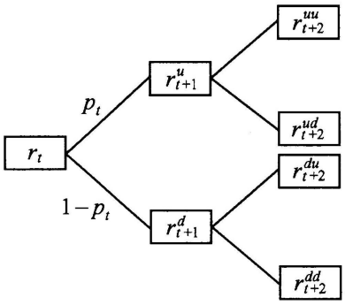

# 第八章 随机模型

## 8.1 随机利率基本模型

将利率看作一个随机变量，对这种情况的处理有如下方法：

1. 不同期限的即期利率均用同意给年利率随机变量$i$表示，相当于将不同投资期限的不确定年利率用一个平均的相同的随机变量代表。
2. 年利率与时间有关（类似于即期利率），但是不同时刻的利率互相独立，这是常用$i_t$表示从$t-1$时刻到$t(t=1, 2, \cdots, n)$时刻的实利率。
3. 不同时刻的利率互相不独立，或者称他们是相互以来的，这时一般采用时间序列模型。
4. 连续利息力$\{\delta_{t}; t\geqslant 0\}$为随机过程。

### 8.1.1 随机利率无期限结构的情形

用$i$表示年实利率，如果纪$r$满足：
$$
E \left( \frac{1}{1+i} \right) = \frac{1}{1+r}
$$
由概率论中的Jesen不等式知道：
$$
r \leqslant E(i)
$$

### 8.1.2 独立条件下的随机利率

假设$\{i_t; t = 1, 2, \cdots, n\}$是独立同分布的随机变量序列，且记$E(i_t) = i$。分别对零息债券和年金讨论再这种利率假设下的现值和终值计算：

1. n年期零息债券的计算

   - 终值的计算

     考虑当前价格为1个货币单位的零息票债券的终值
     $$
     a(n) = \prod_{t=1}^{n}(1 + i_t) \qquad (8.1.1)
     $$
     $a(n)$为随机变量，由独立性假设，有：
     $$
     \begin{align}
     E[a(n)] &= \prod_{t=1}^{n}E[(1+i_t)] = (1 + i)^n \qquad &(8.1.2) \\
     D[a(n)] &= (1 + 2i + i^2 + s^2)^n - (1 + i)^{2n} \\
     &= (1 + j)^n - (1 + i)^{2n} \qquad &(8.1.3)
     \end{align}
     $$
     其中$s^2 = D(i_t), j = 2i + i^2 + s^2$。

   - 现值的计算

     在一般情况下，有：
     $$
     E\left( \frac{1}{1 + i_t} \right) \neq \frac{1}{1+E(i_t)}
     $$
     定义$r$为满足以下条件的实数（由$i_t$的同分布性可以保证$r$与$t$无关）：
     $$
     E\left( \frac{1}{1 + i_t} \right) = \frac{1}{1 + r} \qquad (8.1.4)
     $$
     显然有$E(i_t) = i \neq r$。
     
     同样考虑当前价格为1个货币单位的零息票债券的现值：
     $$
     a^{-1}(n) = \left[ \prod_{t=1}^{n}(1 + i_t) \right]^{-1} \qquad (8.1.5)
     $$
     由前面的独立性假设和公式（8.1.4）的定义，有：
     $$
     \begin{align}
     E[a^{-1}(n)] &= (1 + r)^{-n} \qquad &(8.1.6) \\
     D[a^{-1}(n)] &= E\{[a^{-1}(n)]^2\} - (1+r)^{-2n} \\
     &= (1+k)^{-n} - (1 + r)^{-2n} \qquad &(8.1.7) \\
     \end{align}
     $$
     其中：
     $$
     (1+k)^{-1} = E[(1+i_t)^{-2}] \qquad (8.1.8)
     $$

2. n期年金的计算

   - 标准期初年金终值的计算

     $t(0 \leqslant t < n)$时刻的1个货币单位在$n$时刻的终值为$\prod_{s=t+1}^{n}(1+i_s)$，所以标准期初年金的终值为：
     $$
     \ddot s_{\left.{\overline{\,n\,}}\!\right|} = \sum_{t=1}^{n} \prod_{s=1}^{t}(1+i_s)^{-1} \qquad (8.1.13)
     $$
     进而有如下的数学期望和方差：
     $$
     E(a_{\left.{\overline{\,n\,}}\!\right|}) = a_{\left.{\overline{\,n\,}}\!\right|i} \qquad (8.1.14) \\
     
     D(a_{\left.{\overline{\,n\,}}\!\right|}) = \frac{m_2^a + m_1^a}{m_2^a - m_1^a} a_{\left.{\overline{\,n\,}}\!\right|j} - \frac{2m_2^a}{m_2^a - m_1^a} a_{\left.{\overline{\,n\,}}\!\right|i} - (a_{\left.{\overline{\,n\,}}\!\right|i})^2 \qquad (8.1.15)
     $$
     其中：
     $$
     \begin{cases}
     m_1^a = E[(1+i_t)^{-1}] = (1+i)^{-1} \\
     m_2^a = E[(1+i_t)^{-2}] = (1+k)^{-1}
     \end{cases}
     \qquad (8.1.16)
     $$

### 8.1.3 不独立的远期利率模型

几种时间序列模型：

1. 一阶差分模型

   设$i$为某种长期利率水平，则随机利率的一阶差分方程可表示为：
   $$
   i_t - i = k(i_{t-1} - i)\ (t=1, 2, \cdots)\qquad (8.1.17)
   $$
   其中$k(0 \leqslant k \leqslant 1)$表示各年的短期利率与长期利率偏差的变动比例。

2. 一阶自回归模型

   若用$\delta_{t} = ln(1+i_t)(t = 1, 2, \cdots)$表示第$t$年的利息力水平，并且满足：
   $$
   E(\delta_{t}) = \delta\ (t = 1, 2, \cdots) \qquad (8.1.18)
   $$
   （其中$\delta$为常数，称为长期平均的利息力），则随机利息力$\delta_{t}$的一阶自回归模型（简称AR(1)模型）为：
   $$
   \delta_{t} - \delta = k(\delta_{t-1} - \delta) + e(t)\ (t=1, 2, \cdots) \qquad (8.1.19)
   $$
   其中$e(t)(t = 1, 2, \cdots)$是独立同分布的随机变量序列，共同分布为$N(0, \sigma^2)$；$k$表示利息力的自相关水平。

   在$|k| < 1$的条件下，$\delta_{t}$的方差为：
   $$
   D(\delta_{t}) = \frac{\delta^{2}}{1 - k^2} \qquad (8.1.20)
   $$
   $\delta_{s}$和$\delta_{t}$的协方差为：
   $$
   Cov(\delta_{s}, \delta_{t}) = k^{t-s} \frac{\delta^{2}}{1 - k^2}\ (s < t) \qquad (8.1.21)
   $$

3. 二阶自回归模型

   这里假设当前的利息水平与前两年的利息水平都有关系，随机利息力$\delta_{t}$的二阶自回归模型（简称AR（2）模型）为：
   $$
   \delta_{t} - \delta = k_1(\delta_{t-1} - \delta) + k_2(\delta_{t-2} - \delta) + e(t),\ t = 1, 2, \cdots \qquad (8.1.22)
   $$
   其中$e(t)(t = 1, 2, \cdots)$是独立同分布的随机变量序列，共同分布为$N(0, \delta^{2})$；$k_1$和$k_2$分别表示一阶和二阶自相关水平。

   如果$k_1$和$k_2$满足条件：
   $$
   k_1 + k_2 < 1,\ k_2 - k_1 < 1,\ -1 < k_2 < 1
   $$
   则有$\delta_{t}$的方差为：
   $$
   D(\delta_t) = \frac{1-k_2}{1+k_2} \cdot \frac{\delta^{2}}{(1-k_2)^2 - k_1^{2}} \qquad (8.1.23)
   $$
   $\delta_{s}$和$\delta_t$的协方差为：
   $$
   Cov(\delta_{s}, \delta_{t}) = Var(\delta_{t})[\tau g_1^{t-s} + (1-\tau)g_2^{t-s}]\ (s < t) \qquad (8.1.24)
   $$
   其中：
   $$
   \tau = \frac{g_1(1 - g_2^2)}{(g_1 - g_2)(1+g_1g_2)},\qquad 1-k_1g_i - k_2g_i^2 = 0\qquad (i = 1, 2)
   $$

### 8.1.4 离散时间单因子利率模型

离散时间单因子利率模型中最典型的是所谓的二叉树模型。在这个模型假定下，下一个时间区间的短期利率是以当前的短期利率为基础，并且只有上升或下跌两种情形，如图所示：

$p_t$表示利率上升的概率，$r_t$表示当前的短期利率，$r_{t+1}^{u}$表示下一年下降后的短期利率，$r_{t+2}^{uu}$表示连续两年上升后的短期利率，$r_{t+2}^{ud}$表示下一年上升再下一年下降后的短期利率，$r_{t+2}^{du}$表示下一年下降再下一年上升后的短期利率，$r_{t+2}^{dd}$表示连续两年下降后的短期利率。

二叉树模型中最具代表性的是Ho-lee模型，这种模型对上述分叉模型又有进一步的简化：
$$
r_{t+1}^{u} = r_t(1+\gamma),\qquad r_{t+1}^{d} = r_t(1+\gamma)^{-1},\qquad P_t = p
$$
其中$\gamma (0 < \gamma < 1)$表示利率上升的比例，因此：
$$
r_{t+2}^{uu} = r_t(1 + \gamma)^2,\qquad r_{t+2}^{ud} = r_{t+2}^{du} = r_t,\qquad r_{t+2}^{dd} = r_t(1 + \gamma)^{-2}
$$
Ho-lee模型对于利率衍生产品的定价非常有意义。

### 8.1.5 连续时间单因子利率模型

连续时间单因子利率模型是描述连续利息力随时间变化的随机模型，其基本思想是：利率的变化由两个部分组成：

- 利率随时间推移在整体水平上的变化，这一部分的时间性很强；
- 因随机误差的干扰而造成的利率的随机变化，这一部分对模型本身的依赖性强。

最简单的连续单因子利率模型：
$$
dr(t) = k(\theta - r(t))dt + \sigma \sqrt{r(t)}dZ_1(t),\qquad t \geqslant 0, \qquad (8.1.25)
$$
其中$\theta > 0$，表示利率波动的长期中心位置和平衡点，$k$则表示利率与中心位置的偏离程度，$\sigma^{2}$表示将利率方差用利率水平标准化后得到的利率随机误差水平，$Z_1(t)$是Wiener过程或称布朗运动过程。

由公式（8.1.25）可得：已知时刻$t$的利率水平$r(t)$，则时刻$s(s > t)$的利率水平$r(s)$的预测值（数学期望）为：
$$
r(t)e^{-k(s-t)} + \theta[1 - e^{-k(s-t)}] \qquad (8.1.26)
$$
即$r(s)$的预测值是对当前利率与平均利率水平的加权平均；时刻$s$的利率水平$r(s)$的方差为：
$$
r(t)\frac{\sigma^2}{k}[1-e^{-k(s-t)}] \qquad (8.1.26)
$$
即$r(s)$的预测值是对当前利率与平均利率水平的加权平均；时刻$s$的利率水平$r(s)$的方差为：
$$
r(t)\frac{\sigma^2}{k}[e^{-k(s-t)} - e^{-2k(s-t)}] + \theta\frac{\sigma^2}{2k}[1 - e^{-k(s-t)}]^2  \qquad (8.1.27)
$$
更一般的连续时间单因子利率模型是所谓的HJM模型：
$$
df(t, T) = \alpha(t, T)dt + \sigma(t, T)dZ_d(t),\ t \geqslant 0 \qquad (8.1.28)
$$
其中$f(t, T)$表示$t(t<T)$时刻的未来T-t时期的连续远期利率$a(t, T)$和$\sigma (t, T)$分别是取值实数和d维实值空间的随机过程，$Z_d(t)$表示d维标准布朗运动过程。

模型（8.1.28）的一般解为：
$$
f(t, T) = f(0, T) + \int_{0}^{t}\alpha(u, T)du + \int_{0}^{t}\sigma(u, T)dZ_d(u),\ t \in [0, T]
$$

## 8.2 资本资产定价模型

资本资产定价模型（CAP）用于反映金融资产的收益与风险关系，其基本思想是：市场中每种证券的期望收益率等于无风险利率再加上市场投资组合的期望收益率超过无风险利率部分的一定比例。其主要作用是：

1. 对可能的市场投资机会估算可接受的回报率（价格）；
2. 对未上市交易的资产进行风险评估。

CAPM是对一组风险资产的均衡预期回报率给出的预测，其背景如下：

（1）设有由可交易资产构成的市场资产组合，这个组合的回报率为$r_p$；

（2）第$k$种资产的收益率为$r_k$；

（3）无风险利率为$r_f$。

CAPM的具体公式为：
$$
E(r_k) = r_f + \beta_k[E(r_p) - r_f] \qquad (8.2.1)
$$
其中$\beta_{k} = \frac{Cov(r_k, r_p)}{D(r_p)}$（称为第$k$种资产的系统风险程度系数，简称为$\beta$系数）表示第$k$种资产与市场组合回报的相关程度，$\beta_{k} > 0$表示正相关；$\beta_{k} < 0$表示负相关；$\beta \approx 0$表示不相关。

对一般的1年期投资应用CAPM定义进行分析：

以$W$表示投资再年底的终值，用$r_k$表示投资收益率，现值记为$V$，则三者关系可以表示为：
$$
W = V(1 + r_k)
$$
其中$W$和$r_k$为随机变量，$V$为确定的量。上述公式两边取数学期望后有：
$$
V = \frac{E(W)}{1 + E(r_k)} \qquad (8.2.2)
$$
在相同的投资资本$V$的条件下，以无风险利率$r_f$计算的投资终值为$W_f$，则与公式(8.2.2)类似有：
$$
V = \frac{W_f}{1 + r_f} \qquad (8.2.3)
$$
如果记$r = E(r_k), \mu_p = E(r_p), \sigma_p^2 = D(r_p)$，则由CAPM公式有：
$$
\frac{E(W)}{V} = 1 + r_f + \frac{Cov(r_k, r_p)}{D(r_p)}(\mu_p - r_f) \qquad (8.2.4)
$$
又由$W = V(1 + r_k)$有$r_k = \frac{W}{V} - 1$，所以：
$$
\begin{align}
\frac{E(W)}{V} &= 1 + r_f + \frac{Cov(\frac{W}{V} - 1, r_p)}{D(r_p)}(\mu_p - r_f) \\
&= 1 + r_f + \frac{Cov(\frac{W}{V}, r_p)}{D(r_p)}(\mu_p - r_f) \\
&= 1 + r_f + \frac{1}{V} \cdot \frac{Cov(W, r_p)}{D(r_p)}(\mu_p - r_f) \qquad (8.2.5)
\end{align}
$$
记$\lambda = \frac{\mu_p - r_f}{D(r_p)}$，称之为风险的市场价格。$\lambda$与每种资产的收益水平$r_k$无关，将公式（8.2.5）适当整理后有：
$$
V = \frac{E(W) - \lambda Cov(W, r_p)}{1+r_f} \qquad (8.2.6)
$$
即：
$$
W_f = E(W) - \lambda Cov(W, r_p) \qquad (8.2.7)
$$
公式（8.2.7）表示任何有风险的投资的平均收益与无风险投资的收益的差跟风险的市场价格成比例，而且跟该风险投资与市场资产组合的回报率的协方差成比例。

## 8.3 期权定价模型

期权是其拥有者具有某种未来权益（在将来的某个时刻以事先预定的价格买卖某种金融产品）的凭证。

根据买卖类型分为：

- 买入期权：指可以在指定日期以协议价格买入一定量的金融产品；
- 卖出期权：指可以在指定日期以协议价格卖出一定量的金融产品。

根据期权允许的交易时间分为：

- 欧式期权：指期权的执行日期是事先指定的期权；
- 美式期权：指可以在某个指定日期之前的任何日期执行的期权。

期权本身的价格（在期权合同交易时的价格）由下面几个方面决定：

- $S$ 期权的标的资产价格；
- $E$ 期权合同对这种金融产品指定的未来执行价格；
- $T$ 期权合同的有效期限。

如果用$S_T$表示期权的标的资产在$T$时刻的市场价格，用$C$表示欧式看涨期权的价格，用$P$表示欧式看跌期权的价格，那么，看涨期权和看跌期权在时刻$T$的价值或现金流为：
$$
max\{0, S_T - E\} 和 max\{0, E - S_T\}
$$
期权价格为：
$$
C = v^n E(max\{0, S_T - E\}) \qquad (8.3.1) \\
P = v^n E(max\{0, E - S_T\}) \qquad (8.3.2)
$$
其中$v$是无风险利率的贴现因子，数学期望是给定的概率分布进行计算的。另外，有以下恒等式：
$$
P + S = C + v^n E \qquad (8.3.3)
$$
期权定价计算方法：

1. 二项模型

   二项模型的基本思想是：在期权合同的有效期内，标的资产的价格将经过有限次的波动，达到最终的价格$S_T$。

   将时间段$(0, T)$等分为$m$段：$0 = t_0 < t_1 < \cdots < t_m = T$，设从$t_j$时刻到$t_{j + 1} (j = 0, 1, 2, \cdots, m-1)$时刻价格以概率$p$上涨至$t_j$时刻价格的$(1 + k)$倍，或者以概率$(1 - p)$下跌至$t_j$时刻价格的$(1+k)^{-1}$倍$(t > 0)$，则资产的最终价格$S_T$将服从如下的多项分布：
   $$
   P_r(S_T = S(1 + k)^{m-1}) = {m \choose t} p^{m - t}(1-p)^t,\ t=0, 1, \cdots, m
   $$
   在上述假定下，若再假定在此期间的无风险年利率为$i$，则欧式买入期权的价格公式为：
   $$
   C = \frac{1}{(1 + i)^T} \sum_{t=0}^{m} {m \choose t}p^{m - t}(1 - p)^t max\{0, S(1+k)^{m-t} - E\}
   $$
   $k$的一个常用公式是：
   $$
   k = e^{\sqrt[\delta]{}} - 1 \qquad (8.3.5)
   $$
   其中$\delta$表示价格的波动水平，$h$表示每个时间区间的长度，即$T = mh$；

2. Black-Scholes公式

   一般模型中期权合同中标的资产的价格模型是：
   $$
   S_T = Se^{TR}
   $$
   其中$R$表示标的资产的连续复合收益率。Black-Scholes模型假设$R$服从正态分布$N(\mu, \sigma^2)$，于是欧式买入期权的定价公式为：
   $$
   C = S \cdot N(d_1) - e^{\delta T} \cdot E \cdot N(d_2) \qquad (8.3.6)
   $$
   其中：
   $$
   d_1 = \frac{ln(S/E) + (\delta + \frac{1}{2}\sigma^2)T}{\sigma \sqrt{T}} \\
   d_2 = \frac{ln(S/E) + (\delta - \frac{1}{2}\sigma^2)T}{\sigma \sqrt{T}} \\
   \qquad (8.3.7)
   $$

   - $N(\cdot)$ 标准正态分布的分布函数；
   - $\delta$ 无风险的连续利息力；
   - $\sigma$ 期权合同中标的资产连续收益率的标准差。

   同样地，有欧式卖出期权的定价公式为：
   $$
   P = e^{-\delta T} \cdot E \cdot N(-d_2) - S \cdot N(-d_1) \qquad (8.3.8)
   $$
   