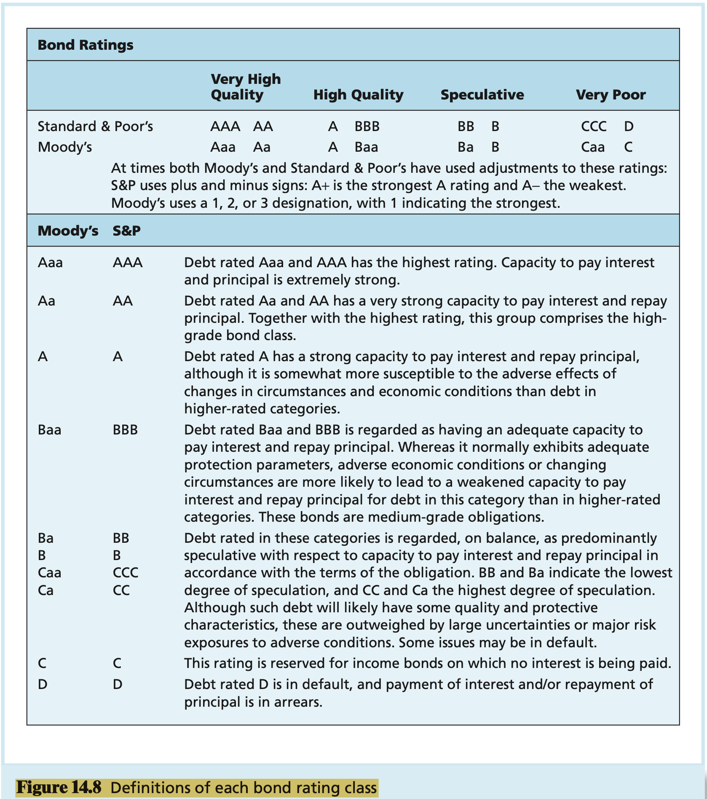

# CHAPTER14 Bond Prices and Yields

A `bond` is a security that is issued in connection with a borrowing arrangement. The borrower issues (i.e., sells) a bond to the lender for some amount of cash; the bond is the "IOU" of the borrower. The arrangement obligates the issuer to make specified payments to the bondholder on specified dates.

When the bond matures, the issuer repays the debt by paying the bond's `par value` (equivalently, its `face value`). The `coupon rate` of the bond determines the interest payment: The annual payment is the coupon rate times the bond's par value. The coupon rate, maturity date, and par value of the bond are part of the `bond indenture`, which is the contract between the issuer and the bondholder.

**Accrued Interest and Quoted Bond Prices** The bond prices that you see quoted in the financial pages are not actually the prices that investors pay for the bond. This is because the quoted price does not include the interest that accrues between coupon payment dates.

**Convertible Bonds** `Convertible bonds` give bondholders an option to exchange each bond for a specified number of shares of common stock of the firm. The `conversion ratio` is the number of shares for which each bond may be exchanged.

**Puttable Bonds** While the callable bond gives the issuer the option to extend or retire the bond at the call date, the `extendable` or `put bond` gives this option to the bondholder.

**Floating-Rate Bonds** `Floating-rate bonds` make interest payments that are tied to some measure of current market rates.

**International Bonds** International bonds are commonly divided into two categories:

- `foreign bonds`, Foreign bonds are issued by a borrower from a country other than the one in which the bond is sold. The bond is denominated in the currency of the country in which it is marketed.
- `Eurobonds`, Eurobonds are denominated in one currency, usually that of the issuer, but sold in other national markets.

To value a security, we discount its expected cash flows by the appropriate discount rate. The cash flows from a bond consist of coupon payments until the maturity date plus the final payment of par value. Therefore:
$$
\text{Bond value} = \text{Present value of coupons} + \text{Present value of par value}
$$
, if we call the maturity date $T$ and call the interest rate $r$, the bond value can be written as:
$$
\text{Bond value} = \sum_{t = 1}^{T}\frac{Coupon}{(1 + r)^t} + \frac{\text{Par value}}{(1 + r)^T}
$$
, the summation sign in above equation directs us to add the present value of each coupon payment; each coupon is discounted based on the time until it will be paid. The first term on the right-had side of above equation is the present value of an annuity. The second term is the present value of a single amount, the final payment of the bond's par value.

You may recall from an introductory finance class that the present value of $\$1$ annuity that lasts for $T$ periods when the interest rate equals $r$ is $\frac{1}{r} \left[1 - \frac{1}{(1 + r)^{T}} \right]$. We call this expression the T-period `annuity factor` for an interest rate of $r^5$. Similarly, we call $\frac{1}{(1 + r)^T}$ the $PV$ factor, that is, the present value of a single payment of $\$1$ to be received in $T$ periods. Therefore, we can write teh price of the bond as:
$$
\begin{equation}\begin{split}
Price &= Coupon \times \frac{1}{r} \left[1 - \frac{1}{(1 + r)^{T}} \right] + \text{Par value} \times \frac{1}{(1 + r)^{T}} \\
&= Coupon \times \text{Annuity factor}(r, T) + \text{Par value} \times \text{PV factor}(r, T)
\end{split}\end{equation}
$$
The basic financial calculator uses five keys that correspond to the inputs for time-value-of-money problems such as bond pricing:

1. $n$ is the number of time periods. In the case of a bond, $n$ equals the number of periods until the bond matures. If the bond makes semiannual payments, $n$ is the number of half-year periods or, equivalently, the number of semiannual coupon payments.
2. $i$ is the interest rate per period, expressed as a percentage (not as a decimal).
3. $PV$ is the present value. Many calculators require that $PV$ be entered as a negative number, in recognition of the fact that purchase of the bond is a cash `outflow`, while the receipt of coupon payments and face value are cash `inflows`.
4. $FV$ is the future value or face value of the bond. In general, $FV$ is interpreted as a one-time future payment of a cash flow, which, for bonds, is the face (i.e., par) value.
5. $PMT$ is the amount of any recurring payment. For coupon bonds, $PMT$ is the coupon payment; for zero-coupon bonds, $PMT$ will be zero.

Bond prices are typically quoted net of accrued interest. These prices, which appear in the financial press, are called `flat prices`. The actual `invoice price` that a buyer pays for the bond includes accrued interest. Thus:
$$
\text{Invoice price} = \text{Flat price} + \text{Accrued interest}
$$
, when a bond pays its coupon, flat price equals invoice price, because at that moment accrued interest reverts to zero. However, this will be the exceptional case, not the rule.

Bond investors are actually subject to two sources of offsetting risk. On the one hand, when rates rise, bond prices fall, which reduces the value of the portfolio. On the other hand, reivested coupon income will compound more rapidly at those higher rates. This `reinvestment rate risk` will offset the impact of price risk.

Bond default risk, usually called `credit risk`, is measured by Moody's Investor Services, Standard & Poor's Corporation, and Fitch Investors Service, all of which provide financial information on firms as well as quality ratings of large corporate and municipal bond issues.

Those rated BBB or above (S&P, Fitch) or Baa and above (Moody's) are considered `investment-grade bonds`, whereas lower-rated bonds are classified as `speculative-grade or junk bonds`.

`Junk bonds`, also known as `high-yield bonds`, are nothing more than speculative-grade(low-rated or unrated) bonds.

Bond rating agencies base their quality ratings largely on an analysis of the level and trend of some of the issuer's financial ratios. The key ratios used to evaluate safety are:

1. `Coverage ratios`, Ratios of company earnings to fixed costs.
2. `Leverage ratio, debt-to-equity ratio`, A too-high leverage ratio indicates excessive indebtedness, signaling the possibility the firm will be unable to earn enough to satisfy the obligations on its bonds.
3. `Liquidity ratios`, The two most common liquidity ratios are the `current ratio`(current assets/current liabilities) and the `auick ratio`(current assets excluding inventories/current liabilities). These ratios measure the firm's ability to pay bills coming due with its mots liquid assets.
4. `Profitability ratios`, Measures of rates of return on assets or equity.
5. `Cash flow-to-debt ratio`, This is the ratio of total cash flow to outstanding debt.

**Sinking Funds** Bonds call for the payment of par value at the end of the bond's life. This payment constitutes a large cash commitment for the issuer. To help ensure the commitment does not create a cash flow crisis, the firm aggress to establish a `sinking fund` to spread the payment burden over several years. The fund may operate in one of two ways:

1. The firm may repurchase a fraction of the outstanding bonds in the open market each year.
2. The firm may purchase a fraction of the outstanding bonds at a special call price associated with the sinking fund provision.

**Subordination of Further Debt** One of the factors determining bond safety is total outstanding debt of the issuer.

**Dividend Restrictions** Covenants also limit teh dividends firms amy pay.

**Collateral** Some bonds are issued with specific collateral behind them.

A `credit default swap (CDS)` is in effect an insurance policy on the default risk of a bond or loan.

## Summary

TODO