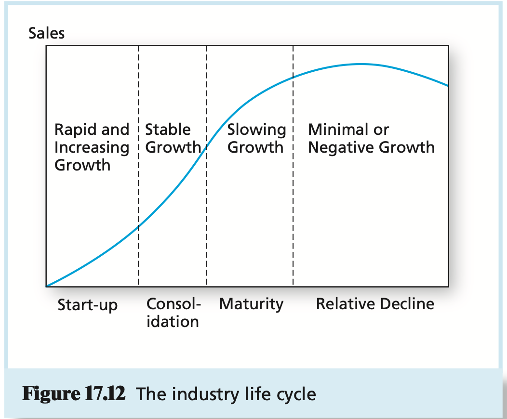

# CHAPTER 17 Macroeconomic and Industry Analysis

The heart of `fundamental analysis`--that is, the analysis of the determinants of value such as earnings prospects.

One obvious factor that affects the international competitiveness of a country's industries is the exchange rate between that country's currency and other currencies. The `exchange rate` is the rate at which domestic currency can be converted into foreign currency.

**Gross Domestic Product** Gross domestic product, or GDP, is the measure of the economy's total production of goods and services.

**Employment** The `unemployment rate` is the percentage of the total labor force (i.e., those who are either working or actively seeking employment) yet to find work.

**Inflation** The rate at which the general level of prices rise is called `inflation`.

**Interest Rates** High interest rates reduce the present value of future cash flows, thereby reducing the attractiveness of investment opportunities.

**Budget Deficit** The `budget deficit` of the federal government is the difference between government spending and revenues.

**Sentiment** Consumers' and producers' optimism or pessimism concerning the economy is an important determinant of economic performance.

A `demand shock` is an event that affects the demand for goods and services in the economy.

A `supply shock` is an event that influences production capacity and costs.

`Fiscal policy` refers to the government's spending and tax actions and is part of "demand-side management."

`Monetary policy` refers to the manipulation of the money supply to affect the macro-economy and is the other main leg of demand-side policy.

The economy recurrently experiences periods of expansion and contraction, although the length and depth of those cycles can be irregular. This recurring pattern of recession and recovery is called the `business cycle`.

We can quantify operating leverage by measuring how sensitive profits are to changes in sales. The `degree of operating leverage`, or DOL, is defined as:
$$
DOL = \frac{\text{Percentage change in profits}}{\text{Percentage change in sales}}
$$
, DOL greater than 1 indicates some operating leverage.

We have seen that the degree of operating leverage increases with a firm's exposure to fixed costs. In fact, one can show that DOL depends on fixed costs in the following manner:
$$
DOL = 1 + \frac{\text{Fixed costs}}{\text{Profits}}
$$

Lynch uses an industry classification system in a very similar spirit to the lifecycle approach we have described. He places firms in the following six groups:

- Slow Growers.
- Stalwarts.
- Fast Growers.
- Cyclicals.
- Turnarounds.
- Asset Plays.

The relationship among industry structure, competitive strategy, and profitability:

- **Threat of Entry**, New entrants to an industry put pressure on price and profits.
- **Rivalry between Existing Competitors**, When there are several competitors in an industry, there will generally be more price competition and lower profit margins as competitors seek to expand their share of the market.
- **Pressure from Substitute Products**, Substitute products means that the industry faces competition from firms in related industries.
- **Bargaining Power of Buyers**, If a buyer purchases a large fraction of an industry's output, it will have considerable bargaining power and can demand price concessions.
- **Bargaining Power of Suppliers**, If a supplier of a key input has monopolistic control over the product, it can demand higher prices for the good and squeeze profits out of the industry.

## Summary

TODO