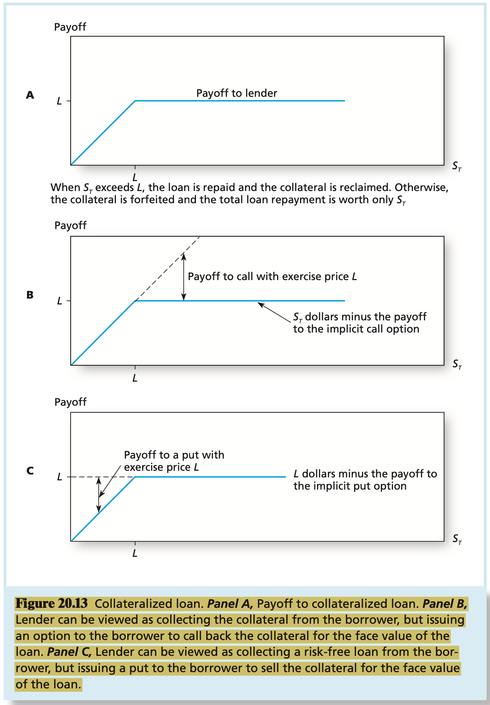

# CHAPTER 20 Options Markets: Introduction

A `call option` gives its holder the right to purchase an asset for a specified price, called the `exercise`, or `strike`, `price`, on or before some specified expiration date.

The purchase price of the option is called the `premium`. It represents the compensation the purchaser of the call must pay for the right to exercise the option only when exercise is desirable.

A `put option` gives its holder the right to `sell` an asset for a specified exercise or strike price on or before some expiration date.

An option is described as `in the money` when its exercise would produce a positive cash flow. Therefore, a call option is in the money when the asset price is greater than the exercise price, and a put option is in the money when the asset price is less than the exercise price. Conversely, a call is `out of the money` when the asset price is less than the exercise price; no one would exercise the right to purchase for the strike price an asset worth less than that amount. A put option is out of the money when the exercise price is less than the asset price. Options are `at the money` when the exercise price and asset price are equal.

An `American option` allows its holder to exercise the right to purchase (if a call) or sell (if a put) the underlying asset on `or before` the expiration date. `European options` allow for the exercise of the option only on the expiration date.

**Index Options** An index option is a call or put based on a stock market index such as the S&P 500 or the NASDAQ 100.

**Futures Options** Futures options give their holders the right to buy or sell a specified futures contract, using as a futures price the exercise price of the option.

**Foreign Currency Options** A currency option offers the right to buy or sell a quantity of foreign currency for a specified amount of domestic currency.

**Interest Rate Options** Options are traded on Treasury notes and bonds, Treasury bills, and government bonds of other major economies such as the U.K. or Japan.

**Call Options** Recall that a call option gives the right to purchase a security at the exercise price. The value of the call option at expiration equals:
$$
\text{Payoff to call holder} = 
\begin{cases}
S_{T} - X, & \text{if }S_{T} > X  \\
0, & \text{if }S_{T} \leq X
\end{cases}
$$
, where $S_{T}$ is the value of the stock at expiration and $X$ is the exercise price. This formula emphasizes the option property because the payoff cannot be negative. The option is exercised only if $S_{T}$ exceeds $X$. If $S_{T}$ is less than $X$, teh option expires with zero value. The loss to the option holder in this case equals the price originally paid for the option. More generally, the `profit` to the otpion holder is the option payoff at expiration minus the original purchase price. Conversely, the writer of the call incurs losses if the stock price is high. In that scenario, the writer will receive a call and will be obligated to deliver a stock worth $S_{T}$ for only $X$ dollars:
$$
\text{Payoff to call writer} = 
\begin{cases}
-(S_{T} - X), & \text{if }S_{T} > X  \\
0, & \text{if }S_{T} \leq X
\end{cases}
$$
, the call writer, who is exposed to losses if the stock price increases, is willing to bear this risk in return for the option premium.

**Put Options** A put option is the right to sell an asset at the exercise price. The value of a put option at expiration is:
$$
\text{Payoff to put holder} = 
\begin{cases}
0, & \text{if }S_{T} > X  \\
X - S_{T}, & \text{if }S_{T} \leq X
\end{cases}
$$

A `covered call` position is the purchase of a share of stock with a simultaneous sale of a call option on that stock.

A long `straddle` is established by buying both a call and a put on a stock, each with the same exercise price, $X$, and the same expiration date, $T$.

A `spread` is a combination of two or more call options (or two or more puts) on the same stock with differing exercise prices or times to maturity. Some options are bought, whereas others are sold, or written. A `money spread` involves the purchase of one option and the simultaneous sale of another with a different exercise price. A `time spread` refers to the sale and purchase of options with differing expiration dates.

A `collar` is an options strategy that brackets the value of a portfolio between two bounds.

If two portfolios always provide equal values, then they must cost the same amount to establish. Therefore, the call-plus-bond portfolio must cost the same as the stock-plus-put portfolio. Each call costs $C$. The riskless zero-coupon bond costs $X/(1 + r_{f})^{T}$. Therefore, the call-plus-bond portfolio costs $C + X / (1 + r_{f})^{T}$. The stock costs $S_{0}$ to purchase now (at time zero), while the put costs $P$. Therefore, we conclude that:
$$
C + \frac{X}{(1 + r_{f})^{T}} = S_{0} + P
$$
, above equation is called the `put-call parity theorem` because it represents the proper relationship between put and call prices. If the parity relation is ever violated, an arbitrage opportunity arises.

The more general formulation of the put-call parity condition is:
$$
P = C - S_{0} + PV(X) + PV(dividends)
$$
In theory, we could value convertible bonds by treating them as straight debt plus call options. In practice, however, this approach is often impractical for several reasons:

1. The conversion price frequently increases over time, which means the exercise price of the option changes.
2. Stocks may pay several dividends over the life of the bond, further complicating the option-valuation analysis.
3. Most convertibles also are callable at the discretion of the firm. In essence, both the investor and the issuer hold options on each other. If the issuer exercises its call option to repurchase the bond, the bondholders typically have a month during which they still can convert. When issuers use a call option, knowing bondholders will choose to convert, the issuer is said to have `forced a conversion`. These conditions together mean the actual maturity of the bond is indeterminate.

`Warrants` are essentially call options issued by a firm.

In our call-option description of the loan, the value of the borrower's liability is $S_{0} - C$: The borrower turns over the asset, which is a transfer of $S_{0}$ dollars, but retains a call worth $C$ dollars. In the put-option description, the borrower is obligated to pay $L$ dollars but retains the put, which is worth $P$: The present value of this net obligation is $L / (1 + r_{f})^{T} - P$. Because these alternative descriptions are equivalent ways of viewing the same loan, the value of the obligations must be equal:
$$
S_{0} - C = \frac{L}{(1 + r_{f})^{T}} - P
$$
, treating $L$ as the exercise price of teh option, above equation is simply the put-call parity relationship.

**Asian Options** Asian-style options are options with payoffs that depend on the average price of the underlying asset during at least some portion of the life of the option.

**Barrier Options** Barrier options have payoffs that depend not only on some asset price at option expiration, but also on whether the underlying asset price has crossed through some "barrier".

**Lookback Options** Lookback options have payoffs that depnd in part on the minimum or maximum price of the underlying asset during the life of teh option.

**Currency-Translated Options** Currency-translated options have either asset or exercise prices denominated in a foreign currency.

**Digital Options** Digital options, also called binary or "bet" options, have fixed payoffs that depend on whether a condition is satisfied by the price of the underlying asset.
