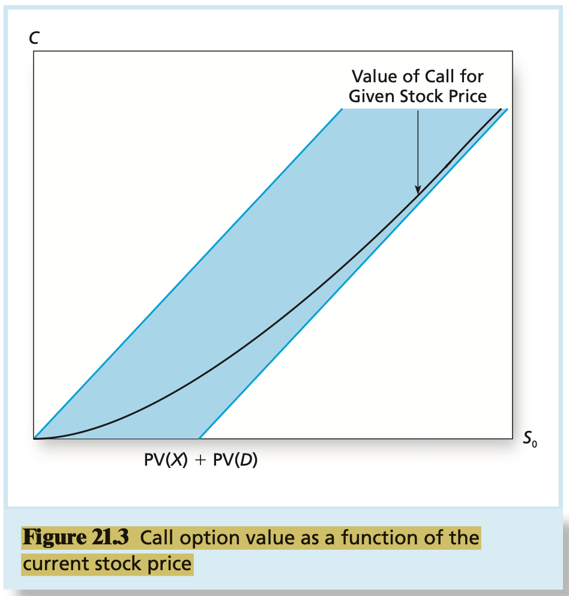

# CHAPTER 21 Option Valuation

The value $S_{0} - X$ is sometimes called the `intrinsic value` of in-the-money call options because it gives the payoff that could be obtained by immediate exercise. Intrinsic value is set equal to zero for out-of-the-money options. The difference between the actual call price and the intrinsic value is commonly called the `time value` of the option.

We can identify at least six factors that should affect the value of a call option: the stock price, the exercise price, the volatility of the stock price, the time to expiration, the interest rate, and the dividend rate of the stock. The call option should increase in value with the stock price and decrease in value with the exercise price because the payoff to a call if exercised, equals $S_{T} - X$. The magnitude of the expected payoff increases with the difference $S_{0} - X$.

Therefore, the value of the call must be greater than $S_{0} - (X + D) / (1 + r_{f})^{T}$, or, more generally:
$$
C \geq S_{0} - PV(X) - PV(D)
$$
, where $PV(X)$ denotes the present value of the exercise price and $PV(D)$ is the present value of the dividends teh stock will pay at the option's expiration. More generally, we can interpret $PV(D)$ as teh present value of any and all dividends to be paid prior to teh option expiration date. Because we know already that the value of a call option must be nonnegative, we may conclude that $C$ is greater than the `maximum` of either $0$ or $S_{0} - PV(X) - PV(D)$.

A call option holder who wants to close out that position has two choices: exercise the call or sell it. If the holder exercises at time $t$, the call will provide a payoff of $S_{t} - X$, assuming, of course, that the option is in the money. We have just seen that the option can be sold for at least $S_{t} - PV(X) - PV(D)$. Therefore, for an option on a non-dividend-paying stock, $C$ is greater than $S_{t} - PV(X)$. Because the present value of $X$ is less than $X$ itself, it follows that:
$$
C \geq S_{t} - PV(X) > S_{t} - X
$$
, the implication here is that the proceeds from a sale of the option (at price $C$) must exceed teh proceeds from an exercise $(S_{t} - X)$. It is economically more attractive to sell the call, which keeps it alive, than to exercise and thereby end the option. In other words, calls on non-dividend-paying stocks are "worth more alive than dead".

The hedge ratio equals teh ratio of ranges because the option and stock are perfectly correlated in this two-state example. Because they are perfectly correlated, a perfect hedge requires that they be held in fraction determined only by relative volatility. We can generalize the hedge ratio for other two-state option problems as:
$$
H = \frac{C_{u} - C_{d}}{uS_{0} - dS_{0}}
$$
, where $C_{u}$ or $C_{d}$ refers to the call option's value when the stock goes up or down, respectively, and $uS_{0}$ and $dS_{0}$ are the stock prices in the two states. The hedge ratio, $H$, is the ratio of the swings in the possible end-of-period values of the option and the stock. If the investor writers one option and holds $H$ shares of stock, the value of teh portfolio will be unaffected by the stock price. In this case, option pricing is easy: Simply set the value of the hedged portfolio equal to the present value of the known payoff.

The probability of each outcome is given by the binomial probability distribution, and this multiperiod approach to option pricing is therefore called the `binomial model`. Choose reasonable values for $u$ and $d$. The spread between up and down movements in the price of the stock reflects the volatility of its rate of return, so the choice for $u$ and $d$ should depend on that volatility. Call $\sigma$ your estimate of the standard deviation of the stock's continuously compounded annualized rate of return, and $\Delta t$ teh length of each subperiod. To make the standard deviation of the stock in the binomial model match your estimate of $\sigma$, it turns out that you can set $u = exp(\sigma \sqrt{\Delta t})$ and $d = exp(-\sigma \sqrt{\Delta t})^{3}$. You can see that the proportional difference between $u$ and $d$ increases with both annualized volatility as well as the duration of the subperiod. This makes sense, as both higher $\sigma$ and longer holding periods make future stock prices more uncertain.

The `Black-Scholes pricing formula` for a call option is:
$$
C_{0} = S_{0}N(d_{1}) - Xe^{-rT}N(d_{2})
$$
, where:
$$
d_{1} = \frac{ln(S_{0} / X) + (r + \sigma^{2} / 2)T}{\sigma \sqrt{T}}
d_{2} = d_{1} - \sigma\sqrt{T}
$$
, and:
$$
\begin{equation}\begin{split}
C_{0} &= \text{Current call option value.} \\
S_{0} &= \text{Current stock price.} \\
N(d) &= \text{The probability that a random draw from a standard normal distribution will be less than d. This equals the area under the normal curve up to d, as in the shaded area of Figure 21.6. In Excel, this function is called NORMSDIST().} \\
X &= \text{Exercise price} \\
e &= \text{The base of the natural log function, approximately 2.71828. In Excel,} e^x \text{ can be evaluated using the function EXP(x).} \\
r &= \text{Risk-free interest rate (the annualized continuously compounded rate on a safe asset with the same maturity as the expiration date of the option, which is to be distinguished from } r_{f}, \text{ the discrete period interest rate).} \\
T &= \text{Time to expiration of option, in years.} \\
ln &= \text{Natural logarithm function. In Excel, ln(x) can be calculated as LN(x).} \\
\sigma &= \text{Standard deviation of the annualized continuously compounded rate of return of the stock.} \\
\end{split}\end{equation}
$$

Some of the important assumptions underlying the formula are teh following:

1. The stock will pay no dividends until after the option expiration date.
2. Both teh interest rate, $r$, and variance rate, $\sigma^{2}$, of the stock are constant (or in slightly more general versions of the formula, both are `known` functions of time any changes are perfectly predictable).
3. Stock prices are continuous, meaning that sudden extreme jumps such as those in the aftermath of an announcement of a takeover attempt are ruled out.

The historical variance of stock market returns can be calculated from $n$ observations as follows:
$$
\sigma^{2} = \frac{n}{n - 1} \sum_{t = 1}^{n} \frac{(r_{t} - \overline{r})^{2}}{n}
$$
, where $\overline{r}$ is the average return over the sample period. The rate of return on day $t$ is defined to be consistent with continuous compounding as $r_{t} = \ln(S_{t} / S_{t - 1})$. [We note again that the natural logarithm of a ratio is approximately the percentage difference between the numerator and denominator so that $\ln(S_{t} / S_{t - 1})$ is a measure of the rate of return of the stock from time $t - 1$ to time $t$.] Historical variance commonly is computed using daily returns over periods of several months. Because the volatility of stock returns must be estimated, however, it is a always possible that discrepancies between an option price and its Black-Scholes value are simply artifacts of error in the estimation of the stock's volatility.

`pseudo-American call option value` is the maximum of the value derived by assuming that the option will be held until expiration and the value derived by assuming that the option will be exercised just before an ex-dividend date.

We can derive Black-Scholes European put option values from call option values using the put-call parity theorem. To value the put option, we simply calculate the value of the corresponding call option in above equation from the Black-Scholes formula, and solve for the put option value as:
$$
P &= C + PV(X) - S_{0} \\
&= C + Xe^{-rT} - S_{0}
$$
, we calculate the present value of the exercise price using continuous compounding to be consistent with the Black-Scholes formula. Sometimes, it is easier to work with a put option valuation formula directly. If we substitute the Black-Scholes formula for a call in above equation, we obtain the value of a european put option as:
$$
P = Xe^{-rT}[1 - N(d_{2})] - S_{0}[1 - N(d_{1})]
$$
Black-Scholes hedge ratios are particularly easy to compute. The hedge ratio for a call is $N(d_{1})$, whereas the hedge ratio for a put is $N(d_{1}) - 1$. We defined $N(d_{1})$ as part of the Black Scholes formula in above equation. Recall that $N(d)$ stands for the area under the standard normal curve up to $d$. Therefore, the call option hedge ratio must be positive and less than 1.0, whereas the put option hedge ratio is negative and of smaller absolute value than 1.0.

Here is the general idea. Even if a put option on the desired portfolio does not exist, a theoretical option-pricing model (such as the Black-Scholes model) can be used to determine how that option's price would respond to the portfolio's value if it did trade.

Market declines require extra hedging, that is, additional conversion of equity into cash. This constant updating of the hedge ratio is called `dynamic hedging` (alternatively, delta hedging).

Consider the payoff to the lender at loan maturity (time $T$) as a function of the value of the borrowing firm, $V_{T}$, when the loan, with face value $L$, comes due. If $V_{T} \geq L$, the lender is paid off in full. But if $V_{T} < L$, the lender gets the firm, which is worth less than the promised payment $L$. We can write the payoff in a way that emphasizes the implicit put option:
$$
Payoff = 
\begin{cases}
L \\ 
V_{T} 
\end{cases}
= L - 
\begin{cases}
0 &\text{if } V_{T} \geq L \\ 
L - V_{T} &\text{if } V_{T} < L
\end{cases}
$$
, this equation show that the payoff on the loan equals $L$ (when the firm has sufficient assets to pay off the debt), minus the payoff of a put option on the value of the firm $(V_{T})$ with an exercise price of $L$. Therefore, we may view risky leading as a combination of safe leading, with a guaranteed payoff of $L$, combined with a short position in a put option on the borrower.

The option `delta` can be interpreted as a hedge ratio that can be used for this purpose. The delta was defined as:
$$
\text{Delta} = \frac{\text{Change in value of option}}{\text{Change in value of stock}}
$$
, therefore, delta is the slope of teh option-pricing curve.

When you establish a position in stocks and options that is hedged with respect to fluctuations in the price of the underlying asset, your portfolio is said to be `delta neutral`, meaning that the portfolio has no tendency to either increase or decrease in value when the stock price fluctuates.

The sensitivity of an option price to changes in volatility is called the option's `vega`.
