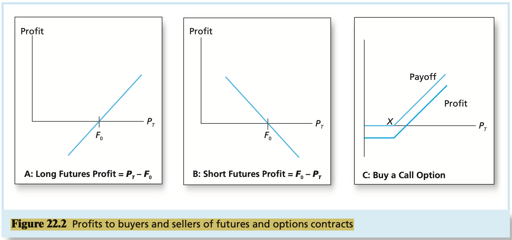
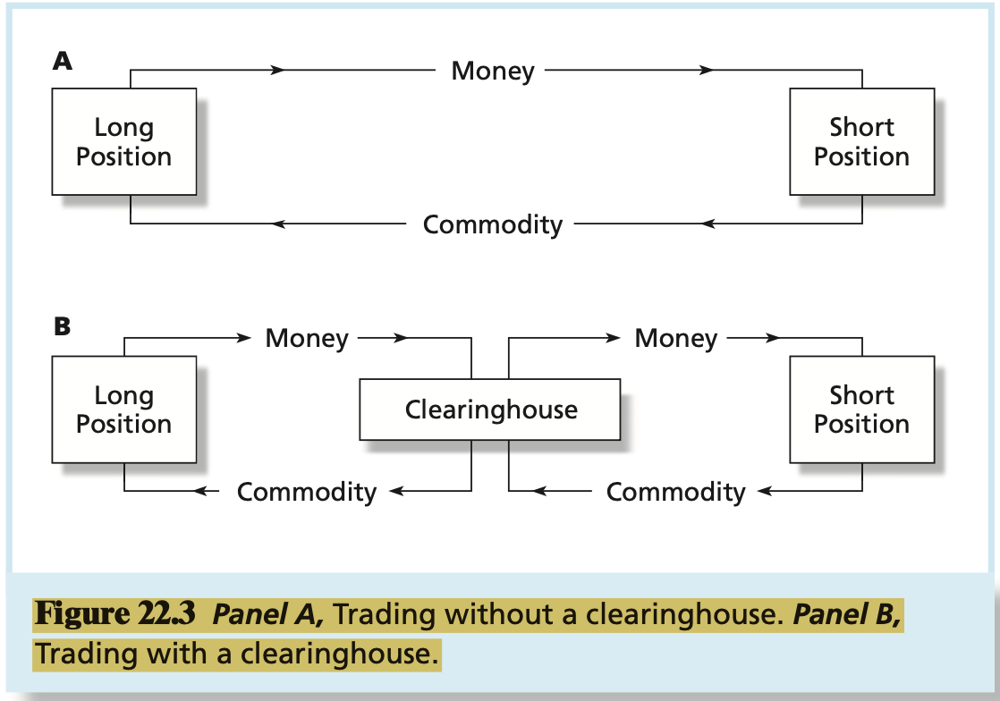
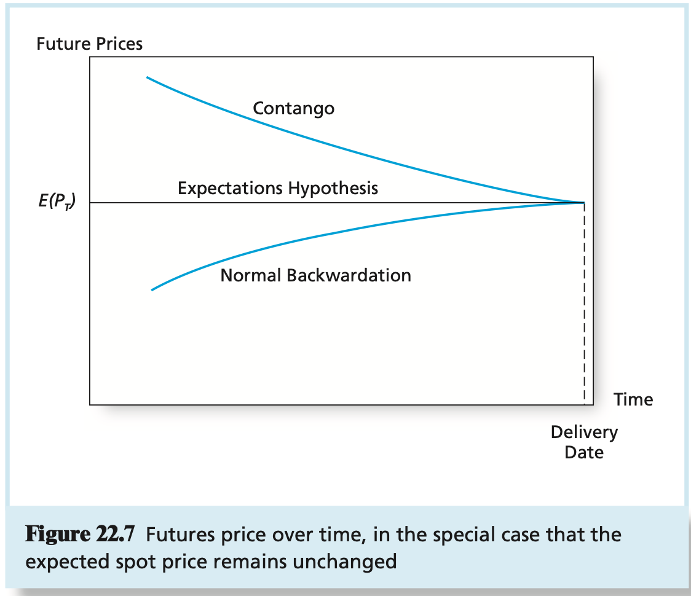

# CHAPTER 22 Futures Markets

The futures contract calls for the delivery of a commodity at a specified delivery or maturity date for an agreed-upon price, called the `futures price`, to be paid at contract maturity. The contract specifies precise requirements for the commodity.

The trader taking the `long position` commits to purchasing the commodity on the delivery date. The trader who takes the `short position` commits to delivering the commodity at contract maturity.

To summarize, at maturity:
$$
\text{Profit to long} = \text{Spot price at maturity} - \text{Original futures price} \\
\text{Profit to short} = \text{Original futures price} - \text{Spot price at maturity}
$$
, where the spot price is the actual market price of teh commodity at the time of the delivery.

The `open interest` on the contract is the number of contracts outstanding. (Long and short positions are not counted separately, meaning that open interest can be defined either as the number of long or short contracts outstanding.)

`marking to market` means teh maturity date of teh contract does not govern realization of profit or loss. Instead, as futures prices change, the proceeds accrue to the trader's margin account immediately.

If a trader accrues sustained losses from daily marking to market, the margin account may fall below a critical value called the `maintenance margin`.

The futures price and the spot price must converge at maturity. This is called the `convergence property`.

The `basis` is the difference between the futures price and the spot price. As we have noted, on the maturity date of a contract, the basis must be zero: The convergence property implies that $F_{T} - P_{T} = 0$. Before maturity, however, the futurs price for later delivery may differ substantially from the current spot price. If the contract and asset are to be liquidated early, before contract maturity, the hedger bears `basis risk`, because the futures price and spot price need not move in perfect lockstep at all times before the delivery date.

`calendar spread` position, where the investor takes a long position in a futures contract of one maturity and a short position in a contract on the same commodity, but with a different maturity. Profits accrue if the difference in futures prices between the two contracts changes in the hoped-for direction, that is, if the futures price on the contract held long increases by more (or decreases by less) than the futures price on the contract held short.

A total investment of $S_{0}$, the current stock price, grows to a final value of $F_{0} + D$, where $D$ is the dividend payout on the portfolio. The rate of return is therefore:
$$
\text{Rate of return on hedged stock portfolio} = \frac{(F_{0} + D) - S_{0}}{S_{0}}
$$
, this return is essentially riskless. We observe $F_{0}$ at the beginning of the period when we enter the futures contract. Rearranging, we find that the futures price must be:
$$
F_{0} = S_{0}(1 + r_{f}) - D = S_{0}(1 + r_{f} - d)
$$
, where $d$ is the dividend yield on the stock portfolio, defined as $D/S_{0}$. This result is called the `spot-futures parity theorem`.

The parity relationship also is called the `cost-of-carry relationship` because it asserts that the futures price is determined by the relative costs of buying a stock with deferred delivery in the futures market versus buying it in the spot market with immediate delivery and "carrying" it in inventory.

The parity relationship is easily generalized to multiperiod applications. We simply recognize that the difference between the futures and spot price will be larger as the maturity of the contract is longer. This reflects the longer period to which we apply the net cost of carry. For contract maturity of $T$ periods, the parity relationship is:
$$
F_{0} = S_{0}(1 + r_{f} - d)^{T}
$$
, notice that when the dividend yield is less than the risk-free rate, above equation implies that futures prices will exceed spot prices, and by greater amounts for longer times to contract maturity. But when $d > r_{f}$, as is the case today, the income yield on the stock exceeds the forgone (risk-free) interest that could be earned on the money invested; in this event, the futures price will be less than the current stock price, again by greater amounts for longer maturities.To be more precise about spread pricing, call $F(T_{1})$ the current futures price for delivery at date $T_{1}$, and $F(T_{2})$ the futures price for delivery at $T_{2}$. Let $d$ be the dividend yield of the stock. We known from the parity above equation that:
$$
F(T_{1}) = S_{0}(1 + r_{f} - d)^{T_{1}} \\
F(T_{2}) = S_{0}(1 + r_{f} - d)^{T_{2}}
$$
, As a result:
$$
F(T_{2}) / F(T_{1}) = (1 + r_{f} - d)^{(T_{2} - T_{1})}
$$
, Therefore, the basic parity relationship for spreads is:
$$
F(T_{2}) = F(T_{1})(1 + r_{f} - d)^{(T_{2} - T_{1})}
$$
The relationship between futures prices and the `current` spot price.

**Expectations Hypothesis** The `expectations hypothesis` is the simplest theory of futures pricing. It states tht the futures price equals the expected value of the future spot price: $F_{0} = E(P_{T})$. Under this theory they expected profit to either position of a futures contract would equal zero: The short position's expected profit is $F_{0} - E(P_{T})$, whereas the long's is $E(P_{T}) - F_{0}$. With $F_{0} = E(P_{T})$, the expected profit to either side is zero. This hypothesis relies on a notion of risk neutrality. If all market participants are risk neutral, they should agree on a futures price that provides an expected profit of zero to all parties.

**Normal Backwardation** This theory is associated with the famous British economists John Maynard Keynes and John Hicks. They argued that for most commodities there are natural hedgers who wish to shed risk.

**Contango** The polar hypothesis to backwardation holds that the natural hedgers are the purchasers of a commodity, rather than the suppliers.

**Modern Portfolio Theory** 

To illustrate this approach, consider once again a stock paying no dividends. If $E(P_{T})$ denotes the expected time-$T$ stock price and $k$ denotes the required rate of return on the stock, then the price of the stock today must equal the present value of its expected future payoff as follows:
$$
P_{0} = \frac{E(P_{T})}{(1 + k)^{T}}
$$
, We also known from the spot-futures parity relationship that:
$$
P_{0} = \frac{F_{0}}{(1 + r_{f})^{T}}
$$
, Therefore, the right-hand sides of above equations must be equal. Equating these terms allows us to solve for $F_{0}$:
$$
F_{0} = E(P_{T}) \left(\frac{1 + r_{f}}{1 + k}\right)^{T}
$$
, You can see immediately from this equation that $F_{0}$ will be less than the expectation of $P_{T}$ whenever $k$ is greater than $r_{f}$, which will be the case for any positive-beta asset. This means that the long side of the contract will make an expected profit [$F_{0}$ will be lower than $E(P_{T})$] when the commodity exhibits positive systematic risk ($k$ is greater than $r_{f}$).

## Summary

TODO

