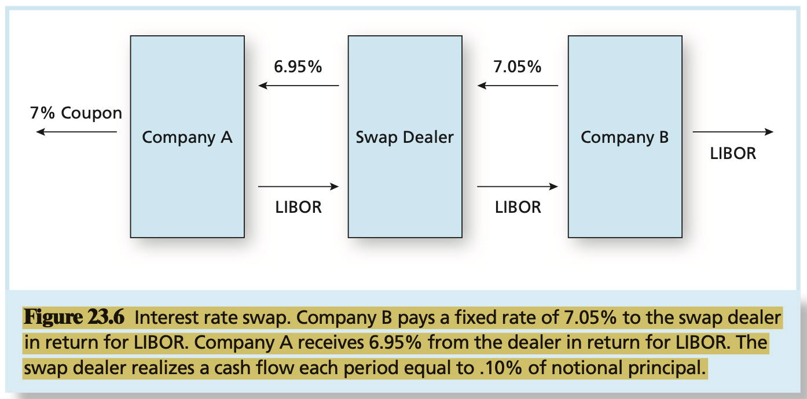

# CHAPTER 23 Futures, Swaps, and Risk Management

`Hedging` refers to techniques that offset particular sources of risk.

As is true of stocks and stock futures, there is a spot futures exchange rate relationship that will prevail in well-functioning markets. Should this so-called `interest rate parity relationship` be violated, arbitrageurs will be able to make risk-free profits in foreign exchange markets with zero-net-investment. Their actions will force futures and spot exchange rates back into alignment. Another term for interest rate parity is the `covered interest arbitrage relationship`.

We can illustrate the interest rate parity theorem by using two currencies, the U.S. dollar and the British (U.K.) pound. Call $E_{0}$ the current exchange rate between the two currencies, that is, $E_{0}$ dollars are required to purchase one pound. $F_{0}$, the forward price, is the number of dollars agreed to today for the purchase of one pound at a time $T$. Call the risk-free rates in the United States and the United Kingdom $r_{US}$ and $r_{UK}$, respectively. The interest rate parity theorem then states that the proper relationship between $E_{0}$ and $F_{0}$ is:
$$
F_{0} = E_{0} \left(\frac{1 + r_{US}}{1 + r_{UK}}\right)^{T}
$$
The net proceeds to the arbitrage portfolio are risk-free and given by $E_{0}(1 + r_{US}) - F_{0}(1 + r_{UK})$. If this value is postiive, borrow in the United Kindom, lend in the United States, and enter a long futures position to eliminate foreign exchange risk. If the value is negative, borrow in the United States, lend in the United Kingdom, and take a short position in pound futures. When prices preclude arbitrage opportunities, the expression must equal zero. This no-arbitrage condition implies that:
$$
F_{0} = \frac{1 + r_{US}}{1 + r_{UK}} E_{0}
$$
, which is the interest rate parity theorem for a 1-year horizon.

`Index arbitrage` is an investment strategy that exploits divergences between the actual futures price and its theoretically correct parity value.

The term `program trading`, which refers to purchases or sales of entire portfolios of stocks.

The manager seek a `market-neutral bet` on the stock, by which we mean that a position on the stock is taken to capture its alpha (its abnormal risk-adjusted expected return), but that market exposure is fully hedged, resulting in a position beta of zero.

A `foreign exchange swap` would call for an exchange of currencies on several future dates.

`interest rate swaps` call for the exchange of a series of cash flows proportional to a given interest rate for a corresponding series of cash flows proportional to a floating interest rate.

A `credit default swap`, or CDS, is not the same type of instrument as interest rate or currency swaps.

Unlike interest rate swaps, credit default swaps do not entail periodic netting fo one reference rate against another. They are in fact more like insurance policies written on particular credit events. Bondholders may buy these swaps to transfer their credit risk exposure to the swap seller, effectively enhancing the credit quality of their portfolios. Unlike insurance policies, however, the swap holder need not hold the bonds underlying the CDS contract; therefore, credit default swaps can be used purely to speculate on changes in the credit standing of the reference firms.

If the cash flow were positive, this strategy would yield guaranteed profits for no investment. If the cash flow were negative, the reverse of this strategey also would yield profits. In practice, the reverse strategy would involve a short sale of the commodity. This is unusual but may be done as long as the short sale contract appropriately accounts for storage costs. Thus, we conclude that:
$$
F_{0} = P_{0}(1 + r_{f}) + C
$$
, Finally, if we define $c = C / P_{0}$, and interpret $c$ as the percentage "rate" of carrying costs, we may write:
$$
F_{0} = P_{0}(1 + r_{f} + c)
$$
, which is a (1-year) parity relationship for futures involving storage costs.

The general rule, then, to determine the appropriate futures price is to equate the present value of the future payment of $F_{0}$ and the present value of teh commodity to be received. This implies:
$$
\frac{F_{0}}{(1 + r_{f})^{T}} = \frac{E(P_{T})}{(1 + k)^{T}}
$$
or:
$$
F_{0} = E(P_{T})\left(\frac{1 + r_{f}}{1 + k}\right)^{T}
$$
, where $k$ is the required rate of return on the commodity, which may be obtained from a model of asset market equilibrium such as the CAPM.

## Summary

TODO