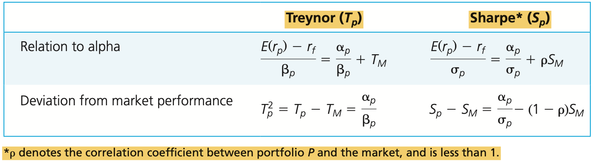

# CHAPTER 24 Portfolio Performance Evaluation

The simplest and most popular way to adjust returns for portfolio risk is to compare rates of return with those of other investment funds with similar risk characteristics.

We start by cataloging some possible risk-adjusted performance measures for a portfolio, $P$, and examine the circumstances in which each measure might be most relevant:

1. `Sharpe ratio`: $(\overline{r}_{p} - \overline{r}_{f}) / \sigma_{p}$

   `Sharpe's ratio` divides the average portfolio excess return over the sample period by the standard deviation of returns over that period. It measures the reward to (total) volatility trade-off.

2. `Treynor measure`: $(\overline{r}_{p} - \overline{r}_{f}) / \beta_{p}$

   Like the Sharpe ratio, `Treynor's measure` gives excess return per unit of risk, but it uses systematic risk instead of total risk.

3. `Jensen's alpha`: $\alpha_{p} = \overline{r}_{p} - [\overline{r}_{f} + \beta_{p}(\overline{r}_{M} - \overline{r}_{f})]$

   `Jensen's alpha` is the average return on the portfolio over and above that predicted by the CAPM, given the portfolio's beta and the average market return.

4. `Information ratio`: $\alpha_{p} / \sigma(e_{p})$

   The `information ratio` divides the alpha of the portfolio by the nonsystematic risk of the portfolio, called "tracking error" in the industry. It measures abnormal return per unit of risk that in principle could be diversified away by holding a market index portfolio.

5. `Morningstar risk-adjusted return`: $MRAR(\gamma) = \left[\frac{1}{T} \sum_{t = 1}^{T} \left(\frac{1 + r_{t}}{1 + r_{ft}}\right)^{-\gamma} \right]^{\frac{12}{\gamma}} - 1$

   The Morningstar rating is a sort of harmonic average of excess returns, where $t = 1, ..., T$ are monthly observations, and $\gamma$ measures risk aversion. Higher $\gamma$ means greater punishment for risk. For mutual funds, Morningstar uses $\gamma = 2$, which is considered a reqsonable coefficient for an average retail client. MRAR can be interpreted as the risk-free equivalent excess return of teh portfolio for an investor with risk aversion measured by $\gamma$.

To compute $M^{2}$, we imagine that a managed portfolio, $P$, is mixed with a position in T-bills so that the complete, or "adjusted", portfolio matches the volatility of a market index such as teh S&P 500. If the managed portfolio has 1.5 times the standard deviation of the index, the adjusted portfolio would be two-thirds invested in the managed portfolio and one-third in bills. The adjusted portfolio, which we call $P^{*}$, would then have the same standard deviation as the index. (If the managed portfolio had `lower` standard deviation than the index, it would be leveraged by borrowing money and investing the proceeds in the portfolio.) Because the market index and portfolio $P^{*}$ have the same standard deviation, we may compare their perfomance simply by comparing returns. This is the $M^{2}$ measure for portfolio $P$:
$$
M_{p}^{2} = r_{p^{*}} - r_{M}
$$
The relationship between the three performance meansures discussed so far. The following table shows these relationships.

A manipulation-proof performance measure (MPPM) must fulfill four requirements:

1. The measure shold produce a single-value score to rank a portfolio.
2. The score should not depend on the dollar value of the portfolio.
3. An uninformed investor should not expect to improve the expected score by deviating from the benchmark portfolio.
4. The measure should be consistent with standard financial market equilibrium conditions.

The standard error of the alpha estimate in the SCL regression is approximately:
$$
\hat{\sigma}(\alpha) = \frac{\hat{\sigma}(e)}{\sqrt{N}}
$$
, where $N$ is the number of observations and $\hat{\sigma}(e)$ is the sample estimate of nonsystematic risk. The $t$-statistic for the alpha estimate is then:
$$
t(\hat{\alpha}) = \frac{\hat{\alpha}}{\hat{\sigma}(\alpha)} = \frac{\hat{\alpha}\sqrt{N}}{\hat{\sigma}(e)}
$$
Call the active portfolio established by the hedge fund $H$, and the investor's baseline passive portfolio $M$. Then the optimal position of $H$ in the overall portfolio, denoted $P^{*}$. The improvement in the Sharpe measure will be determined by its information ratio $\alpha_{H} / \sigma(e_{H})$, according to:
$$
S_{P^{*}}^{2} = S_{M}^{2} + \left[\frac{\alpha_{H}}{\sigma(e_{H})}\right]^{2}
$$
, this equation tells us that the appropriate performance measure for the hedge fund is its information ratio (IR).

In practice, evaluating hedge funds poses considerable practical challenges:

1. The risk profile of hedge funds (both total volatility and exposure to relevant systematic factors) may change rapidly. hedge funds have far greater leeway than mutual funds to change investment strategy opportunistically. This instability makes it hard to measure exposure at any given time.
2. Hedge funds tend to invest in illiquid assets. We therefore must disentangle liquidity premiums from true alpha to properly assess their performance. Moreover, it can be difficult to accurately price inactively traded assets, and coorespondingly difficult to measure rates of return.
3. Many hedge funds pursue strategies that may provide apparent profits over long periods of time, but expose the fund to infrequent but severe losses. Therefore, very long time periods may be required to formulate a realistic picture of their true risk return trade-off.
4. Hedge funds have ample latitude to change their risk profiles and therefore considerable ability to manipulate conventional performance meansures. Only the MRAR is manipulation-proof, and investors should urge these funds to use them.
5. When hedge funds are evaluated as a group, survivorship bias can be a major consideration, because turnover in this industry is far higher than for investment companies such as mutual funds.

The exercise price of the perfect-timer call option on $\$1$ of the equity portfolio is the final value of the T-bill investment. Using continuous compounding, this is $\$1 \times e^{rT}$. When you use this exercise price in Black-Scholes formula for the value of the call option, the formula simplifies considerably to:
$$
MV(\text{Perfect timer per \$ of assets}) = C = 2N(1/2 \sigma_{M} \sqrt{T}) - 1
$$
If we call $P_{1}$ the proportion of the correct forecasts of bull markets and $P_{2}$ the proportion for bear markets, then $P_{1} + P_{2} - 1$ is the correct measure of timing ability.

When timing is imperfect, Merton shows that if we measure overall accuracy by the statistic $P_{1} + P_{2} - 1$, the market value of the services of an imperfect timer is simply:
$$
MV(\text{Imperfect timer}) = (P_{1} + P_{2} - 1) \times C = (P_{1} + P_{2} - 1)[2N(1/2 \sigma_{M} \sqrt{T}) - 1]
$$
A further variation on the valuation of market timing is a case in which the timer does not shift fully from one asset to the other. In particular, if the timer knows her forecasts are imperfect, one would not expect her to shift fully between markets. She presumably would moderate her positions. Suppose that she shifts a fraction $w$ of the portfolio between T-bills and equities. In that case, above equation can be generalized as follows:
$$
MV(\text{Imperfect timer}) = w(P_{1} + P_{2} - 1)[2N(\sigma_{M} \sqrt{T}) - 1]
$$
To do style analysis using Solver, start with arbitrary coefficients (e.g., you can set $\alpha = 0$ and set each $\beta = 1/3$). Use these to compute the time series of residuals from the style regression according to:
$$
e(t) = R(t) - [\alpha + \beta_{1}R_{1}(t) + \beta_{2}R_{2}(t) + \beta_{3}R_{3}(t)]
$$
, where:
$$
R(t) = \text{Excess return on the measured fund for date } t \\
R_{i}(t) = \text{Excess return on the ith style portfolio (i = 1, 2, 3)} \\
\alpha = \text{Abnormal performance of the fund over the sample period} \\
\beta_{i} = \text{Beta of the fund on the ith style portfolio}
$$
The attribution method explains the difference in returns between a managed portfolio, $P$, and a selected benchmark portfolio, $B$, called the `bogey`. Suppose that the universe of assets for $P$ and $B$ includes $n$ asset classes such as equities, bonds, and bills. For each asset class, a benchmark index portfolio is determined. For example, the S&P 500 may be chosen as benchmark for equities. The bogey portfolio is set to have fixed weights in each asset class, and its rate of return is given by:
$$
r_{B} = \sum_{i = 1}^{n} w_{Bi}r_{Bi}
$$
, where $w_{Bi}$ is the weight of the bogey in asset class $i$, and $r_{Bi}$ is the return on the benchmark portfolio of that class over the evaluation period. The portfolio managers choose weights in each class, $w_{pi}$, based on their capital market expectations, and they choose a portfolio of the securities within each class based on their security analysis, which earns $r_{pi}$ over the evaluation period. Thus the return of teh managed portfolio will be:
$$
r_{p} = \sum_{i = 1}^{n}w_{pi}r_{pi}
$$
, The difference between the two rates of return, therefore, is:
$$
r_{p} - r_{B} = \sum_{i = 1}^{n}w_{pi}r_{pi} - \sum_{i = 1}^{n}w_{Bi}r_{Bi} = \sum_{i = 1}^{n}(w_{pi}r_{pi} - w_{Bi}r_{Bi})
$$
, Each term in the summation of above equation can be rewritten in a way that shows how asset allocation decisions versus security selection decisions for each asset class contributed to overall performance. We decompose each term of the summation into a sum of two terms as follows. Note that the two terms we label as contribution from asset allocation and contribution from security selection inthe following decomposition do in fact sum to the total contribution of each asset class to overall performance:

TODO

## Summary

TODO

