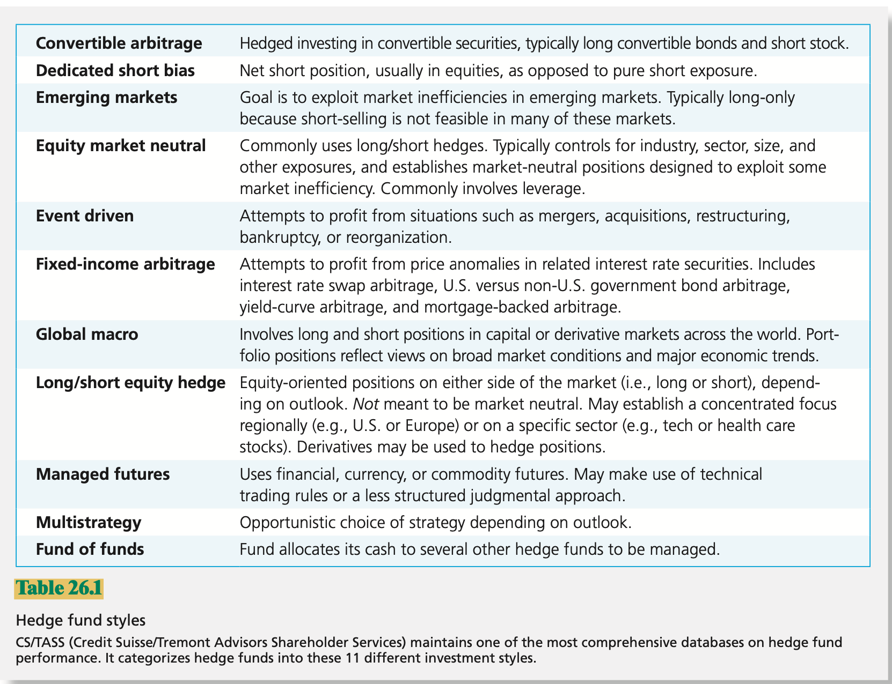

# CHAPTER 26 Hedge Funds

Like mutual funds, the basic idea behind `hedge funds` is investment pooling. Investors buy shares in these funds, which then invest the pooled assets on their behalf. The net asset value of each share represents the value of the investor's stake in the portfolio. In this regard, hedge funds operate much like mutual funds. However, there are important differences between the two:

- Transparency
- Investors
- Investment Strategies
- Liquidity
- Compensation Structure

**Directional and Nondirectional Strategies**

`Directional strategies` are easy to understand. They are simply bets that one sector or another will outperform other sectors of the market. In contrast, `non-directional strategies` are usually designed to exploit temporary misalignments in security valuations.

