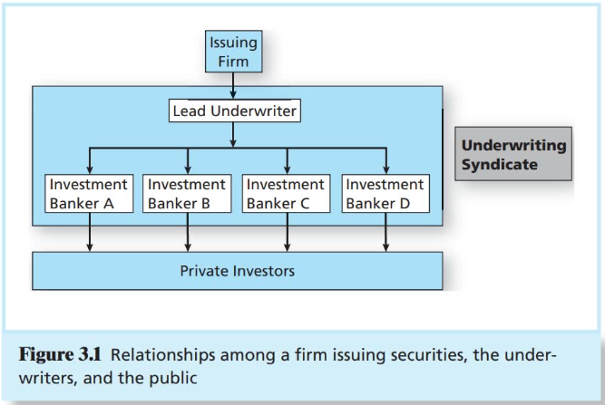

# CHAPTER 3 How Securities Are Traded

Investment bankers are generally hired to manage the sale of these securities in what is called a `primary market` for newly issued securities.

Trees in existing securities take place in the `secondary market`.

When private firms wish to raise funds, they sell shares directly to a small number of institutional or wealthy investors in a `private placement`.

`Liquidity` has many specific meanings, but generally speaking, it refers to the ability to buy or sell an asset at a fair price on short notice.

When private firms wish to raise funds, they sell shares directly to a small number of institutional or wealthy investors in a `private placement`.

When a private firm decides that it wishes to raise capital from a wide range of investors, it may decide to go `public`. This means that it will sell it's securities to the general public and allow those investors to freely trade those shares in established securities markets. The first issue of shares to the general public is called the firm's `initial public offering`, or `IPO`. Later, the firm may go back to the public and issue additional shares. A `seasoned equity offering` is the sale of additional shares in firms that already are publicly traded.

Public offerings of both stocks and bonds typically are marketed by investment bankers who in this role are called `underwriters`.

When the statement is in final form and accepted by the `Exchange Commission (SEC)`, it is called the `prospectus`.

Types of Markets:

- Direct Search Markets: A `direct search market` is the least organized market. Buyers and sellers must seek each other out directly.
- Brokered Markets: The next level of organization is a `brokered market`. In markets where trading in a good is active, brokers find it profitable to offer search services to buyers and sellers.
- Dealer Markets: When trading activity in a particular type of asset increases, dealer markets arise. Dealers specialize in various assets, purchase these assets for their own accounts, and later sell them for a profit from their inventory.
- Auction Markets: The most integrated market is an `auction market`, in which all traders converge at one place (either physically or "electronically") to buy or sell an asset.

Types of Orders:

- Market Orders: Market orders are buy or sell orders that are to be executed immediately at current market prices.
- Price-Contingent Orders: Investors also may place orders specifying prices at which they are willing to buy or sell a security.
- Dealer Markets: Roughly 35,000 securities trade on the `over-the-counter` or `OTC market`. Thousands of brkers register with the SEC as security dealers.
- Specialist Markets: Specialist systems have been largely replaced by electronic communication networks, but as recently as a decade ago, they were still a dominant of market organization for trading in stocks.

Electronic Communication Networks (ECNs): `Electronic communication networks` allow participants to post market and limit orders over computer networks. The limit-order book is available to all participants.

The NYSE is the largest `U.S.stock exchange` as measured by the value of the stocks listed on the exchange.

`Latency` refers to the time it takes to accept, process, and deliver a trading order.

`Algorithmic trading` is the use of computer programs to make trading decisions.

`High-frequency trading` is a subset of algorithmic trading that relies on computer programs to make extremely rapid decisions.

Block trading today has been displaced to a great extent by `dark pools`, trading systems in which participants can buy or sell large blocks of securities without showing their hand.

The `margin` in the account is the portion of the purchase price contributed by the investor; the remainder is borrowed from the broker.

## Vocabulary

venue `/ˈvenjuː/` n. 审判地；集合地；会场，场所；体育场馆；犯罪地点

procedure `/prəˈsiːdʒə/` n. 手术；程序；手续；步骤

midwives `/ˈmɪdwaɪf/` n. 接生婆, 助产士

arena `/əˈriːnə/` n. 竞技场

mechanic `/mɪ'kænɪk/` n. 力学；机械学；(技术的；操作的)过程；手法

integration `/ˌɪntɪˈɡreɪʃn/` n. 集成；综合；同化

proportion `/prəˈpɔːʃn/` n. 部分；比例；均衡；（复）规模；vt. 使成比例；使均衡；分摊

obligation `/ˌɒblɪˈɡeɪʃn/` n. 义务；责任

registration `/ˌredʒɪ'streɪʃn/` n. 注册；登记；挂号

chafe `/tʃeɪf/` vt. & vi. 擦痛,擦伤,擦破; 惹怒,使急躁; 发怒,焦躁; 擦热(尤指皮肤); n. 擦伤

middlemen `/'mɪd(ə)lmæn/` n. 中间人

disclosure `/dɪs'kləʊʒə(r)/` n. 揭发；公开；透露

skeptic `/ˈskeptɪk/` n. 怀疑者；怀疑论者；无神论者

syndicate `/ˈsɪndɪkət/` n. 辛迪加, 企业联合组织, 财团; vt. & vi. (使)联合组成辛迪加; vt. (通过报业联合组织)出售(稿件)

preliminary `/prɪˈlɪmɪnəri/` adj. 初步的；预备的；开始的；n. 初步行动；准备；初步措施

innovation `/ˌɪnə'veɪʃn/` n. 创新；革新

flotation `/fləʊ'teɪʃ(ə)n/` n. (公开发行股票)开办新公司

imminent `/'ɪmɪnənt/` adj. 逼近的；即将发生的

institution `/ˌɪnstɪ'tjuːʃn/` n. 制定；制度；机构；名流

bargain `/'bɑːgɪn/` n. 交易；便宜货；契约；v. 讨价还价；议价；(谈价钱后)卖

ritter `/'ritə/` n. 骑士

refrigerator `/rɪ'frɪdʒəreɪtə(r)/` n. 冰箱

sporadic `/spəˈrædɪk/` adj. 不定时发生的；零星的

stipulate `/'stɪpjuleɪt/` v. 规定；保证；adj. 有明文规定的

commission `/kə'mɪʃn/` n. 佣金；委员会；委托；委任；犯罪；vt. 授予；使服役；委托

revise `/rɪ'vaɪz/` n. 校订；修正；再校稿；v. 校订；修正；校正

incur `/ɪnˈkɜːr/` vt. 招致；遭受；惹起

integration `/ˌɪntɪˈɡreɪʃn/` n. 集成；综合；同化

increment `/'ɪŋkrəmənt/` n. 增量；增加；增值；增额

drove `/drʌɪv/` n. 畜群；一大群；移动的人群或大批的东西；v. 开车；驱赶；迫使

aftermath `/'ɑːftəmæθ/` n. 后果；余波；灾后时期；再生作物

impetus `/ˈɪmpɪtəs/` n. 推动力；刺激

collude `/kəˈluːd/` vi. 密谋,共谋

distinct `/dɪˈstɪŋ(k)t/` adj. 明显的；清晰的；不同的；独特的

spun `/spʌn/` v. 纺(线)；(使)快速旋转;(使)急转身，猛转回头，急转弯；adj. 纺制的

regime `/reɪˈʒiːm/` n. 政体；政权；制度

aggressive `/ə'ɡresɪv/` adj. 侵略的；进攻性的；好斗的；有进取心的

sophisticate `/səˈfɪstɪkət/` n. 久经世故的人；vt. 玩弄诡辩；掺合；弄复杂

consolidate `/kənˈsɒlɪdeɪt/` vt. & vi. 合并，巩固，加固，统一

integrate `/'ɪntɪɡreɪt/` v. （数学）求积分；整合；结合；取消隔离；adj. 完整的；组合的

intervention `/ˌɪntə'venʃn/` n. 介入；干预；调停

affiliation `/əˌfɪli'eɪʃn/` n. 加入；入会；联系；附属机构，分公司，分部；结交，交往

transitory `/'trænsətri/` adj. 暂时的；瞬息的；短暂的；片刻的

discrepancy `/dɪs'krepənsi/` n. 差异；不一致；分歧

essence `/ˈɛsns/` n. 精髓；本质；要素；香精

initiate `/ɪˈnɪʃieɪt/` vt. 开始；创始；启蒙；介绍加入；n. 创始人；adj. 新加入的；启蒙的

evaporate `/ɪˈvæpəreɪt/` v. 蒸发；失去水分；消失

anonymity `/ˌænəˈnɪməti/` n. 匿名；作者不详；匿名者，无名者

comparison `/kəm'pærɪsn/` n. 比较；比喻

feasible `/'fiːzəbl/` adj. 可行的；可能的

decimalization `/ˌdesiməlai'zeiʃən/` n. 十进制

disrupt `/dɪs'rʌpt/` vt. 干扰；打断；妨碍；使分裂；使破裂

akin `/əˈkɪn/` adj. 同族的；同类的；近似的

turbulence `/ˈtɜːbjələns/` n. 骚乱；动荡；喧嚣；狂暴；湍流

intraday `/ˌɪntrə'deɪ/` adj. 一天内的；当天的

arbitrage `/'ɑːbɪtrɑːʒ/` n. 套利交易；套汇；仲裁

tremendous `/trəˈmendəs/` adj. 巨大的；惊人的

premium `/'priːmiəm/` n. 额外费用；奖金；保险费；n. (商)溢价；adj. 高价的；优质的

brokerage `/'brəʊk(ə)rɪdʒ/` n. 经纪业;佣金,手续费,经纪费

expertise `/ˌekspɜːˈtiːz/` n. 专门知识；专门技术；专家的意见

lump `/lʌmp/` n. 块；团；笨重的人；瘤；v. 使成块；形成团状；归并；(笨重地)移动

obscure `/əbˈskjʊr/` adj. 难解的；不著名的；微暗的；[语音学]轻音的；v. 使 ... 模糊；隐藏；变模糊；n. 模糊不清的东西

controversial `/ˌkɒntrəˈvɜːʃl/` adj. 有争议的；引起争论的

consolidate `/kənˈsɒlɪdeɪt/` vt. & vi. 合并，巩固，加固，统一

onerous `/'əʊnərəs/` adj. 繁重的

division `/dɪ'vɪʒn/` n. 划分；除法；部门；分开；师（军队）

tumble `/'tʌmbl/` v. 暴跌；倒塌；跌倒；翻滚；弄乱；明白；突然发现；n. 暴跌；跌跤；混乱

circuit `/ˈsɜːkɪt/` n. 巡回；线路；环形；电路；回路；v. 巡回；绕 ... 环形

fragility `/frə'dʒɪləti/` n. 脆弱，虚弱

nuts `/nʌts/` adj. 疯的；狂热的; int. 呸；胡说; n. 坚果，果仁；螺帽；怪人（名词nut的复数形式）

bolt `/bəʊlt/` n. 门闩；螺栓；一卷布；弩箭; v. （突然）逃离；闩住；狼吞虎咽；用螺栓固定; adv. 挺直地

derivative `/dɪ'rɪvətɪv/` n.（数学）导数；派生物

forecast `/ˈfɔːkɑːst/` n. 预测；预报；v. 预测

faith `/feɪθ/` n. 信心；信任；相信；宗教信仰

discretionary `/dɪˈskreʃənəri/` adj. 任意的,无条件的

unscrupulous `/ʌnˈskruːpjələs/` adj. 肆无忌惮的；不道德的

churn `/tʃɜːn/` n. 搅乳器；v. 搅拌；搅动；翻腾；〈口〉粗制滥造

frill `/frɪl/` n. 褶边；装饰; vt. 折成皱边; vi. 起边皱

concession `/kənˈseʃn/` n. 让步；特许权；租界；妥协

collateral `/kə'lætərəl/` adj. 旁系的；并行的；附属的；n. 附属担保物；支亲；副保
