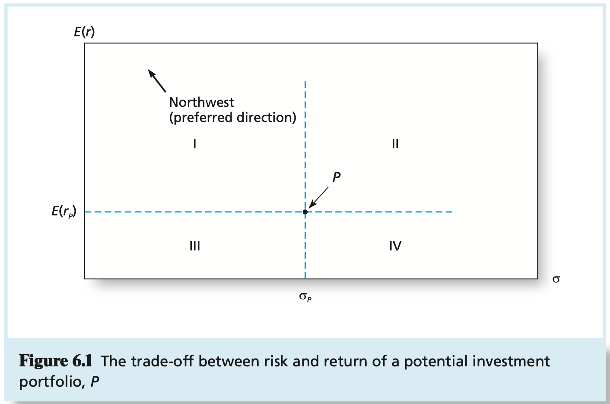

# CHAPTER 6 Capital Allocation to Risky Assets

Investors who are `risk averse` reject investment portfolios that are fair games or worse.

One reasonable function that has been employed by both financial theorists and the CFA Institute assigns a portfolio with expected return $E(r)$ and variance of returns $\sigma^2$ the following utility score:
$$
U = E(r) - 1/2A\sigma^2
$$
, where $U$ is the utility value and $A$ is an index of the investor's risk aversion. The factor of $1/2$ is just a scaling convention.

In contrast to risk-averse investors, `risk-neutral` investors (with A = 0) judge risky prospects solely by their expected rates of return.

A `risk lover` (for whom A < 0) is happy to engage in fair games and gambles; this investor adjusts the expected return `upward` to take into account the "fun" of confronting the prospect's risk.

*Portfolio $P$, which has expected return $E(r_P)$ and standard deviation $\sigma_{P}$, is preferred by risk-averse investors to any portfolio in quadrant $IV$ because its expected return is equal to or greater than any portfolio in that quadrant and its standard deviation is equal to or smaller than any portfolio in that quadrant. Conversely, any portfolio in quadrant $I$ dominates portfolio $P$ because its expected return is equal to or greater than P's and its standard deviation is equal to or smaller than P's.*

This is the mean-standard deviation, or equivalently, `mean-variance (M-V) criterion`. It can be stated as follows: portfolio $A$ dominates $B$ if:
$$
E(r_A) \geq E(r_B)
$$
and:
$$
\sigma_A \leq \sigma_B
$$
, and at least one inequality is strict (to rule out indifference).

With a proportion, $y$, in the risky portfolio, and $1 - y$ in the risk-free asset, the rate of return on the `complete` portfolio, denoted $C$, is $r_C$ where:
$$
r_C = yr_p + (1 - y)r_f
$$
, taking the expectation of this portfolio's rate of return:
$$
\begin{equation}\begin{split}
E(r_C) &= yE(r_P) + (1 - y)r_f \\
&= r_f + y[E(r_P) - r_f] = 7 + y(15 - 7)
\end{split}\end{equation}
$$

With a proportion $y$ in a risky asset, the standard deviation of the complete portfolio is the standard deviation of the risky asset multiplied by the weight, $y$, of the risky asset in that portfolio. Because the standard deviation of the risky portfolio is $\sigma_{P} = 22%$:
$$
\sigma_{C} = y\sigma_{P} = 22y
$$
, which makes sense because the standard deviation of the portfolio is proportional to both the standard deviation of the risky asset and the proportion invested in it. In sum, the expected return of the complete portfolio is $E(r_C) = r_f + y[E(r_P) - r_f] = 7 + 8y$ and the standard deviation is $\sigma_{C} = 22y$.

To solve the utility maximization problem more generally, we write the problem as follows:
$$
Max\ U = E(r_C) - 1/2A\sigma_{C}^2 = r_f + y[E(r_p) - r_f] - 1/2Ay^2\sigma_{P}^2
$$
Students of calculus will recognize that the maximization problem is solved by setting the derivative of this expression to zero. Doing so and solving for $y$ yields the optimal position for risk-averse investors in the risky asset, $y^{*}$, as follows:
$$
y^{*} = \frac{E(r_P) - r_f}{A\sigma_{P}^2}
$$
We call the capital allocation line provided by 1-monty T-bills and a broad index of common stocks the `capital market line` (CML). A passive strategy generates an investment opportunity set that is represented by the CML.

Investing a fraction $y$ in the prospect and the remainder in the risk-free asset provides a total rate of return of $1 + r + by$ with probability $p$, or $1 + r - ay$ with probability $q$. Because Kelly employs a log utility function, the expected utility of the prospect, per dollar of initial wealth, is:
$$
E[U(y)] = p\ ln(1 + r + yb) + q\ ln(1 + r - ay)
$$
, the investment that maximizes the expected utility has become known as the Kelly criterion (or Kelly formula). The criterion states that the fraction of total wealth invested in the risky prospect is independent of wealth and is given by:
$$
y = (1 + r)\left(\frac{p}{a} - \frac{q}{b}\right)
$$
, this will be the investor's asset allocation in each period.

## Vocabulary

aversion

