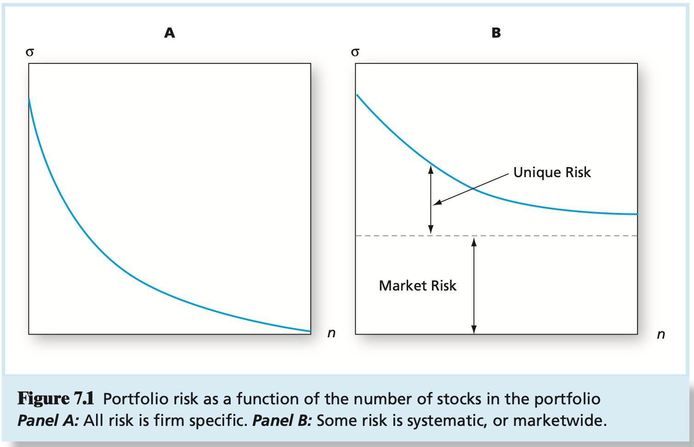
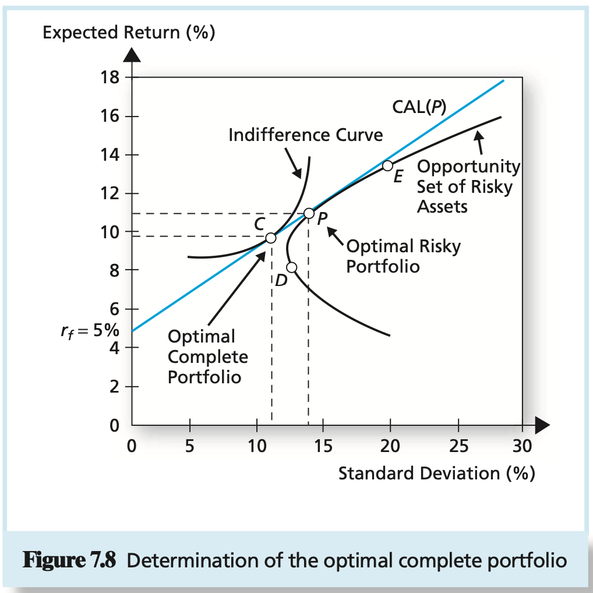
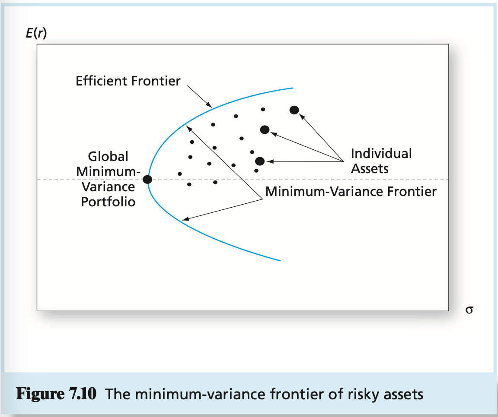
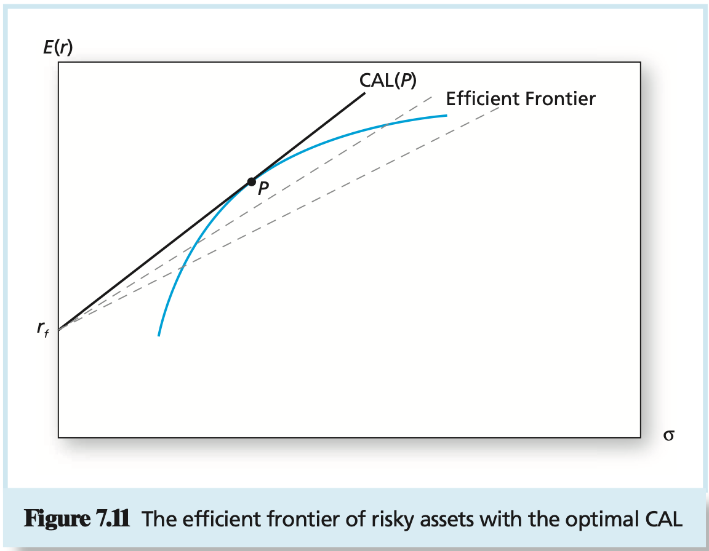
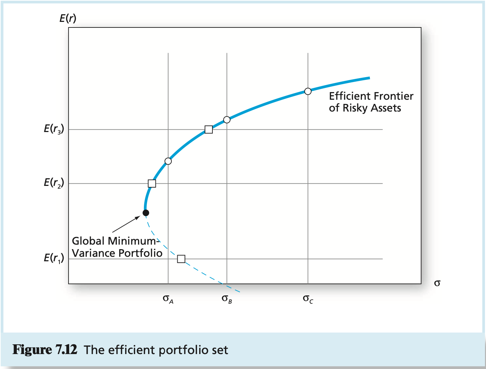

# CHAPTER 7 Optimal Risky Portfolios

The reduction of risk to very low levels in the case of independent risk sources is sometimes called the `insurance principle`, because of the notion that an insurance company depends on the risk reduction achieved through diversification when it writes many policies insuring against many independent sources of risk, each policy being a small part of the company's overall portfolio.

The risk that remains even after extensive diversification is called `market risk`, risk that is attributable to marketwide risk sources. Such risk is also called `systematic risk`, or `nondiversifiable risk`. In contrast, the risk that can be eliminated by diversification is called `unique risk, firm-specific risk, nonsystematic risk`, or `diversifiable risk`.

A proportion denoted by $w_D$ is invested in the bond fund, and the remainder, $1 - w_D$, denoted $w_E$, is invested in the stock fund. The rate of return on this portfolio, $r_p$, will be:
$$
r_p = w_Dr_D + w_Er_E
$$
, where $r_D$ is the rate of return on the debt fund and $r_E$ is the rate of return on the equity fund.

The expected return on the portfolio is a weighted average of expected returns on the component securities with portfolio proportions as weights:
$$
E(r_P) = w_D E(r_D) + w_E E(r_E)
$$
, the variance of the two-asset portfolio is:
$$
\sigma_{p}^2 = w_{D}^2\sigma_{D}^2 + w_{E}^2\sigma_{E}^2 + 2w_Dw_E\ Cov(r_D, r_E)
$$
Out first obsrevation is that the variance of the portfolio, unlike the expected return, is `not` a weighted average of the individual asset variances. To understand the formula for the portfolio variance more clearly, recall that the convariance of a variable with itself is the variance of that variable; that is:
$$
\begin{equation}\begin{split}
Cov(r_D, r_D) &= \sum_{scenarios}Pr(scenario)[r_d - E(r_D)][r_D - E(r_D)] \\
&= \sum_{scenarios}Pr(scenario)[r_D - E(r_D)]^2 \\
&= \sigma_{D}^2\\
\end{split}\end{equation}
$$
, therefore, another way to write the variance of the portfolio is:
$$
\sigma_{p}^2 = w_D w_D Cov(r_D, r_D) + w_E w_E Cov(r_E, r_E) + 2w_D w_E Cov(r_D, r_E)
$$
, notice that the covariance can be computed from the correlation coefficient, $\rho_{DE}$, as:
$$
Cov(r_D, r_E) = \rho_{DE}\sigma_{D}\sigma_{E}
$$
, therefore:
$$
\sigma_{p}^2 = w_{D}^2 \sigma_{D}^2 + w_{E}^2 \sigma_{E}^2 + 2 w_D w_E \sigma_D \sigma_E \rho_{DE}
$$
, other things equal, portfolio variance is higher when $\rho_{DE}$ is higher. In the case of perfect positive correlation, $\rho_{DE} = 1$, the right-hand side of $\sigma_{p}^2 = w_{D}^2 \sigma_{D}^2 + w_{E}^2 \sigma_{E}^2 + 2 w_D w_E \sigma_D \sigma_E \rho_{DE}$ is a perfect square and simplifies to:
$$
\sigma_{p}^2 = (w_D \sigma_D + w_E \sigma_E)^2
$$
or:
$$
\sigma_{p} = w_D \sigma_D + w_E \sigma_E
$$
, therefore, the standard deviation of the portfolio with perfect positive correlation is just the weighted average of the component standard deviations.

portfolios of less than perfectly correlated assets always offer some degree of diversification benefit.

The lowest possible value of the correlation coefficient is $-1$, representing perfect negative correlation. In this case, equation $\sigma_{p}^2 = w_{D}^2 \sigma_{D}^2 + w_{E}^2 \sigma_{E}^2 + 2 w_D w_E \sigma_D \sigma_E \rho_{DE}$ simplifies to:
$$
\sigma_{p}^2 = (w_D \sigma_D - w_E \sigma_E)^2
$$
, and the portfolio standard deviation is:
$$
\sigma_p = Absolute\ value(w_D \sigma_D - w_E \sigma_E)
$$
, when $\rho = -1$, a perfectly hedged position can be obtained by choosing the portfolio proportions to solve:
$$
w_D \sigma_D - w_E \sigma_E = 0
$$
, the solution to this equation is:
$$
w_D = \frac{\sigma_E}{\sigma_D + \sigma_E} \\
w_E = \frac{\sigma_D}{\sigma_D + \sigma_E} = 1 - w_D
$$
In the case of two risky assets, the solution for the weights of the `optimal risky portfolio`, $P$ is given by:
$$
\begin{equation}\begin{split}
w_D &= \frac{E(R_D) \sigma_{E}^2 - E(R_E)Cov(R_D, R_E)}{E(R_D)\sigma_{E}^2 + E(R_E)\sigma_{D}^2 - [E(R_D) + E(R_E)]Cov(R_D, R_E)} \\
w_E &= 1 - w_D
\end{split}\end{equation}
$$
, notice that the solution employs `excess` return (denoted $R$) rather than total returns (denoted $r$).

Once these estimates are compiled, the expected return and variance of any risky portfolio with weights in each security, $w_i$, can be calculated from the bordered covariance matrix or, equivalently:
$$
E(r_p) = \sum_{i = 1}^{n}w_i E(r_i) \\
\sigma_{p}^2 = \sum_{i = 1}^{n} \sum_{j = 1}^{n} w_i w_j Cov(r_i, r_j)
$$
, an extended worked example showing how to do this using a spreadsheet is presented in Appendix A of this chapter.

The general formula for the variance of a portfolio is:
$$
\sigma_{p}^2 = \sum_{i = 1}^{n} \sum_{j = 1}^{n} W_i W_j Cov(r_i, r_j)
$$
, consider now the naive diversification strategy in which an `equally weighted` portfolio is constructed, meaning that $w_i = 1 / n$ for each security. In above equation may be rewritten as follows, where we break out the terms for which $i = j$ into a separate sum, noting that $Cov(r_i, r_j) = \sigma_{i}^2$:
$$
\sigma_{p}^2 = \frac{1}{n} \sum_{i = 1}^{n} \frac{1}{n} \sigma_{i}^2 + \sum_{j = 1, j\neq i}^{n} \sum_{i = 1}^{n} \frac{1}{n^2} Cov(r_i, r_j)
$$
, note that there are $n$ variance terms and $n(n - 1)$ covariance terms in above equation.

If we define the average variance and average covariance of the securities as:
$$
\overline{\sigma}^2 = \frac{1}{n} \sum_{i = 1}^{n} \sigma_{i}^2 \\
\overline{Cov} = \frac{1}{n(n - 1)} \sum_{j = 1, j \neq i}^{n} \sum_{i = 1}^{n} Cov(r_i, r_j)
$$
, we can express portfolio variance as:
$$
\sigma_{p}^{2} = \frac{1}{n} \overline{\sigma}^2 + \frac{n - 1}{n} \overline{Cov}
$$
, to see further the fundamental relationship between systematic risk security correlations, suppose for simplicity that all securities have a common standard deviation, $\sigma$, and all security pairs have a common correlation coefficient, $\rho$. Then the covariance between all pairs of securities is $\rho \sigma^2$, and $\sigma_{p}^{2} = \frac{1}{n} \overline{\sigma}^2 + \frac{n - 1}{n} \overline{Cov}$ becomes:
$$
\sigma_{p}^{2} = \frac{1}{n} \sigma^2 + \frac{n - 1}{n} \rho \sigma^2
$$
`Risk pooling` means merging uncorrelated, risky projects as a means to reduce risk.

`Risk sharing`, the act of selling shares in an attractive risky portfolio to limit risk and yet maintain the Sharpe ratio (profitability) of the resultant position.

For an analysis with $n$ scenarios, where the rate of return in scenario $i$ is $r(i)$ with probability $p(i)$, the expected return is:
$$
E(r) = \sum_{i = 1}^{n}p(i)r(i)
$$
, if you were to increase the rate of return assumed for each scenario by some amount $\Delta$, then the mean return will increase by $\Delta$. If you multiply the rate in each scenario by a factor $w$, the new mean will be multiplied by that factor:
$$
\sum_{i = 1}^{n}p(i) \times [r(i) + \Delta] = \sum_{i = 1}^{n} p(i) \times r(i) + \Delta\sum_{i=1}^{n}p(i) = E(r) + \Delta \\
\sum_{i = 1}^{n}p(i) \times [wr(i)] = w\sum_{i = 1}^{n} p(i) \times r(i) = wE(r)
$$
, $w(D)$, in bonds and the fraction $w(E)$ in stocks. The portfolio's rate of return in each scenario and its expected return are given by:
$$
\begin{equation}\begin{split}
r_P(i) &= w_D r_D(i) + w_E r_E(i) \\
E(r_P) &= \sum p(i)[w_D r_D(i) + w_E r_E(i)] = \sum p(i)w_D r_D(i) + \sum p(i)w_E r_E(i) \\
&= w_D E(r_D) + w_E E(r_E) \\
\end{split}\end{equation}
$$
The variance and standard deviation of the rate of return on an asset from a scenario analysis are given by:
$$
\sigma^2(r) = \sum_{i = 1}^{n}p(i)[r(i) - E(r)]^2 \\
\sigma(r) = \sqrt{\sigma^2(r)}
$$
When you multiply the return in each scenario by a factor $w$, the variance is multiplied by the square of that factor (and the $SD$ is multiplied by $w$):
$$
Var(wr) = \sum_{i = 1}^{n}p(i) \times [wr(i) - E(wr)]^2 = w^2 \sum_{i = 1}^{n}p(i)[r(i) - E(r)]^2 = w^2 \sigma^2 \\
SD(wr) = \sqrt{w^2 \sigma^2} = w\sigma(r)
$$
To avoid having to first compute columns of squared deviations from the mean, however, we can simplify our problem by expressing the variance as a difference between two easily computable terms:
$$
\begin{equation}\begin{split}
\sigma^2(r) &= E[r - E(r)]^2 = E\{r^2 + [E(r)]^2 - 2rE(r)\} \\
&= E(r^2) + [E(r)]^2 - 2E(r)E(r) \\
&= E(r^2) - [E(r)]^2 = \sum_{i = 1}^{n}p(i)r(i)^2 - \left[\sum_{i = 1}^{n}p(i)r(i)\right]^2 \\
\end{split}\end{equation}
$$
The variance of a `portfolio` return is not as simple to compute as the mean. The portfolio variance is `not` the weighted average of the asset variances. The deviation of the portfolio rate of return in any scenario from its mean return is:
$$
\begin{equation}\begin{split}
r_P - E(r_P) &= w_D r_D (i) + w_E r_E (i) - [w_D E(r_D) + w_E E(r_E)] \\
&= w_D[r_D(i) - E(r_D)] + w_E[r_E(i) - E(r_E)] \\
&= w_D d(i) + w_E e(i)
\end{split}\end{equation}
$$
, where the lowercase variables denote deviations from the mean:
$$
d(i) = r_D(i) - E(r_D) \\
e(i) = r_E(i) - E(r_E)
$$
, we express the variance of the portfolio return in terms of these deviations from the mean in above equation:
$$
\begin{equation}\begin{split}
\sigma_{P}^{2} &= \sum_{i = 1}^{n}p(i)[w_D d(i) + w_E e(i)]^2 \\
&= \sum_{i = 1}^{n}p(i)[w_D^2 d(i)^2 + w_E^2 e(i)^2 + 2w_D w_E d(i)e(i)] \\
&= w_D^2 \sum_{i = 1}^{n}p(i)d(i)^2 + w_E^2\sum_{i = 1}^{n}p(i)e(i)^2 + 2w_D w_E\sum_{i = 1}^{n}p(i)d(i)e(i) \\
&= w_D^2 \sigma_D^2 + w_E^2 \sigma_E^2 + 2w_D w_E \sum_{i = 1}^{n}p(i)d(i)e(i)
\end{split}\end{equation}
$$
, the last line in this equation tells us that the variance of a portfolio is the weighted sum of portfolio variances (notice that the weights are the squares of the portfolio weights), plus an additional term that, as we will soon see, makes all the difference.

The covariance between two variables equals:
$$
\begin{equation}\begin{split}
Cov(r_D, r_E) &= E(d \times e) = E\{[r_D - E(r_D)][r_E - E(r_E)]\} \\
&= E(r_D r_E) - E(r_D)E(r_E)
\end{split}\end{equation}
$$
, the covariance is an elegant way to quantify the covariation of two variables. This is easiest seen through a numerical example.
