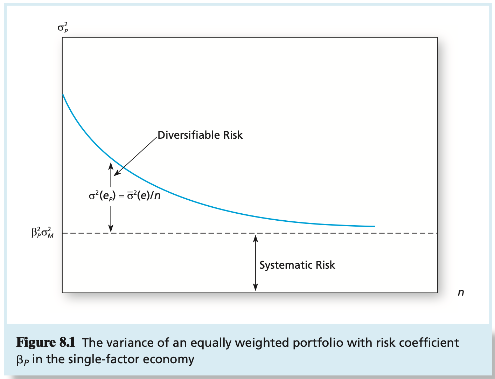

# CHAPTER 8 Index Models

We can always decompose the rate of return on any security, $i$, into the sum of its expected plus unanticipated components:
$$
r_i = E(r_i) + e_i
$$
, where the unexpected return, $e_i$, has a mean of zero and a standard deviation of $\sigma_{i}$ that measures the uncertainty about the security return. Suppose the common factor, $m$, that drives innovations in security returns is some macroeconomic variable that affects all firms. Then we can decompose the sources of uncertainty into uncertainty about the economy as a whole, which is captured by $m$, and uncertainty about the firm in particular, which is captured by $e_i$. In this case, we amend the equation $r_i = E(r_i) + e_i$ to accommodate two sources of variation in return:
$$
r_i = E(r_i) + m + e_i
$$
The macroeconomic factor, $m$, measures unanticipated macro surprises. As such, it has a mean of zero (over time, surprises will average out to zero), with a standard deviation of $\sigma_{m}$. In contrast, $e_i$ measures only the firm-specific surprise. Notice that $m$ has no subscript because the same common factor affects all securities. Most important is the fact that $m$ and $e_i$ are uncorrelated, that is, because $e_i$ is firm-specific, it is independent of shocks to the common factor that affects the entire economy. The variance of $r_i$ thus arises from two uncorrelated sources, systematic and firm-specific. Therefore:
$$
\sigma_{i}^2 = \sigma_{m}^2 + \sigma^2(e_i)
$$
The common factor, $m$, generates correlation across securities, because all securities will respond to the same macroeconomic news, while the firm-specific surprises, captured by $e_i$, are assumed to be uncorrelated across firms. Because $m$ is also uncorrelated with any of the firm-specific surprises, the covariance between any two securities $i$ and $j$ is:
$$
Cov(r_i, r_j) = Cov(m + e_i, m + e_j) = \sigma_{m}^2
$$
Finally, we recognize that some securities will be more sensitive than others to macro-economic shocks. We can capture this refinement by assigning each firm a sensitivity coefficient to macro conditions. Therefore, if we denote the sensitivity coefficient for firm $i$ by the Greek letter beta, $\beta_i$, we modify $r_i = E(r_i) + m + e_i$ to obtain the `single-factor model`:
$$
r_i = E(r_i) + \beta_im + e_i
$$
The systematic risk of security $i$ is $\beta_{i}^2 \sigma_{m}^2$, and its total risk is:
$$
\sigma_{i}^2 = \beta_{i}^2 \sigma_{m}^2 + \sigma^2(e_i)
$$
The covariance between any pair of securities also is determined by their betas:
$$
Cov(r_i, r_j) = Cov(\beta_i m + e_i, \beta_j m + e_j) = \beta_i \beta_j \sigma_{m}^2
$$
, in terms of systematic risk and market exposure, this equation tells us that firms are close substitutes. Equivalent beta securities give equivlent market exposures.

We denote the market index by $M$, with excess return of $R_M = r_M - r_f$, and standard deviation of $\sigma_{M}$. Because the index model is linear, we can estimate the sensitivity (or beta) coefficient of a security on the index using a single-variable linear regression. We regress the excess return of a security, $R_i = r_i - r_f$, on the excess return of the index, $R_M$. To estimate the regression, we collect a historical sample of paired observations, $R_i(t)$ and $R_M(t)$, where $t$ denotes the date of each pair of observations (e.g., the excess returns on the stock and the index in a particular month). The `regression equation` is:
$$
R_i(t) = \alpha_i + \beta_i R_M(t) + e_i(t)
$$
, the intercept of this equation (denoted by the Greek letter alpha, or $\alpha$) is the security's expected excess return `when the market excess return is zero`.

Because $E(e_i) = 0$, if we take the expected value of $E(R_i)$ in equation $R_i(t) = \alpha_i + \beta_i R_M(t) + e_i(t)$, we obtain the expected return-beta relationship of the single-index model:
$$
E(R_i) = \alpha_i + \beta_i E(R_M)
$$
, the second term in above equation tells us that part of a security's risk premium is due to the risk premium of the index.

Both variances and covariances are determined by the security betas and the properties of the market index:
$$
\begin{equation}\begin{split}
Total\ risk &= Systematic\ risk + Firm-specific\ risk \\
\sigma_{i}^2 &= \beta_{i}^2 \sigma_{M}^2 + \sigma^2(e_i) \\
Covariance &= Product\ of\ betas \times Market-index\ risk \\
Cov(r_i, r_j) &= \beta_i \beta_j \sigma_{M}^2 \\
Correlation &= Product\ of\ correlations\ with\ the\ market\ index \\
Corr(r_i, r_j) &= \frac{\beta_i \beta_j \sigma_{M}^2}{\sigma_i \sigma_j} = \frac{\beta_i \sigma_{M}^2 \beta_j \sigma_{M}^2}{\sigma_i \sigma_M \sigma_j \sigma_M} = Corr(r_i, r_M) \times Corr(r_j, r_M)
\end{split}\end{equation}
$$
We can write the excess return on the portfolio of stocks as:
$$
R_P = \alpha_P + \beta_P R_M + e_p
$$
Note that the excess rate of return on this equally weighted portfolio, for which each portfolio weight $w_i = 1 / n$, is:
$$
\begin{equation}\begin{split}
R_P &= \sum_{i = 1}^{n}w_i R_i = \frac{1}{n} \sum_{i = 1}^{n}R_i = \frac{1}{n} \sum_{i = 1}^{n}(\alpha_i + \beta_i R_M + e_i) \\
&= \frac{1}{n} \sum_{i = 1}^{n} \alpha_i + \left(\frac{1}{n} \sum_{i = 1}^{n} \beta_i \right)R_M + \frac{1}{n} \sum_{i = 1}^{n} e_i \\
\end{split}\end{equation}
$$
, we see that the portfolio has a sensitivity to the market given by:
$$
\beta_P = \frac{1}{n} \sum_{i = 1}^{n} \beta_i
$$
, which is the average of the individual $\beta_i s$. It has a onmarket return component of:
$$
\alpha_P = \frac{1}{n} \sum_{i = 1}^{n} \alpha_i
$$
, which is the average of the individual alphas, plus the zero mean variable:
$$
e_p = \frac{1}{n} \sum_{i = 1}^{n}e_i
$$
, which is the average of the firm-specific components. Hence the portfolio's variance is:
$$
\alpha_{P}^2 = \beta_{P}^2 \alpha_{M}^2 + \alpha^2(e_P)
$$
The nonsystematic component of the portfolio variance is $\sigma^2(e_P)$ and is attributable to firm-specific components, $e_i$. Because these $e_i s$ are independent, and all have zero expected value, the law of averages can be applied to conclude that as more and more stocks are added to the portfolio, the firm-specific components tend to cancel out, resulting in ever-smaller nonmarket risk. Such risk is thus termed `diversifiable`. To see this more rigorously, examine the formula for the variance of th equally weighted "portfolio" of firm-specific components. Because the $e_i s$ are uncorrelated:
$$
\sigma^2(e_P) = \sum_{i = 1}^{n}\left(\frac{1}{n}\right)^2 \sigma^2(e_i) = \frac{1}{n} \overline{\sigma}^2(e)
$$
, where $\overline{\sigma}^2(e)$ is the average of the firm-specific variances. Because this average is independent of $n$, when $n$ gets large, $\sigma^2(e_P)$ becomes negligible.

The regression estimates describe a straight line with intercept $\alpha_{HP}$ and $\beta_{HP}$, which we call the `security characteristic line (SCL)` for Hewlett-Packard.

The single-index model create a framework that separates these two quite different sources of return variation and makes it easier to ensure consistency across analysts. We can lay down a hierarchy of the preparation of the input list using the framework of the single-index model:

1. Macroeconomic analysis is used to estimate the risk premium and risk of the market index.
2. Statistical analysis is used to estimate the beta coefficients of all securities and their residual variances, $\sigma^2(e_i)$.
3. The portfolio manager uses the estimates for the market-index risk premium and the beta coefficient of a security to establish the expected return of that security `absent` any contribution from security analysis. The market-driven expected return is conditional on information common to all securities, not on information gleaned from security analysis of particular firms. This market-driven expected return can be used as a benchmark.
4. Security-specific expected return forecasts (specifically, security alphas) are derived from various security-valuation models. Thus, the alpha value distills the `incremental` risk premium attributable to private information developed from security analysis.

Specifically:
$$
\alpha_P = \sum_{i = 1}^{n + 1}w_i \alpha_i\quad and\ for\ the\ index,\ \alpha_{n + 1} = \alpha_M = 0 \\
\beta_P = \sum_{i = 1}^{n + 1}w_i \beta_i\quad and\ for\ the\ index, \beta_{n + 1} = \beta_M = 1 \\
\alpha^2(e_P) = \sum_{i = 1}^{n + 1}w_i^2 \alpha^2(e_i)\quad and\ for\ the\ index, \alpha^2(e_{n + 1}) = \alpha^2(e_M) = 0
$$
, the objective is to maximize the sharpe ratio of the portfolio by using portfolio weights, $w_1, ..., w_{n + 1}$. With this set of weights, the expected return, standard deviation, and sharpe ratio of the portfolio are:
$$
E(E_P) = \alpha_P + E(R_M)\beta_P = \sum_{i = 1}^{n + 1}w_i \alpha_i + E(R_M)\sum_{i = 1}^{n + 1}w_i \beta_i \\
\alpha_P = [\beta_P^2 \alpha_M^2 + \alpha^2(e_P)]^{1/2} = \left[\alpha_M^2 \left(\sum_{i = 1}^{n + 1}w_i\beta_i \right)^2 + \sum_{i = 1}^{n + 1}w_i^2 \alpha^2(e_i) \right]^{1/2} \\
S_P = \frac{E(R_P)}{\sigma_P}
$$
The analogous ratio for the index portfolio is $E(R_M)/\sigma_{M}^2$, and hence the initial position in the active portfolio (i.e., if its beta were 1) is:
$$
w_A^0 = \frac{\frac{\alpha_A}{\alpha_A^2}}{\frac{E(R_M)}{\alpha_M^2}}
$$
For any level of $\sigma_A^2$, the correlation between the active and passive portfolios is greater when the beta of the active portfolio is higher. This implies less diversification benefit from the passive portfolio and a lower position in it. Correspondingly, the position in the active portfolio increases. The precise modification for the position in the active portfolio is:
$$
w_A^{*} = \frac{w_A^0}{1 + (1 - \beta_A)w_A^0}
$$
, notice that when $\beta_A = 1, w_A^{*} = w_A^{0}$.

With $w_A^{*}$ in the active portfolio and $1 - w_{A}^{*}$ invested in the index portfolio, we can compute the expected return, standard deviation, and Sharpe ratio of th eoptimal risky portfolio. The sharpe ratio of an optimally constructed risky portfolio will exceed that of the index portfolio (the passive strategy). The exact relationship is:
$$
S_P^2 = S_M^2 = \left[\frac{\alpha_A}{\sigma(e_A)}\right]^2
$$
Scaling the ratio of $\alpha_i / \alpha^2(e_i)$ so that the total position in the active portfolio adds up to $w_A^{*}$, the weight in each security is:
$$
w_i^{*} = w_A^{*} \frac{\frac{\alpha_i}{\sigma^2(e_i)}}{\sum_{i=1}^{n} \frac{\alpha_i}{\sigma^2(e_i)}}
$$
, with this set of weights, the contribution of each security to the information ratio of the active portfolio is the square of its `own` information ratio, that is:
$$
\left[\frac{\alpha_A}{\sigma(e_A)}\right]^2 = \sum_{i=1}^{n} \left[\frac{\alpha_i}{\sigma(e_i)}\right]^2
$$
Once security analysis is complete, the optimal risky portfolio is formed from the index model estimates of security and market index parameters using these steps:

1. Compute the initial position of each security in the active portfolio as $w_i^0 = \alpha_i / \sigma^2(e_i)$.
2. Scale those initial positions to force portfolio weights to sum to 1 by dividing by their sum, that is, $w_i = \frac{w_i^0}{\sum_{i=1}^{n} w_i^0}$.
3. Compute the alpha of the active portfolio:$\alpha_A = \sum_{i=1}^{n} w_i \alpha_i$.
4. Compute the residual variance of the active portfolio: $\sigma^2(e_A) = \sum_{i=1}^{n}w_i^2 \sigma^2(e_i)$.
5. Compute the initial position in the active portfolio: $w_A^0 = \left[\frac{\alpha_A/\sigma^2(e_A)}{E(R_M)/\sigma_M^2}\right]$.
6. Compute the beta of the active portfolio: $\beta_A = \sum_{i=1}^{n}w_i\beta_i$.
7. Adjust the initial position in the active portfolio: $w_A^{*} = \frac{w_A^0}{1 + (1 - \beta_A)w_A^0}$.
8. Note: the optimal risky portfolio now has weights: $w_M^{*} = 1 - w_A^{*}; w_i^{*} = w_A^{*}w_i$.
9. Calculate the risk premium of the optimal risky portfolio from the risk premium of the index portfolio and the alpha of the active portfolio: $E(R_P) = (w_M^{*} + w_A^{*}\beta_A)E(R_M) + w_A^{*}\alpha_A$. Notice that the beta of the risky portfolio is $w_M^{*} + w_A^{*}\beta_A$ because the beta of the index portfolio is 1.
10. Compute the variance of the optimal risky portfolio from the variance of the index portfolio and the residual variance of the active portfolio: $\sigma_P^2 = (w_M^{*} + w_A^{*}\beta_A)^2\sigma_M^2 + [w_A^{*}\sigma(e_A)]^2$.

A portfolio manager who has neither special information about a security nor insight that is unavailable to the general public will take the security's alpha value as zero, and, according to equation $E(R_i) = \alpha_i + \beta_i E(R_M)$, will forecast a risk premium for the security equal to $\beta_i R_M$. If we restate this forecast in terms of total returns, one would expect:
$$
E(r_i) = r_f + \beta_i[E(r_M) - r_f]
$$
Estimate a variant of our index model, which is:
$$
r = a + br_M + e^{*}
$$
, instead of:
$$
r - r_f = \alpha + \beta(r_M - r_f) + e
$$
, to see the effect of this departure, we can rewrite above equation as:
$$
r = r_f + \alpha + \beta r_M - \beta r_f + e = \alpha + r_f(1 - \beta) + \beta r_M + e
$$
, comparing the above equations, you can see that if $r_f$ is constant over the sample period, both equations have the same independent variable, $r_M$, and residual, $e$. Therefore, the slope coefficient will be the same in the two regressions.

One simple approach would be to collect data on beta in different periods and then estimate a regression equation:
$$
Current\ beta = a + b(Past beta)
$$
Given estimates of $a$ and $b$, we would then forecast future betas using the rule:
$$
Forecast\ beta = a + b(Current\ beta)
$$
Suppose a portfolio manager believes she has identified an underpriced portfolio. Her security analysis team estimates the index model equation for this portfolio (using the S&P 500 index) in excess return form and obtains the following estimates:
$$
R_P = .04 + 1.4R_{S\&P500} + e_P
$$
Consider buying portfolio $P$ but at the same time offsetting systematic risk by assuming a short position in the tracking portfolio. The short position in $T$ cancels out the systematic exposure of the long position in $P$: the overall combined position is thus `market neutral`. Therefore, even if the market does poorly, the combined position should not be affected. But the alpha on portfolio $P$ will remain intact. The combined portfolio, $C$, provides an excees return per dollar of:
$$
R_C = R_P - R_T = (.04 + 1.4R_{S\&P500} + e_P) - 1.4R_{S\&P500} = .04 + e_P
$$
, while this portfolio is still risky (due to the residual risk, $e_P$), the systematic has been eliminated, and if $P$ is reasonably well-diversified, the remaining nonsystemic risk will be small.
