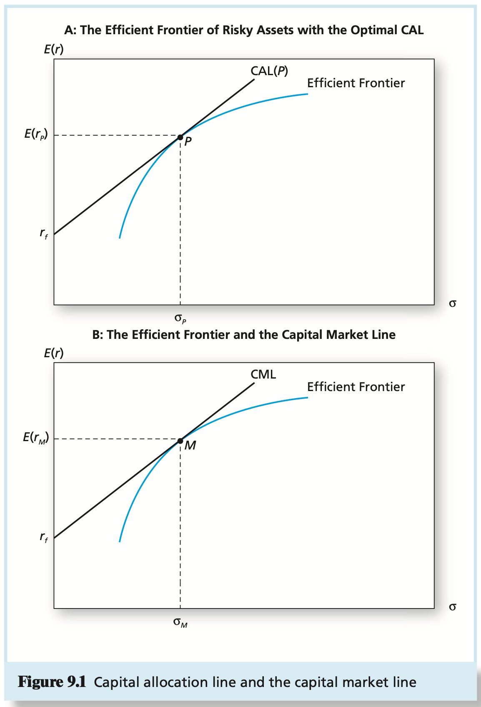
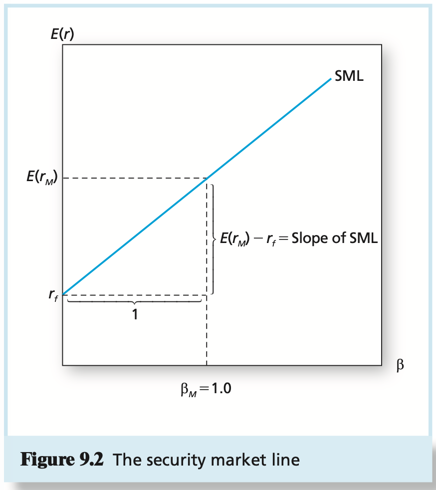
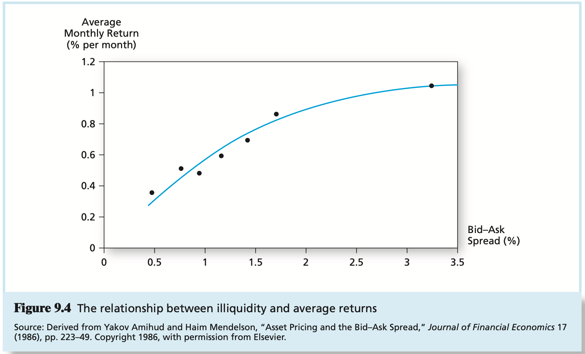

# CHAPTER 9 The Capital Asset Pricing Model

Recall that each individual investor chooses a proportion $y$, allocated to the optimal portfolio $M$, such that:
$$
y = \frac{E(r_M - r_f)}{A \alpha_M^2}
$$
, where $E(r_M) - r_f = E(R_M)$ is the risk premium (expected excess return) on the market portfolio. Setting $y = 1$ in this equation and rearranging, we find that the risk premium on the market portfolio is related to its variance by the average degree of risk aversion:
$$
E(R_M) = \overline{A} \sigma_M^2
$$
The contribution of GE's stock to the variance of the market portfolio is:
$$
w_{GE}[w_1 Cov(R_1, R_{GE}) + w_2Cov(R_2, R_{GE}) + ... + w_{GE}Cov(R_{GE}, R_{GE}) + ... + w_n Cov(R_n, R_{GE})]
$$
, notice that every term in the square brackets can be slightly rearranged as follows: $w_i Cov(R_i, R_{GE}) = Cov(w_i R_i, R_{GE})$. Moreover, because covariance is additive, the sum of the term in the square brackets is:
$$
\sum_{i=1}^{n}w_i Cov(R_i, R_{GE}) = \sum_{i = 1}^{n} Cov(w_i R_i, R_{GE}) = Cov \left(\sum_{i=1}^{n}w_i R_i, R_{GE}\right)
$$
, but because $\sum_{i=1}^{n}w_i R_i = R_M$, this equation implies that:
$$
\sum_{i=1}^{n}w_i Cov(R_i, R_{GE}) = Cov(R_M, R_{GE})
$$
, and therefore, GE's contribution to the variance of the market portfolio may be more simply stated as $w_{GE}Cov(R_M, R_{GE})$.

The market portfolio is the tangency (efficient mean-variance) portfolio. The reward-to-risk ratio for investment in the market portfolio is:
$$
\frac{Market\ risk\ premium}{Market\ variance} = \frac{E(R_M)}{\sigma_M^2}
$$
, this ratio is often called the `market price of risk` because it quantifies the extra return that investors demand to bear portfolio risk.

We conclude that the reward-to-risk ratios of GE and the market portfolio should be equal:
$$
\frac{E(R_{GE})}{Cov(R_{GE}, R_M)} = \frac{E(R_M)}{\sigma_M^2}
$$
, to determine the fair risk premium of GE stock, we rearrange above equation slightly to obtain:
$$
E(R_{GE}) = \frac{Cov(R_{GE}, R_M)}{\sigma_M^2}E(R_M)
$$
, the ratio $Cov(R_{GE}, R_M)/\sigma_M^2$ measures the contribution of GE stock to the variance of the market portfolio as a fraction of the total variance of the market portfolio. The ratio is called `beta` and is denoted by $\beta$. Using this measure, we can restate above equation as:
$$
E(r_{GE}) = r_f + \beta_{GE}[E(r_M) - r_f]
$$
, this `expected return-beta` (or `mean-beta`) `relationship` is the most familiar expression of the CAPM to practitioners.

The expected return-beta relationship can be portrayed graphically as the `security market line (SML)` in Figure 9.2. Because the market's beta is 1, the slope is the risk premium of the market portfolio. At the point on the horizontal axis where $\beta = 1$, we can read off the vertical axis the expected return on the market portfolio.

The difference between the fair and actually expected rates of return on a stock is called the stock's `alpha`, denoted by $\alpha$.

The key implications of the CAPM can be summarized by these two statements:

1. The market portfolio is efficient.
2. The risk premium on a risky asset is proportional to its beta.

The excess return on any stock is described by equation $R_P = \alpha_P + \beta_P R_M + e_P$ and restated here:
$$
R_i = \alpha_i + \beta_i R_M + e_i
$$
Each firm-specific, zero-mean residual, $e_i$, is uncorrelated across stocks and uncorrelated with the market factor, $R_M$. Residuals represent diversifiable, nonsystematic, or unique risk. The total risk of a stock is then just the sum of the variance of the systematic component, $\beta_i R_M$, and the variance of $e_i$. In sum, the risk premium (mean excess return) and variance are:
$$
E(R_i) = \alpha_i + \beta_i E(R_M) \\
\sigma_i^2 = \beta_i^2 \sigma_M^2 + \sigma^2(e_i)
$$
, the return on a portfolio, $Q$, constructed from $N$ stocks (ordered by $k = 1, ..., N$) with a set of weights, $w_k$, must satisfy above equation, which states that the portfolio alpha, beta, and residual will be the weighted average of the respective parameters of the component securities:
$$
R_Q = \sum_{k=1}^{N}w_k \alpha_k + \sum_{k=1}^{N}w_k \beta_k R_M + \sum_{k=1}^{N}w_k e_k = \alpha_Q + \beta_Q R_M + e_Q
$$
We have cited explicitly only these three assumptions:

1. Investors are rational, mean-variance optimizers.
2. Investors use identical input lists, referred to as `homogeneous expectations`.
3. All assets are publicly traded (short positions are allowed) and investors can borrow or lead at a common risk-free rate.

We start with the fact that short positions are not as easy to take as long ones for three reasons:

1. The liability of investors who hold a short position in an asset is potentially unlimited, since the price may rise without limit. Hence a large short position requires large collateral, and proceeds cannot be used to invest in other risky assets.
2. There is a limited supply of shares of any stock to be borrowed by would-be short sellers. It often happens that investors simply cannot find shares to borrow in order to short.
3. Many investment companies are prohibited from short sales. The U.S. and other countries further restrict short sales by regulation.

Efficient frontier portfolios have a number of interesting characteristics, independently derived by Merton and Roll. Two of these are:

1. Any portfolio that is a combination of two frontier portfolios is itself on the efficient frontier.

2. Every portfolio on the efficient frontier, except for the global minimum-variance portfolio, has a "companion" portfolio on the bottom (inefficient) half of the frontier with which it is uncorrelated. Because it is uncorrelated, the companion portfolio is referred to as the `zero-beta portfolio` of the efficient portfolio. If we choose the market portfolio $M$ and its zero-beta companion portfolio $Z$, then we obtain a CAPM-like equation:
   $$
   E(r_i) - E(r_Z) = [E(R_M) - E(R_Z)] \frac{Cov(r_i, r_M)}{\sigma_M^2} = \beta_i[E(r_M) - E(r_Z)]
   $$
   , this equation resembles the SML of the CAPM, except that the risk-free rate is replaced with the expected return on the zero-beta companion of the market-index portfolio.

The resultant SML equation is:
$$
E(R_i) = E(R_M) \frac{Cov(R_i, R_M) + \frac{P_H}{P_M} Cov(R_i, R_H)}{\sigma_M^2 + \frac{P_H}{P_M} Cov(R_M, R_H)}
$$
, where:

- $P_H$ = value of aggregate human capital
- $P_M$ = market value of traded assets (market portfolio)
- $R_H$ = excess rate of return on aggregate human capital

More generally, suppose we can identify $K$ sources of extramarket risk and find $K$ associated hedge portfolios. Then, Merton's ICAPM expected return-beta equation would generalize the SML to a multi-index version:
$$
E(R_i) = \beta_{iM} E(R_M) + \sum_{k=1}^{K} \beta_{ik} E(R_k)
$$
, where $\beta_{iM}$ is the familiar security beta on the market-index portfolio, and $\beta_{ik}$ is the beta on the $k$th hedge portfolio.

We can write the risk premium on an asset as a function of its "consumption risk" as follows:
$$
E(R_i) = \beta_{iC}RP_C
$$
, where portfolio $C$ may be interpreted as a `consumption-tracking portfolio` (also called a `consumption-mimicking portfolio`), that is, the portfolio with the highest correlation with consumption growth; $\beta_{iC}$ is the slope coefficient in the regression of asset $i$'s excess returns, $R_i$, on those of the consumption-tracking portfolio; and, finally, $RP_C$ is the risk premium associated with consumption uncertainty, which is measured by the expected excess return on the consumption-tracking portfolio:
$$
RP_C = E(R_C) = E(r_C) - r_f
$$
In the linear relationship between the market-index risk premium and that of the consumption portfolio:
$$
E(R_M) = \alpha_M + \beta_{MC}E(R_C) + \varepsilon_M
$$
, where $\alpha_M$ and $\varepsilon_M$ allow for empirical deviation from the exact model in equation $E(R_i) = \beta_{iC}RP_C$, and $\beta_{MC}$ is not necessarily equal to 1.

The `liquidity` of an asset is the ease and speed with which it can be sold at fair market value. Conversely, `illiquidity` can be measured in part by the discount from fair market value a seller must accept if the asset is to be sold quickly.

The objective is to test the SML equation, $E(R_i) = \beta_i R_M$. We do so with a regression of excess returns of a sample of stocks $(i = 1, ..., N)$ over a given period, $t$, against the betas of each stock:
$$
R_{i,t} = \lambda_0 + \lambda_1\beta_i + \lambda_2\sigma_{e_i}^2 + \eta_{i,t}
$$
, the CAPM predicts that $\lambda_0 = 0$, that is, the average alpha in the sample will be zero; $\lambda_1 = R_M$, that is, the slope of the SML equals the market-index risk premium; and $\lambda_2 = 0$, that is, unique risk, $\sigma_{e_i}^2$, doesn't earn a risk premium. $\eta_i$ is the zero-mean residual of this regression.

## Summary

TODO