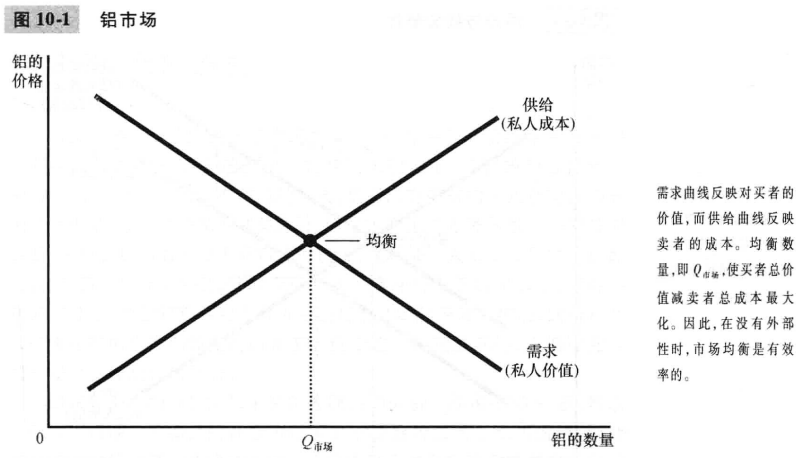
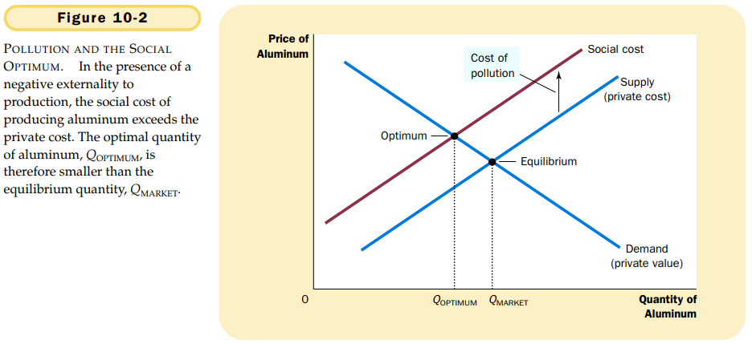
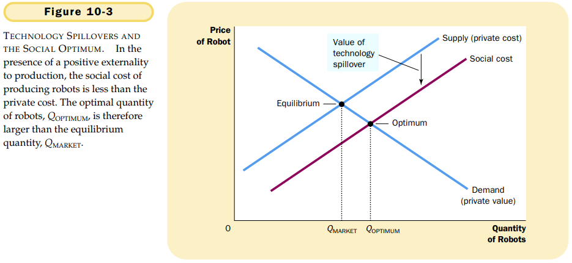
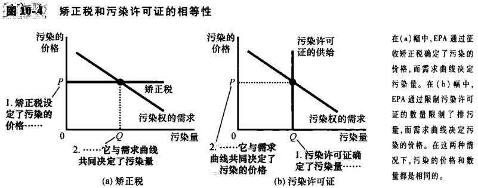

# 第10章 外部性

## 10.1 外部性和市场无效率

### 10.1.1 福利经济学：回顾

### 10.1.2 负外部性

`外部性内在化（internalizing the externality）`改变激励，以使人们考虑到自己行为的外部效应。

### 10.1.3 正外部性

负外部性使市场生产的数量大于社会合意的数量，正外部性使市场生产的数量小于社会合意的数量。为了解决这个问题，政府可以通过对有负外部性的物品征税和给予有正外部性的物品补贴来使外部性内在化。

## 10.2 针对外部性的公共政策

### 10.2.1 命令与控制政策：管制

### 10.2.2 以市场为基础的政策1：矫正税与补贴

`矫正税（corrective taxes）`旨在引导私人决策者考虑负外部性引起的社会成本的税收。

### 10.2.3 以市场为基础的政策2：可交易的污染许可证

### 10.2.4 对关于污染的经济分析的批评

## 10.3 外部性的私人解决方法

### 10.3.1 私人解决方法的类型

### 10.3.2 科斯定理

`科斯定理（Coase theorem）`如果私人各方可以无成本地就资源配置进行协商，那么他们就可以自己解决外部性问题。

科斯定理说明，私人经济主体可以解决他们之间的外部性问题。无论最初的权利如何分配，有关各方总可以达成一种协议，在这种协议中，每个人的状况都可以变好，而且，结果是有效率的。

### 10.3.3 为什么私人解决方法并不总是有效

`交易成本（transaction cost）`各方在达成协议与遵守协议过程中所发生的成本。

## 10.4 结论

- 当买者和卖者之间的交易间接影响第三方时，这种影响称为外部性。如果一项活动产生了负外部性（例如污染），市场的社会最优量将小于均衡量。如果一项活动产生了正外部性（例如技术溢出效应），社会最优量将大于均衡量。
- 政府用各种政策来解决外部性引起的无效率。
- 受外部性影响的人有时可以用私人方法解决问题。