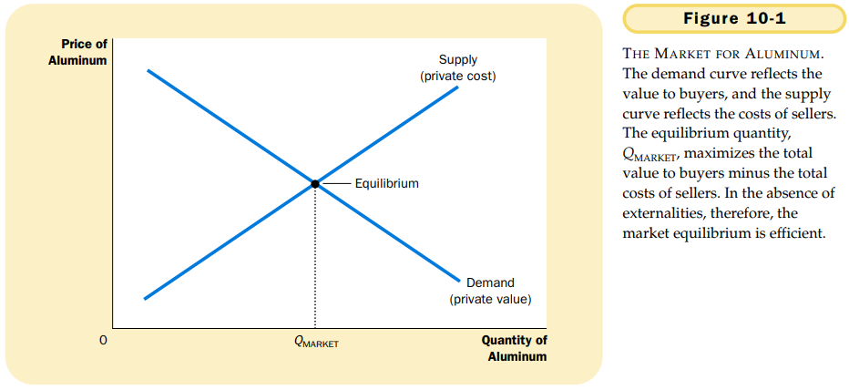
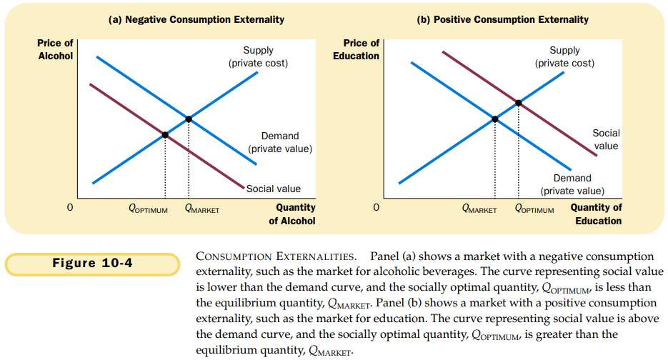

# CHAPTER 10 EXTERNALITIES

`internalizing an externality`. altering incentives so that people take account of the external effects of their actions.

Negative externalities in production or consumption lead markets to produce a larger quantity than is socially desirable. Positive externalities in production or consumption lead markets to produce a smaller quantity than is socially desirable. To remedy the problem, the government can internalize the externality by taxing goods that have negative externalities and subsidizing goods that have positive externalities.

`Coase theorem`. the proposition that if private parties can bargain without cost over the allocation of resources, they can solve the problem of externalities on their own.

The Coase theorem says that private economic actors can solve the problem of externalities among themselves. Whatever the initial distribution of rights, the interested parties can always reach a bargain in which everyone is better off and the outcome is efficient.

`transaction costs`. the costs that parties incur in the process of agreeing and following through on a bargain.

`Pigovian tax`. a tax enacted to correct the effects of a negative externality.

## Summary

- When a transaction between a buyer and seller directly affects a third party, the effect is called an externality. Negative externalities, such as pollution, cause the socially optimal quantity in a market to be less than the socially optimal quantity in a market to be less than the equilibrium quantity. Positive externalities, such as technology spillovers, cause the socially optimal quantity to be greater than the equilibrium quantity.
- Those affected by externalities can sometimes solve the problem privately. For instance, when on business confers an externality on another business, the two businesses can internalize the externality by merging. Alternatively, the interested parties can solve the problem by negotiating a contract. According to the Coase theorem, if people can bargain without cost, then they can always reach an aggrement in which resources are allocated efficiently. In many cases, however, reaching a bargain among the many interested parties is difficult, so the Coase theorem does not apply.
- When private parties cannot adequately deal with external effects, such as pollution, the government often steps in. Sometimes the government prevents socially inefficient activity by regulating behavior. Other times it internalizes an externality using Pigovian taxes. Another way to protect the environment is for the government to issue a limited number of pollution permits. The end result of this policy is largely the same as imposing Pigovian taxes on polluters.