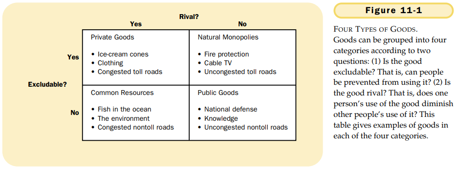

# CHAPTER 11 PUBLIC GOODS AND COMMON RESOURCES

`excludability`. the property of a good whereby a person can be prevented from using it.

`rivalry`. the property of a good whereby one person's use diminishes other people's use.

In thinking about the various goods in the economy, it is useful to group them according to two characteristics:

- Is the good excludable? Can people be prevented from using the  good?
- Is the good rival? Does one person's use of the good diminish another person's enjoyment of it?

Using these two characteristics, Figure 11-1 divides goods into four categories:

1. `Private goods` are both excludable and rival.
2. `Public goods` are neither excludable nor rival.
3. `Common resources` are rival but not excludable.
4. When a good is excludable but not rival, it is an example of a `natural monopoly`.

`free rider`. a person who receives the benefit of a good but avoids paying for it.

`cost-benefit analysis`. a study that compares the costs and benefits to society of providing a public good.

`Tragedy of the Commons`. a parable that illustrates why common resources get used more than is desirable from the standpoint of society as a whole.

## Summary

- Goods differ in whether they are excludable and whether they are rival. A good is excludable if it is possible to prevent someone from using it. A good is rival if one person's enjoyment of the good prevents other people from enjoying the same unit of the good. Markets work best for private goods, which are both excludable and rival. Markets do not work as well for other types of goods.
- Public goods are neither rival nor exclusdable. Examples of public goods include fireworks displays, national defense, and the creation of fundamental knowledge. Because people are not charged for their use of the public good, they have an incentive to free ride when the good is provided privately. Therefore, governments provide public goods, making their decision about the quantity based on cost-benefit analysis.
- Common resources are rival but not excludable. Examples include common grazing land, clean air, and congested roads. Because people are not charged for their use of common resources, they tend to use them excessively. Therefore, governments try to limit the use of common resources.

