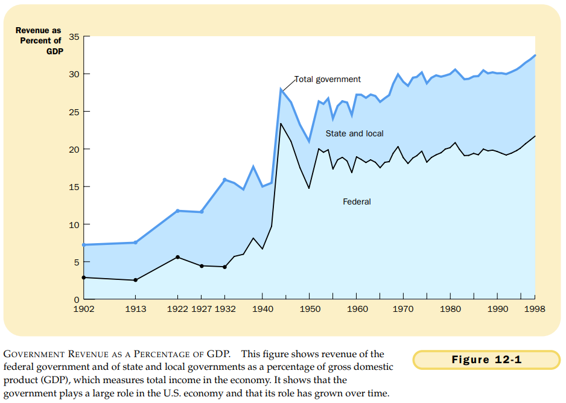

# CHAPTER 12 THE DESIGN OF THE TA X SYSTEM

`budget surplus`. an excess of government receipts over government spending.

`budget deficit`. an excess of government spending over government receipts.

`average tax rate`. total taxes paid divided by total income.

`marginal tax rate`. the extra taxes paid on an additional dollar of income.

`lump-sum tax`. a tax that is the same amount for every person.

`benefits principle`. the idea that people should pay taxes based on the benefits they receive from government services.

`ability-to-pay principle`. the idea that taxes should be levied on a person according to how well that person can shoulder the burden.

`vertical equity`. the idea that taxpayers with a greater ability to pay taxes should pay larger amounts.

`horizontal equity`. the idea that taxpayers with similar abilities to pay taxes should pay the same amount.

`proportional tax`. a tax for which high-income and low-income taxpayers pay the same fraction of income.

`regressive tax`. a tax for which high-income taxpayers pay a smaller fraction of their income than do low-income taxpayers.

`progressive tax`. a tax for which high-income taxpayers pay a larger fraction of their income than do low-income taxpayers.

## Summary

TODO
