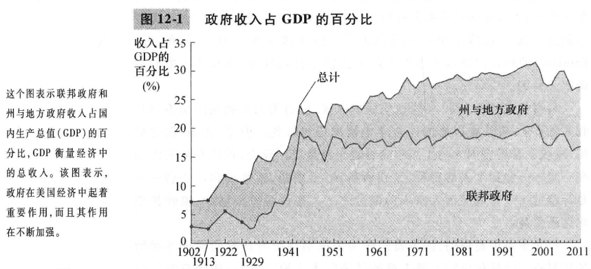
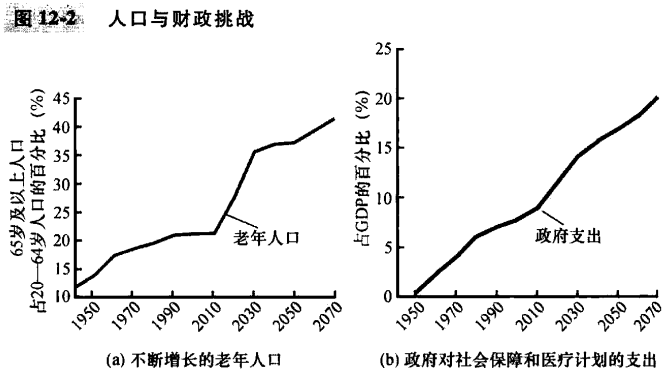

# 第12章 税制的设计

`预算赤字（budget deficit）`政府支出大于政府收入。

`预算盈余（budget surplus）`政府收入大于政府支出。

`平均税率（average tax rate）`支付的总税收除以总收入。

`边际税率（marginal tax rate）`增加1美元收入所支付的额外税收。

`定额税（lump-sum tax）`对每个人等量征收的税收。

`受益原则（benefits principle）`认为人们应该根据他们从政府服务中得到的利益来纳税的思想。

`支付能力原则（ability-to-pay principle）`认为应该根据一个人可以承受的负担来对这个人征税的思想。

`纵向平等（vertical equity）`认为支付能力更强的纳税人应该缴纳等量税收。

`横向平等（horizontal equity）`认为有相似支付能力的纳税人应该缴纳等量税收。

`比例税（proportional tax）`高收入纳税人和低收入纳税人缴纳收入中相同比例的税收。

`累退税（regressive tax）`高收入纳税人缴纳的税收在收入中的比例低于低收入纳税人的这一比例。

`累进税（progressive tax）`高收入纳税人缴纳的税收在收入中的比例高于低收入纳税人的这一比例。

## 内容提要

- 美国政府用各种税收筹集收入。
- 税制的效率是指它给纳税人带来的成本。
- 税制的平等涉及税收负担是否公平地在个人之间进行分配。
- 当考虑税法的变动时，决策者经常面临效率与平等之间的权衡取舍。

