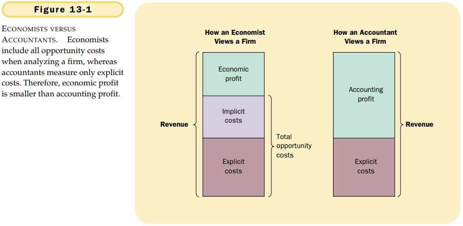
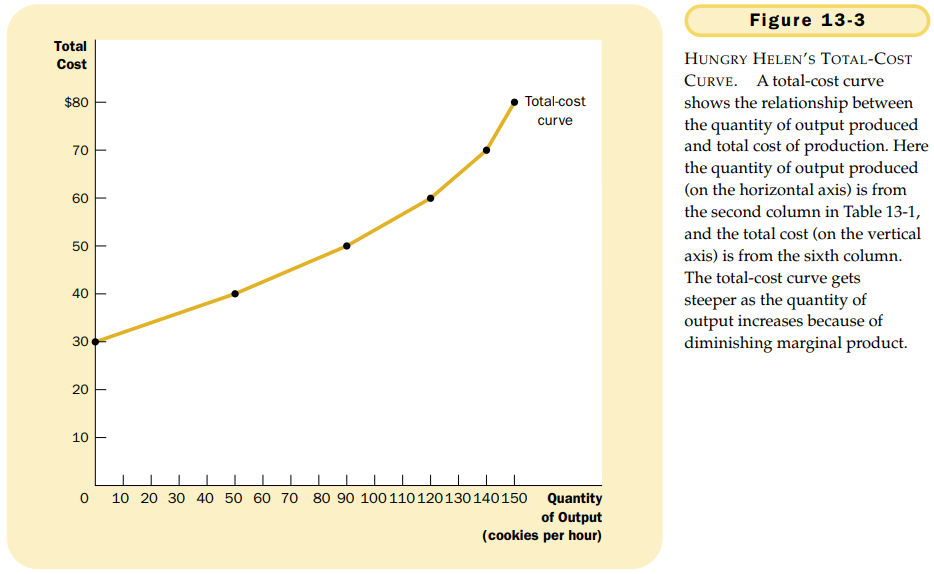

# CHAPTER 13 THE COSTS OF PRODUCTION

`total revenue`. the amount a firm receives for the sale of its output.

`total cost`. the market value of the inputs a firm uses in production.

`profit`. total revenue minus total cost. $Profit = Total\ revenue - Total\ cost$.

`explicit costs`. input costs that require an outlay of money by the firm.

`implicit costs`. input costs that do not require an outlay of money by the firm.

`economic profit`. total revenue minus total cost, including both explicit and implicit costs.

`accounting profit`. total revenue minus total explicit cost.

`production function`. the relationship between quantity of inputs used to make a good and the quantity of output of that good.

`marginal product`. the increase in output that arises from an additional unit of input.

`diminishing marginal product`. the property whereby the marginal product of an input declines as the quantity of the input increases.

`fixed costs`. costs that do not vary with the quantity of output produced.

`variable costs`. costs that do vary with the quantity of output produced.

`(average total cost, ATC)`. total cost divided by the quantity of output.

`(average fixed cost, AFC)`. fixed costs divided by the quantity of output.

`(average variable cost, AVC)`. variable costs divided by the quantity of output.

`(marginal cost, MC)`. the increase in total cost that arises from an extra unit of production.

If $Q$ stands for quantity, $TC$ for total cost, $ATC$ for average total cost, and $MC$ for marginal cost, then we can then write:
$$
ATC = Total\ cost/Quantity = TC/Q
$$

and

$$
MC = (Change\ in\ total\ cost)/(Change\ in\ quantity) = \Delta TC / \Delta Q
$$

Here $\Delta$, the Greek letter `delta`, represents the change in a variable.

Average total cost tells us the cost of a typical unit of output if total cost is divided evenly over all the units produced. Marginal cost tells us the increase in total cost that arises from producing an additional unit of output.

`efficient scale`. the quantity of output that minimizes average total cost.

Whenever marginal cost is less than average total cost, average total cost is falling. Whenever marginal cost is greater than average total cost, average total cost is rising.

The marginal-cost curve crosses the average-total-cost curve at the efficient scale.

Despite these differences from our previous example, Big Bob’s cost curves share the three properties that are most important to remember:

- Marginal cost eventually rises with the quantity of output.
- The average-total-cost curve is U-shaped.
- The marginal-cost curve crosses the average-total-cost curve at the minimum of average total cost.

`economies of scale`. the property whereby long-run average total cost falls as the quantity of output increases.

`diseconomies of scale`. the property whereby long-run average total cost rises as the quantity of output increases.

`constant returns to scale`. the property whereby long-run average total cost stays the same as the quantity of output changes.

## Summary

TODO
