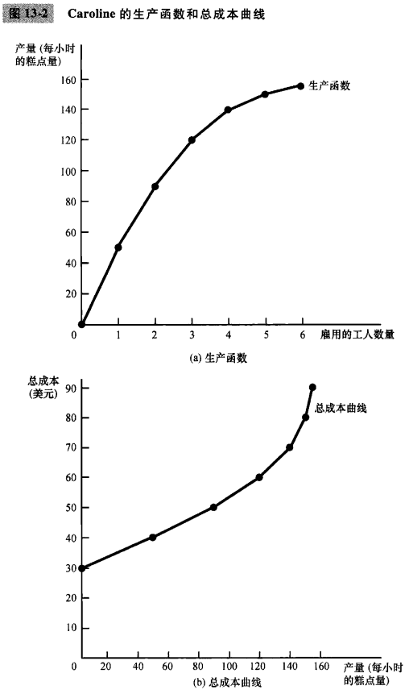
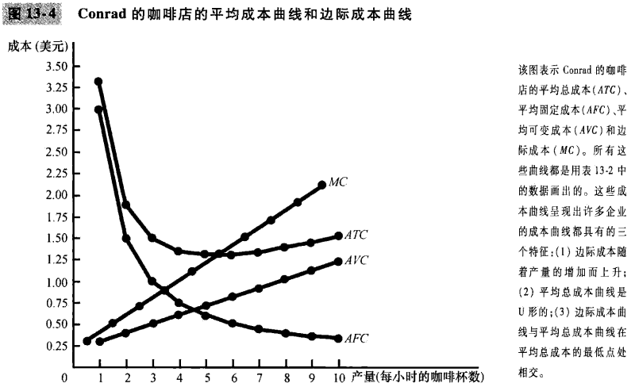
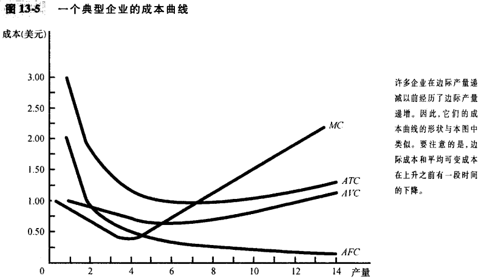
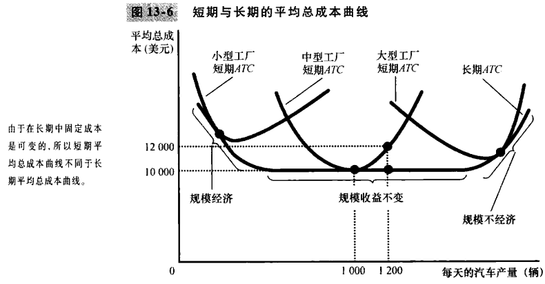
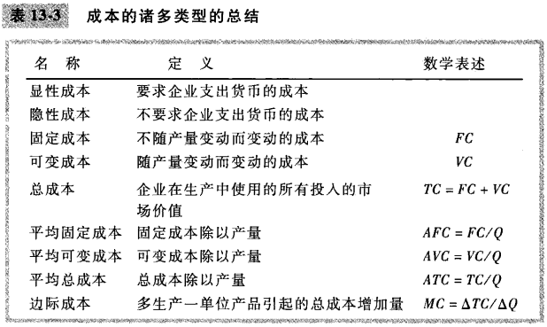

# 第13章 生产成本

## 13.1 什么是成本

### 13.1.1 总收益，总成本和利润

`总收益（total revenue）`企业出售其产品所得到的货币量。

`总成本（total cost）`企业用于生产的投入品的市场价值。

`利润（profit）`总收益减去总成本：$利润 = 总收益 - 总成本$。

### 13.1.2 作为机会成本的成本

`显性成本（explicit costs）`需要企业支出货币的投入成本。

`隐性成本（implicit costs）`不需要企业支出货币的投入成本。

### 13.1.3 作为一种机会成本的资本成本

### 13.1.4 经济利润与会计利润

`经济利润（economic profit）`总收益减总成本，包括显性成本与隐性成本。

`会计利润（accounting profit）`总收益减总显性成本。

## 13.2 生产与成本

### 13.2.1 生产函数

`生产函数（production function）`用于生产一种物品的投入量与该物品产量之间的关系。

`边际产量（marginal product）`增加一单位投入所引起的产量增加。

`边际产量递减（diminishing marginal product）`一种投入的边际产量随着投入量增加而减少的特征。

### 13.2.2 从生产函数到总成本曲线

## 13.3 成本的各种衡量指标

### 13.3.1 固定成本与可变成本

`固定成本（fixed costs）`不随着产量变动而变动的成本。

`可变成本（variable costs）`随着产量变动而变动的成本。

### 13.3.2 平均成本与边际成本

`平均总成本（average total cost, ATC）`总成本除以产量。

`平均固定成本（average fixed cost, AFC）`固定成本除以产量。

`平均可变成本（average variable cost, AVC）`可变成本除以产量。

`边际成本（marginal cost, MC）`额外一单位产量所引起的总成本的增加。
$$
平均总成本 = 总成本/产量 \\
ATC = TC/Q
$$

$$
边际成本 = 总成本变动量/产量变动量 \\
MC = \Delta TC / \Delta Q
$$

$\Delta$代表变量的变动。

平均成本告诉我们，如果总成本在所生产的所有单位中平均分摊，普通一单位产品的成本。边际成本告诉我们，多生产一单位产品引起的总成本增加。

### 13.3.3 成本曲线及其形状

`有效规模（efficient scale）`使平均总成本最小的产量。

只要边际成本小于平均总成本，平均总成本就下降；只要边际成本大于平均总成本，平均总成本就上升。

边际成本曲线与平均总成本曲线在平均总成本曲线的最低点处相交。

### 13.3.4 典型的成本曲线

- 随着产量增加，边际成本最终会上升。
- 平均总成本曲线是U形的。
- 边际成本曲线与平均总成本曲线在平均总成本曲线的最低点处相交。

## 13.4 短期成本与长期成本

### 13.4.1 短期与长期平均总成本之间的关系

### 13.4.2 规模经济与规模不经济

`规模经济（economies of scale）`长期平均总成本随产量增加而减少的特性。

`规模不经济（diseconomies of scale）`长期平均总成本随产量增加而增加的特性。

`规模收益不变（constant returns to scale）`长期平均总成本在产量变动时保持不变的特性。

## 13.5 结论

- 企业的目标是利润最大化，利润等于总收益减总成本。
- 分析企业的行为时，重要的是要包括生产的所有机会成本。
- 企业的成本反映其生产过程。
- 企业的总成本可以分为固定成本和可变成本。
- 企业的总成本可以派生出成本的两种相关的衡量指标。
- 在分析企业行为时，画出平均总成本和边际成本的图形往往是有帮助的。
- 一个企业的成本往往取决于所考虑的时间范围。

