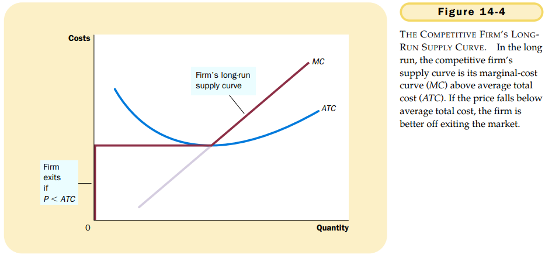
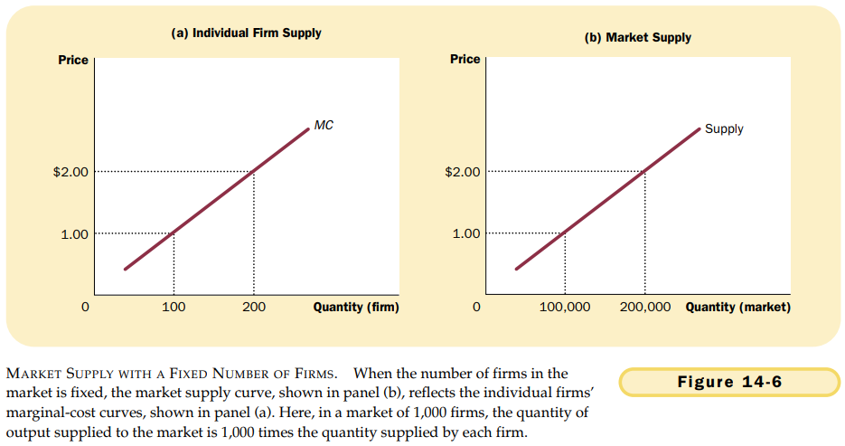

# CHAPTER 14 FIRMS IN COMPETITIVE MARKETS

`competitive market`. a market with many buyers and sellers trading identical products so that each buyer and seller is a price taker.

A competitive market, sometimes called a `perfectly competitive market`, has two characteristics:

- There are many buyers and many sellers in the market.
- The goods offered by the various sellers are largely the same.
- Firms can freely enter or exit the market.

`average revenue`. total revenue divided by the quantity sold. Total revenue is the price times the quantity $(P \times Q)$, and average revenue is total revenue $(P \times Q)$ divided by the quantity $(Q)$. Therefore, for all firms, average revenue equals the price of the good.

`marginal revenue`. the change in total revenue from an additional unit sold. Total revenue is $P \times Q$, and $P$ is fixed for a competitive firm. Therefore, when $Q$ rises by 1 unit, total revenue rises by $P$ dollars. For competitive firms, marginal revenue equals the price of the good.

At the profit-maximizing level of output, marginal revenue and marginal cost are exactly equal.

In essence, because the firm’s marginal-cost curve determines the quantity of the good the firm is willing to supply at any price, it is the competitive firm’s supply curve.

the firm shuts down if the revenue that it would get from producing is less than its variable costs of production.

A small bit of mathematics can make this shutdown criterion more useful. If $TR$ stands for total revenue, and $VC$ stands for variable costs, then the firm's decision can be written as
$$
Shut\ down\ if\ TR < VC.
$$
The firm shuts down if total revenue is less than variable cost. By dividing both sides of this inequality by the quantity $Q$, we can write it as 
$$
Shut\ down\ if\ TR/Q < VC/Q.
$$
Notice that this can be further simplified. $TR/Q$ is total revenue divided by quantity, which is average revenue. As we discussed previously, average revenue for any firm is simply the good's price $P$. Similarly, $VC/Q$ is average variable cost $AVC$. Therefore, the firm's shutdown criterion is 
$$
Shut\ down\ if\ P < AVC.
$$
That is, a firm chooses to shut down if the price of the good is less than the average variable cost of production.

The competitive firm's short-run supply curve is the portion of its marginal-cost curve that lies above average variable cost.

`sunk cost`. a cost that has already been committed and cannot be recovered.

The firm exits the market if the revenue it would get from producing is less than its total costs.

If $TR$ stands for total revenue, and $TC$ stands for total cost, then the firm's criterion can be written as
$$
Exit\ if\ TR < TC.
$$
The firm exits if total revenue is less than total cost. By dividing both sides of this inequality by quantity $Q$, we can write it as 
$$
Exit\ if\ TR/Q < TC/Q.
$$
We can simplify this further by noting that $TR/Q$ is average revenue, which equals the price $P$, and that $TC/Q$ is average total cost $ATC$. Therefore, the firm's exit criterion is 
$$
Exit\ if\ P < ATC.
$$
That is, a firm chooses to exit if the price of the good is less than the average total cost of production.

A parallel analysis applies to an entrepreneur who is considering starting a firm. The firm will enter the market is such an action would be profitable, which occurs if the price of the good exceeds the average total cost of production. The entry criterion is
$$
Enter\ if\ P > ATC.
$$
The criterion for entry is exactly the opposite of the criterion for exit.

Recall that profit equals total revenue $(TR)$ minus total cost $(TC)$:
$$
Profit = TR - TC.
$$
We can rewrite this definition by multiplying and dividing the right-hand side by $Q$:
$$
Profit = (TR/Q - TC/Q) \times Q.
$$
But note that $TR/Q$ is average revenue, which is the price $P$, and $TC/Q$ is average total cost $ATC$. Therefore,
$$
Profit = (P - ATC) \times Q.
$$

At the end of this process of entry and exit, firms that remain in the market must be making zero economic profit.
$$
Profit = (P - ATC) \times Q.
$$
This equation shows that an operating firm has zero profit if and only if the price of the good equals the average total cost of producing that good. If price is above average total cost, profit is positive, which encourages new firms to enter. If price is less than average total cost, profit is negative, which encourages some firms to exit.

The process of entry and exit ends only when price and average total cost are driven to equality.

Because firms can enter and exit more easily in the long run than in the short run, the long-run supply curve is typically more elastic than the short-run supply curve.

## Summary

TODO
