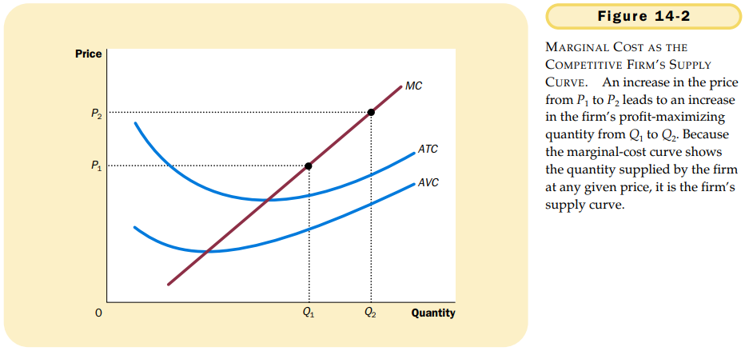
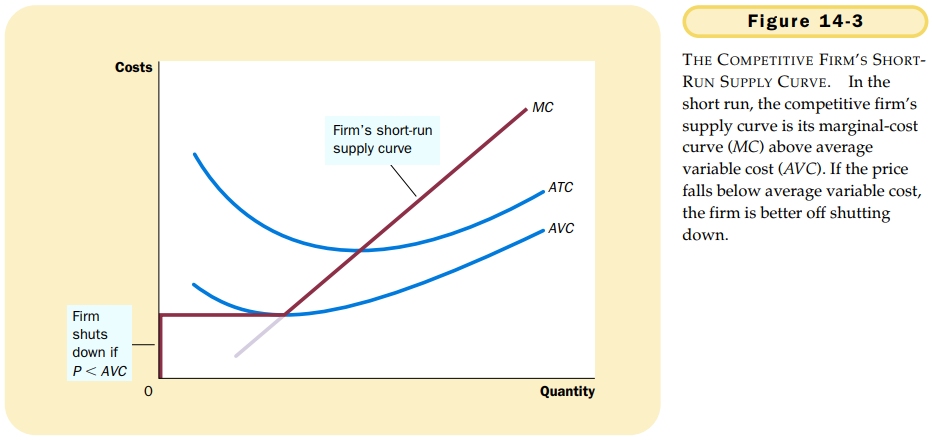
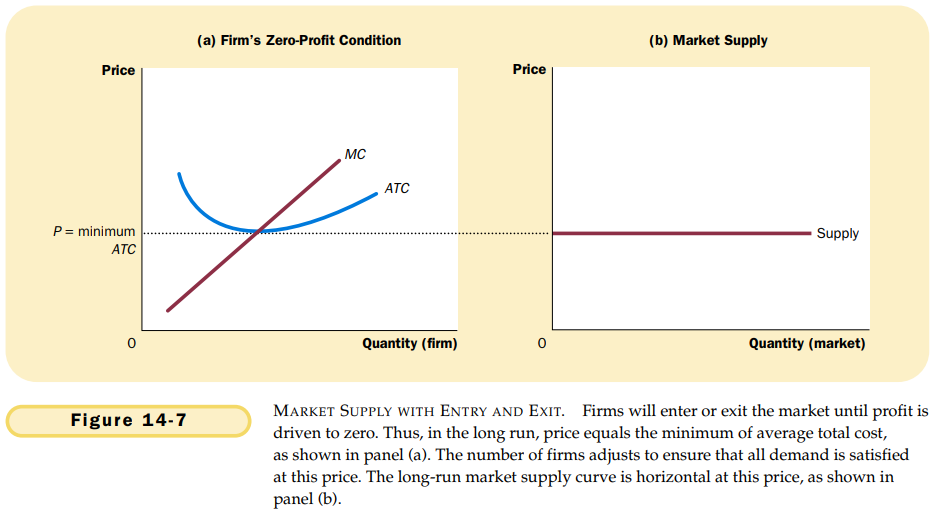

# 第14章 竞争市场上的企业

`竞争市场（competitive market）`有时称为完全竞争市场，它有三个特征：

- 市场上有许多买者和许多卖者。
- 各个卖者提供的物品大体上是相同的。
- 企业可以自由地进入或退出市场。

在竞争市场上，买者和卖者必须接受市场决定的价格，因而被称为价格接受者。

`平均收益（average revenue）`总收益$(P \times Q)$除以产量$(Q)$；对所有企业而言，平均收益等于物品的价格。

`边际收益（marginal revenue）`增加一单位销售量引起的总收益变动；对竞争企业而言，边际收益等于物品的价格。

对一个竞争企业来说，企业产品的价格既等于其平均收益（AR），又等于其边际收益（MR）。

利润最大化的三个一般性规律：

- 如果边际收益大于边际成本，企业应该增加其产量。
- 如果边际成本大于边际收益，企业应该减少其产量。
- 在例如最大化的产量水平时，边际收益和边际成本正好相等。

在本质上，由于企业的边际成本曲线决定了企业在任何一种价格时愿意供给的物品数量，因此，边际成本曲线也是竞争企业的供给曲线。

**停止营业**指由于当前的市场条件而在某个特定时期不生产任何东西的短期决策。

**退出**指离开市场的长期决策。

如果生产能得到的收益小于生产的可变成本，企业就停止营业。
$$
如果TR < VC, 停止营业 \\
如果TR / Q < VC / Q，停止营业 \\
如果P < AVG，停止营业
$$
$TR$代表总收益，$VC$代表可变成本，$AVC$代表平均可变成本，$Q$代表产量，$P$代表价格。

竞争企业的短期供给曲线是边际成本曲线位于平均可变成本曲线之上的那一部分。

`沉没成本（sunk cost）`已经发生而且无法收回的成本。

如果从生产中得到的收益小于它的总成本，企业就应退出市场。

$$
如果 TR < TC，就退出 \\
如果 TR/Q < TC/Q，就退出 \\
如果 P < ATC，就退出 \\
如果 P > ATC，就进入
$$
$TR$代表总收益，$TC$代表总成本，$Q$代表产量，$ATC$代表平均总成本。

竞争企业的长期供给曲线是边际成本曲线位于平均总成本曲线之上的那一部分。

$$
利润 = (TR/Q - TC/Q) \times Q
$$

$TR/Q$是平均收益（也是价格$P$），而$TC/Q$是平均总成本$ATC$。

在这种进入和退出过程结束时，仍然留在市场中的企业的经济利润必定为零。

企业利润计算公式：$利润 = (P - ATC) \times Q$。

这个公式表明，当且仅当物品的价格等于生产那种物品的平均总成本时，一个正在经营的企业才有零利润。只有当价格与平均总成本被推向相等时，进入与退出过程才结束。

在可以自由进入与退出的竞争市场的长期均衡中，企业一定是在其有效规模上运营。

由于企业在长期中比在短期中更容易进入和退出，所以长期供给曲线一般比短期供给曲线更富弹性。

## 内容提要

- 由于竞争企业是价格接收者，所以它的收益与产量是成比例的。
- 为了使利润最大化，企业选择使边际收益等于边际成本的产量。
- 在短期中，当企业不能收回其固定成本时，如果物品价格小于平均可变成本，企业将选择暂时停止营业。在长期中，当企业能收回其固定成本和可变成本时，如果价格小于平均总成本，企业将选择退出市场。
- 在可以自由进入与退出的市场上，长期中利润为零。
- 需求变动在不同时间范围之内有不同影响。
