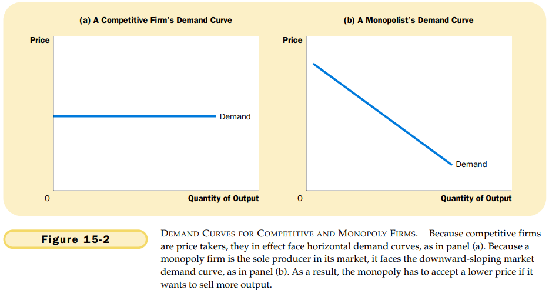
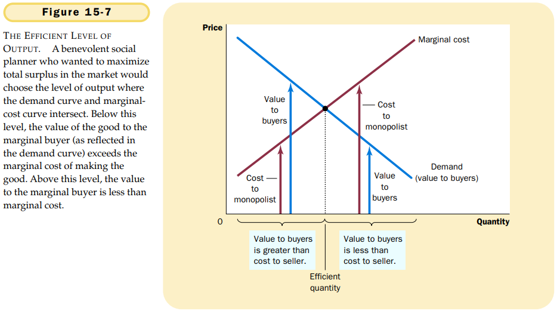

# CHAPTER 15 MONOPOLY

`monopoly`. a firm that is the sole seller of a product without close substitutes.

The fundamental cause of monopoly is `barriers to entry`: A monopoly remains the only seller in its market because other firms cannot enter the market and compete with it. Barriers to entry, in turn, have three main sources:

- A key resource is owned by a single firm.
- The government gives a single firm the exclusive right to product some good or service.
- The costs of production make a single producer more efficient than a large number of producers.

`natural monopoly`. a monopoly that arises because a single firm can supply a good or service to an entire market at a smaller cost than could two or more firms.

A monopolist's marginal revenue is always less than the price of its good.

When a monopoly increases the amount it sells, it has two effects on total revenue $(P \times Q)$:

- The output effect: More output is sold, so $Q$ is higher.
- The price effect: The price falls, so $P$ is lower.

Thus, the monopolist's profit-maximizing quantity of output is determined by the intersection of the marginal revenue curve and the marginal-cost curve.

The marginal revenue of a competitive firm equals its price, whereas the marginal revenue of a monopoly is less than its price. That is, 
$$
For\ a\ competitive\ firm: P = MR = MC. \\
For\ a\ monopoly\ firm: P > MR = MC.
$$
In competitive markets, price equals marginal cost. In monopolized market, proce exceeds marginal cost.

To see the monopoly's profit, recall that profit equals total revenue $(TR)$ minus total costs $(TC)$:
$$
Profit = TR - TC.
$$
We can rewrite this as
$$
Profit = (TR/Q - TC/Q) \times Q.
$$
$TR/Q$ is average revenue, which equals the price $P$, and $TC/Q$ is average total cost $ATC$. Therefore,
$$
Profit = (P - ATC) \times Q.
$$

Thus, the socially efficient quantity is quantity is found where the demand curve and the marginal-cost curve intersect.

The monopolist produces less than the socially efficient quantity of output.

Policymakers in the government can respond to the problem of monopoly in one of four ways:

- By trying to make monopolized industries more competitive.
- By regulating the behavior of the monopolies.
- By turning some private monopolies into public enterprises.
- By doing nothing at all.

`price discrimination`. the business practice of selling the same good at different prices to different customers.

## Summary

TODO
