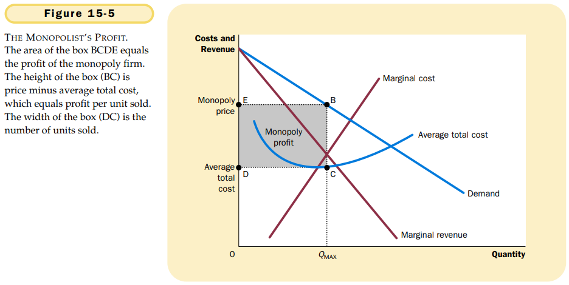
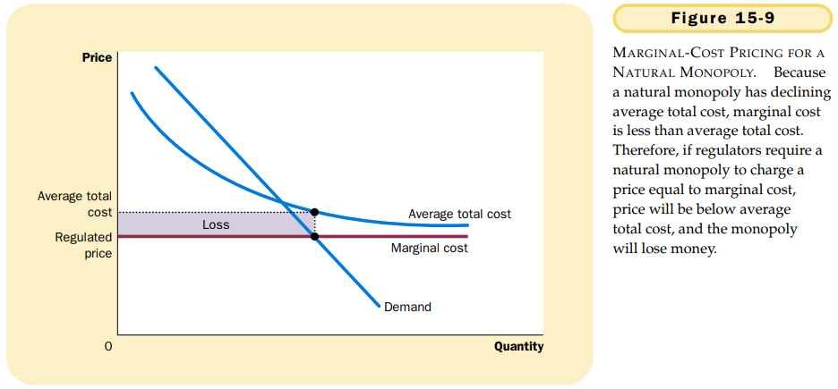

# CHAPTER 15 MONOPOLY

`monopoly`. a firm that is the sole seller of a product without close substitutes.

The fundamental cause of monopoly is `barriers to entry`: A monopoly remains the only seller in its market because other firms cannot enter the market and compete with it. Barriers to entry, in turn, have three main sources:

- A key resource is owned by a single firm.
- The government gives a single firm the exclusive right to product some good or service.
- The costs of production make a single producer more efficient than a large number of producers.

`natural monopoly`. a monopoly that arises because a single firm can supply a good or service to an entire market at a smaller cost than could two or more firms.

A monopolist's marginal revenue is always less than the price of its good.

When a monopoly increases the amount it sells, it has two effects on total revenue $(P \times Q)$:

- The output effect: More output is sold, so $Q$ is higher.
- The price effect: The price falls, so $P$ is lower.

Thus, the monopolist's profit-maximizing quantity of output is determined by the intersection of the marginal revenue curve and the marginal-cost curve.

The marginal revenue of a competitive firm equals its price, whereas the marginal revenue of a monopoly is less than its price. That is, 
$$
For\ a\ competitive\ firm: P = MR = MC. \\
For\ a\ monopoly\ firm: P > MR = MC.
$$
In competitive markets, price equals marginal cost. In monopolized market, proce exceeds marginal cost.

To see the monopoly's profit, recall that profit equals total revenue $(TR)$ minus total costs $(TC)$:
$$
Profit = TR - TC.
$$
We can rewrite this as
$$
Profit = (TR/Q - TC/Q) \times Q.
$$
$TR/Q$ is average revenue, which equals the price $P$, and $TC/Q$ is average total cost $ATC$. Therefore,
$$
Profit = (P - ATC) \times Q.
$$

Thus, the socially efficient quantity is quantity is found where the demand curve and the marginal-cost curve intersect.

The monopolist produces less than the socially efficient quantity of output.

Policymakers in the government can respond to the problem of monopoly in one of four ways:

- By trying to make monopolized industries more competitive.
- By regulating the behavior of the monopolies.
- By turning some private monopolies into public enterprises.
- By doing nothing at all.

`price discrimination`. the business practice of selling the same good at different prices to different customers.

## Summary

- A monopoly is a firm that is the sole seller in its market. A monopoly arises when a single firm owns a key resource, when the government gives a firm the exclusive right to produce a good, or when a single firm can supply the entire market at a smaller cost than many firms could.
- Because a monopoly is the sole producer in its market, it faces a downward-sloping demand curve for its product. When a monopoly increases production by 1 unit, it causes the price of its good to fall, which reduces the amount of revenue earned on all units produced. As a result, a monopoly's marginal revenue is always below the price of its good.
- Like a competitive firm, a monopoly firms maximizes profit by producing the quantity at which marginal revenue equals marginal cost. The monopoly then chooses the price at which that quantity is demanded Unlike a competitive firm, a monopoly firm's price exceeds it marginal revenue, so its price exceeds marginal cost.
- A monopolist's profit-maximizing level of output is below the level that maximizes the sum of consumer and producer surplus. That is, when the monopoly charges a price above marginal cost, some consumers who value the good more than its cost of production do not buy it. As a result, monopoly causes deadweight losses similar to the deadweight losses caused by taxes.
- Policymakers can respond to the inefficiency of monopoly behavior in four ways. They can use the antitrust laws to try to make the industry more competitive. They can regulate the prices that the monopoly charges. They can turn the monopolist into a government-run enterprise. Or, if the market failure is deemed small compared to the inevitable imperfections of policies, they can do nothing at all.
- Monopolists often can raise their their profits by charging different prices for the same good based on a buyer's willingness to pay. This practice of price discrimination can raise economic welfare by getting the good to some comsumers who otherwise would not buy it. In the extreme case of perfect price discrimination, the deadweight losses of monopoly are completely eliminated. More generally, when price discrimination is imperfect, it can either raise or lower welfare compared to the coucome with a single monopoly price.

