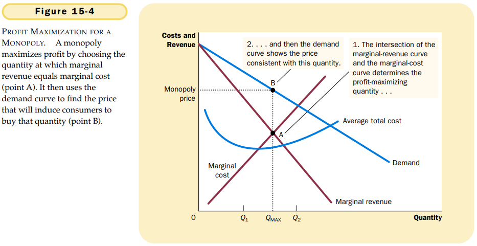
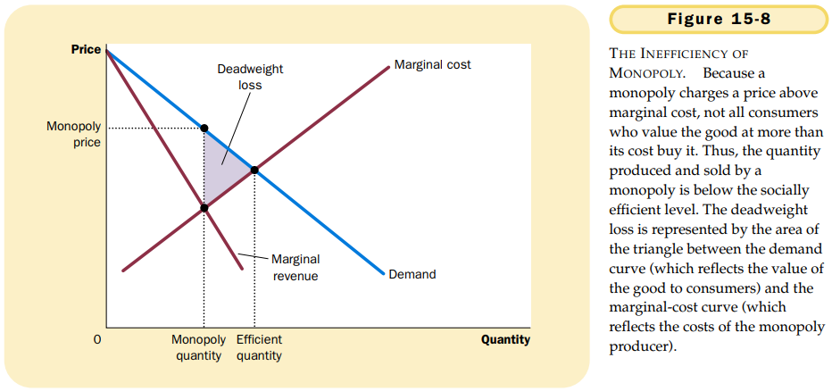
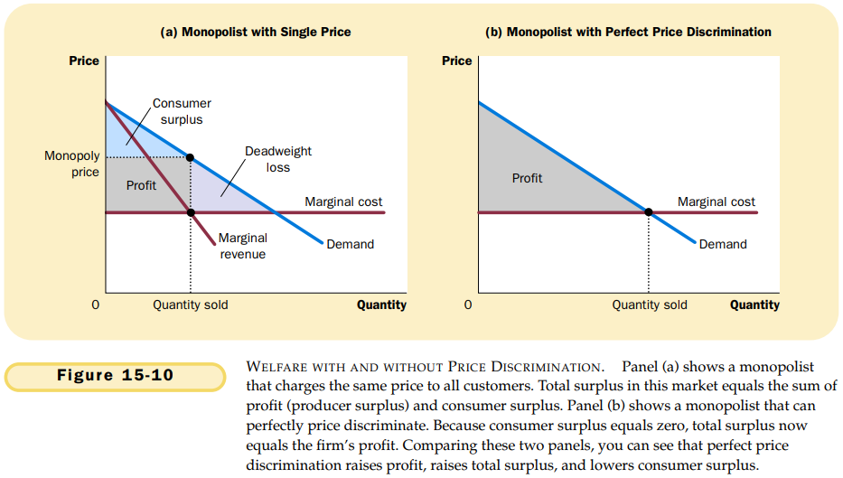

# 第15章 垄断

竞争企业是价格接受者，而垄断企业是价格决定者。

`monopoly`作为一种没有相近替代品的产品的唯一卖者的企业。

垄断产生的原因是进入壁垒，进入壁垒有三个主要形成原因：

- 垄断资源：生产所需要的关键资源由单个企业所拥有；
- 政府管制：政府给予单个企业排他性地生产某种物品或服务的权力；
- 生产流程：某个企业能以低于大量企业的成本生产产品。

`自然垄断（natural monopoly）`由于一个企业能以低于两个或更多企业的成本向整个市场供给一种物品或服务而产生的垄断。

垄断者的边际收益总是小于其物品的价格。

当垄断者增加它的销售的数量时，这对总收益$(P \times Q)$有两种效应：

- 产量效应：销售的数量增多了，即$Q$增大，从而可能增加总收益。
- 价格效应：价格下降了，即$P$降低，从而可能减少总收益。

垄断者的利润最大化产量是由边际收益曲线与边际成本曲线的交点决定的。

竞争企业的边际收益等于其价格，而垄断企业的边际收益小于其价格：
$$
对于竞争企业：P = MR = MC \\
对于垄断企业：P > MR = MC
$$
在竞争市场上，价格等于边际成本；在垄断市场上，价格大于边际成本。

$$
\begin{equation}\begin{split}
利润 &= TR - TC \\
利润 &= (TR/Q - TC/Q) \times Q \\
利润 &= (P - ATC) \times Q
\end{split}\end{equation}
$$

$TR$代表总收益，$TC$代表总成本，$TR/Q$代表平均收益，$P$代表价格，$ATC$代表平均总成本。

可以在需求曲线与边际成本曲线相交之处找出社会有效率的产量。

垄断者生产的产量小于社会有效率的产量。

`价格歧视（price discrimination）`以不同价格向不同顾客出售同一种物品的经营做法。

## 内容提要

- 垄断者是在其市场上作为唯一卖者的企业。
- 由于垄断者是其市场上唯一的生产者所以它面临向右下方倾斜的产品需求曲线。
- 和竞争企业一样，垄断企业也通过生产边际收益等于边际成本的产量来实现利润最大化。
- 垄断者通常可以通过根据买者的支付意愿对同一种物品收取不同的价格来增加利润。
- 决策者可以用四种方式对垄断行为的无效率做出反应。