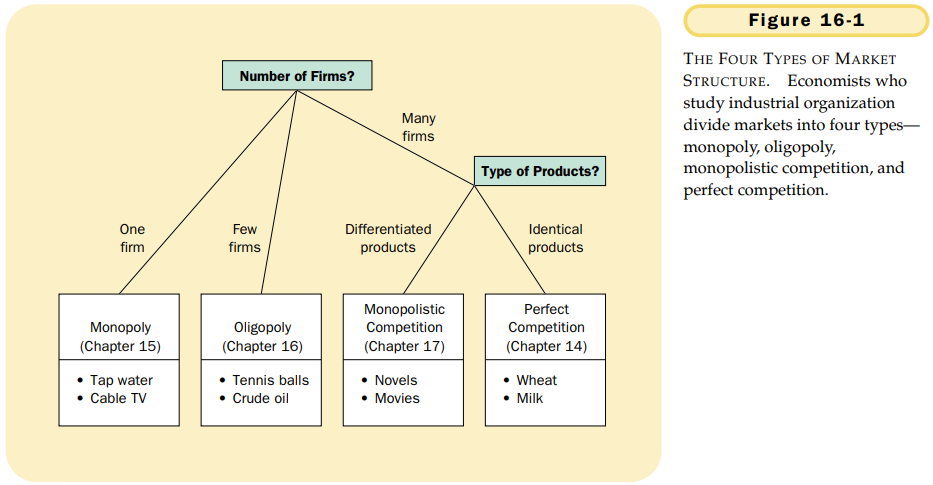

# CHAPTER 16 OLIGOPOLY

`oligopoly`. a market structure in which only a few sellers offer similar or identical products.

`monopolistic competition`. a market structure in which many firms sell products that are similar but not identical.

`collusion` an agreement among firms in a market about quantities to produce or prices to charge.

`cartel`. a group of firms acting in union.

`Nash equilibrium`. a situation in which economic actors interacting with one another each choose their best strategy given the strategies that all the other actors have chosen.

When firms in an oligopoly individually choose production to maximize profit, they produce a quantity of output greater than the level produced by monopoly and less than the level produced by competition. The oligopoly price is less than the monopoly price but greater than the competitive price (which equals marginal cost).

In making thist decision, the well owner weight two effects:

- `The output effect`: Because price is above marginal cost, selling 1 more gallon of water at the going price will raise profit.
- `The price effect`: Raising production will increase the total amount sold, which will lower the price of water and lower the profit on all the other gallons sold.

As the number of sellers in an oligopoly grows larger, an oligopolistic market looks more and more like a competitive market. The price approaches marginal cost, and the quantity produced approaches the socially efficient level.

`game theory`. the study of how people behave in strategic situations.

`prisoners' dilemma`. a particular "game" between two captured prisoners that illustrates why cooperation is difficult to maintain even when it is mutually beneficial.

Business practices that appear to reduce competition may in fact have legitimate purposes.

## Summary

- Oligopolists maximize their total profits by forming a cartel and acting like a monopolist. Yet, if oligopolists make decisions about production levels individually, the result is a greater quantity and lower price than under the monopoly outcome. The larger the number of firms in the oligopoly, the closer the quantity and price will be to the levels that would prevail under competition.
- The prisoners' dilemma shows that self-interest can prevent people from maintaining cooperation, even when cooperation is in their mutual interest. The logic of the prisoners' dilemma applies in many situations, including arms races, advertising, common-resource problems, and oligopolies.
- Policymakers use the antitrust laws to prevent oligopolies from engaging in behavior that reduces competition. The application of these laws can be controversial, because some behavior that may seem to reduce competition may in fact have legitimate business purposes.
