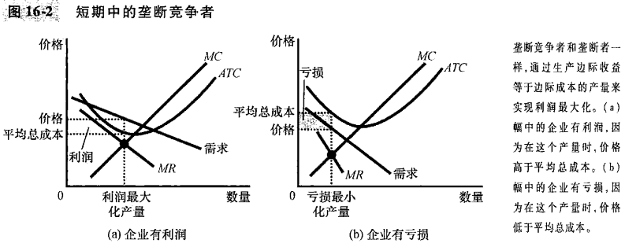
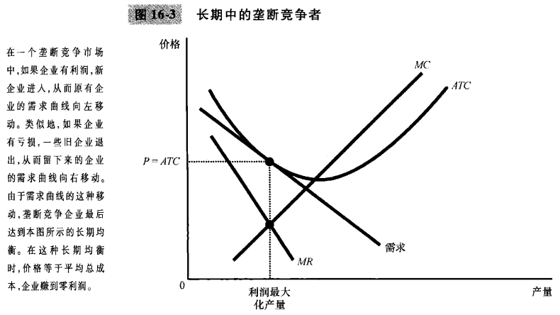
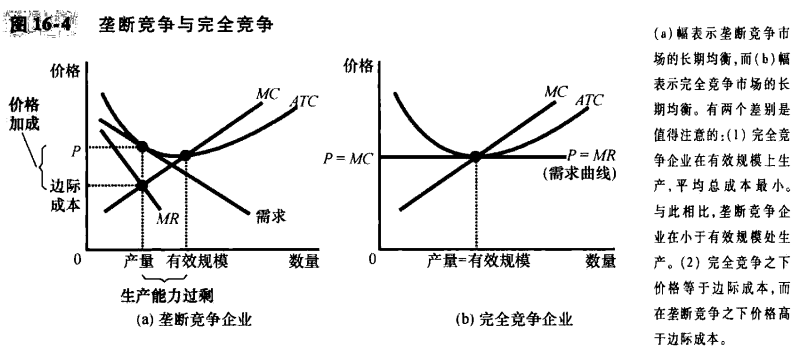
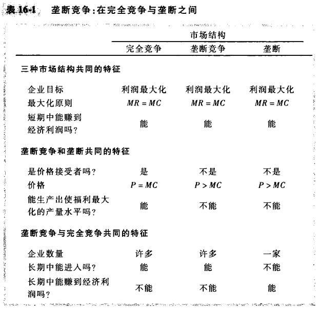

# 第16章 垄断竞争

## 16.1 在垄断和完全竞争之间

`寡头（oligopoly）`只有少数几个提供相似或相同产品的卖者的市场结构。

`垄断竞争（monopolistic competition）`存在许多出售相似但不相同产品的企业的市场结构。

垄断竞争描述了具有以下特征的市场：

- 许多卖者。
- 产品存在差别。
- 自由进入和退出。

## 16.2 差别产品的竞争

### 16.2.1 短期中的垄断竞争企业

### 16.2.2 长期均衡

以下两个特点描述了垄断竞争市场上的长期均衡：

- 正如在垄断市场上一样，价格大于边际成本。
- 正如在竞争市场上一样，价格等于平均总成本。

### 16.2.3 垄断竞争与完全竞争

### 16.2.4 垄断竞争与社会福利

每当一家新企业进入时带来了两种外部效应：

- 产品多样化外部性：由于消费者从新产品引进中得到了消费者剩余，因此新企业进入给消费者带来了正外部性。
- 抢走业务外部性：由于其他企业因新竞争者进入而失去了部分顾客和利润，因此新企业进入给原有企业带来了负外部性。

垄断竞争市场并不具有完全竞争市场所具有的全部合意的福利特点。

## 16.3 广告

### 16.3.1 关于广告的争论

### 16.3.2 作为质量信号的广告

### 16.3.3 品牌

## 16.4 结论

- 垄断竞争市场有三个特点：许多企业，有差别的产品和自由进入。
- 垄断竞争市场的长期均衡在两个相关的方面不同于完全竞争市场。第一，垄断竞争市场上的每个企业有过剩生产能力。第二。每个企业都收取高于边际成本的价格。
- 垄断竞争没有完全竞争的所有合意的特点，存在由高于边际成本的价格加成引起的垄断的标准无谓损失。
- 垄断竞争中固有的产品差别使企业使用广告和品牌。
