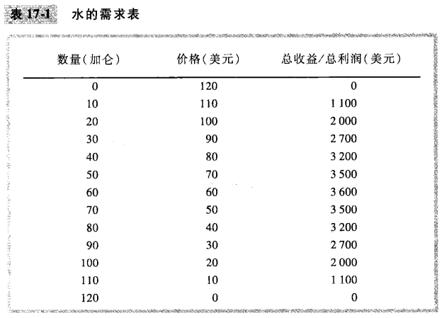
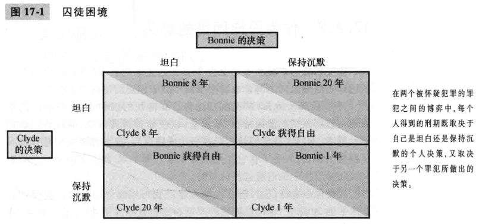
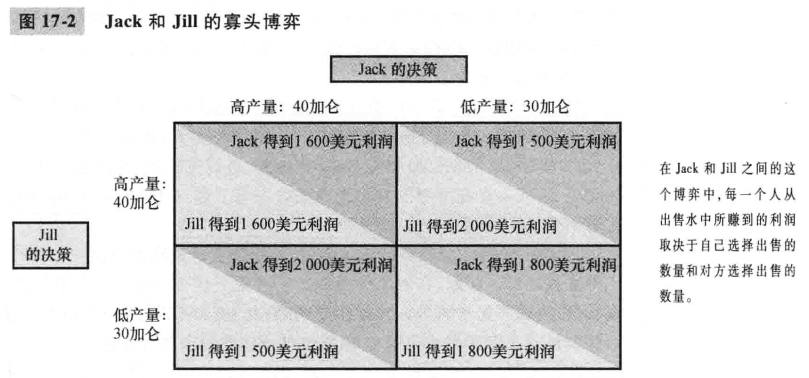
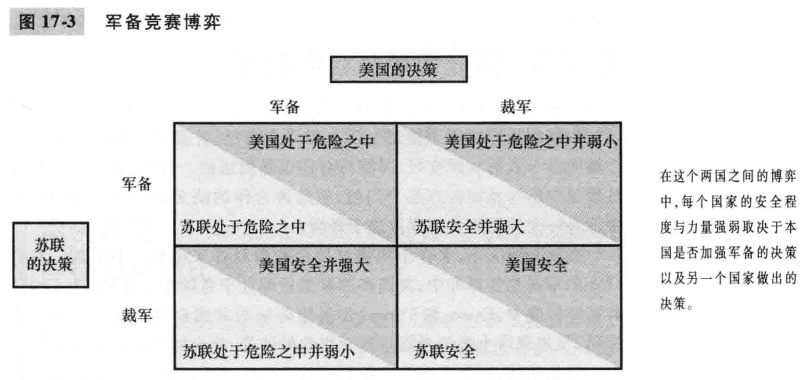
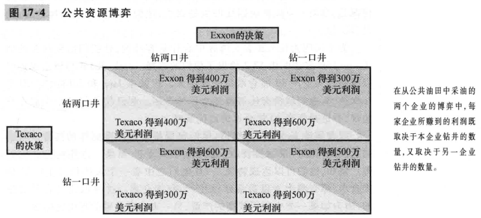

# 第17章 寡头

`寡头（oligopoly）`只有少数几个卖者提供相似或相同产品的市场结构。

`博弈论（game theory）`研究在策略状况下人们如何行为的理论。

## 17.1 只有少数几个卖者的市场

### 17.2.1 双头的例子

### 17.1.2 竞争，垄断和卡特尔

`勾结（collusion）`一个市场上的企业之间就生产的产量或收取的价格达成的协议。

`卡特尔（cartel）`联合起来行事的企业集团。

### 17.1.3 寡头的均衡

`纳什均衡（Nash equilibrium）`相互作用的经济主体在假定所有其他主体所选策略为既定的情况下选择它们自己最优策略的状态。

当寡头企业单独地选择利润最大化的产量时，它们生产的产量大于垄断但小于竞争的产量水平。寡头价格低于垄断价格，但高于竞争价格（竞争价格等于边际成本）。

### 17.1.4 寡头数量如何影响市场结果

随着寡头市场上卖者数量增加，寡头市场就越来越像竞争市场。其价格接近于边际成本，生产量接近于对社会有效率的水平。

## 17.2 合作经济学

`囚徒困境（prisoners' dilemma）`两个被捕的囚徒之间的一种特殊“博弈”，说明为什么甚至在合作对双方都有利时，保持合作也是困难的。

### 17.2.1 囚徒困境

`占优策略（dominant strategy）`无论其他参与者选择什么策略，对一个参与者都为最优的策略。

### 17.2.2 作为囚徒困境的寡头

### 17.2.3 囚徒困境的其他例子

### 17,2,4 囚徒困境与社会福利

### 17.2.5 人们有时能合作的原因

## 17.3 针对寡头的公共策略

### 17.3.1 贸易限制与反托拉斯法

### 17.3.2 关于反托拉斯政策的争论

看起来减少竞争的经营做法实际上可能有其合理的目的。

## 17.4 结论

- 寡头通过形成一个卡特尔并像垄断者一样行事以使自己的总利润最大化。
- 囚徒困境表明，利己使人们即使在合作符合它们共同利益时也无法维持合作。
- 决策者用反托拉斯法来放置寡头从事减少竞争的行为。

