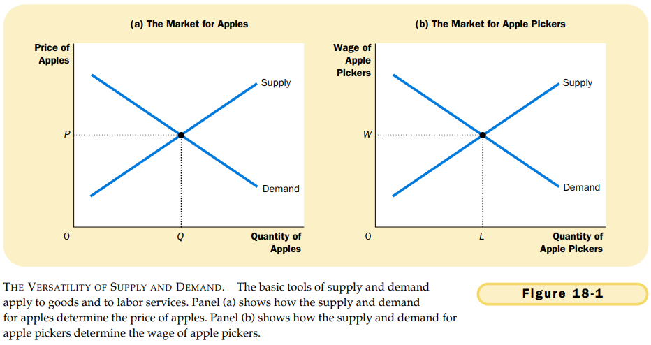

# CHAPTER 18 THE MARKETS FOR THE FACTORS OF PRODUCTION

`factors of production`. the inputs used to produce goods and services.

`production function`. the relationship between the quantity of inputs used to make a good and the quantity of output of that good.

`marginal product of labor`. the increase in the amount of output from an additional unit of labor.

`diminishing marginal product`. the property whereby the marginal product of an input declines as the quantity of the input increases.

`value of the marginal product`. the marginal product of an input times the price of the output.

A competitive, profit-maximizing firm hires workers up to the point where the value of the marginal product of labor equals the wage.

the value-of-marginal-product curve is the labor demand curve for a competitive, profit-maximizing firm.

So far we have established two facts about how wages are determined in competitive labor markets:

- The wage adjusts to balance the supply and demand for labor.
- The wage equals the value of the marginal product of labor.

Any event that changes that changes the supply or demand for labor must change the equilibrium wage and the value of the marginal product by the same amount, because these must always be equal.

Briefly note three key determinants of productivity:

- Physical capital: When workers work with a larger quantity of equipment and structures, they produce more.
- Human capital: When workers are more educated, they produce more.
- Technological knowledge: When workers have access to more sophisticated technologies, they produce more.

`captital`. the equipment and structures used to produce goods and services.

Labor, land, and capital each earn the value of their marginal contribution to the production process.

## Summary

TODO

