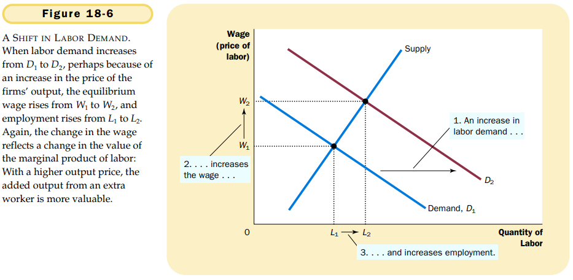
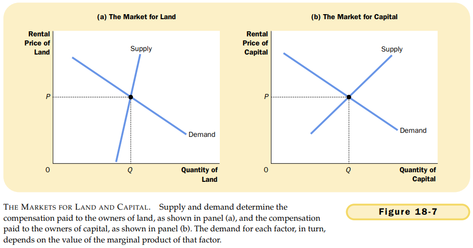

# 第18章 生产要素市场

`生产要素（factors of production）`用于生产物品与服务的投入。

`生产函数（production function）`用于生产一种物品的投入量与该物品产量之间的关系。

`劳动的边际产量（marginal product of labor）`增加的一单位劳动所引起的产量增加量。

`边际产量递减（diminishing marginal product）`一单位投入的边际产量随着投入量增加而减少的性质。

`边际产量值（value of the marginal product）`一种投入的边际产量乘以该产品的价格。

一个竞争性的，利润最大化企业雇佣的工人数要达到使劳动的边际产量值等于工资的那一点。

对一个竞争性，利润最大化的企业来说，边际产量值曲线也是劳动需求曲线。

当一个竞争企业雇佣的劳动达到边际产量值等于工资的那一点时，它的产量也就达到价格等于边际成本的那一点。

竞争性劳动市场上工资如何决定的两个因素：

- 工资会自发调整，使劳动的供求达到平衡。
- 工资等于劳动的边际产量值。

改变劳动供求的任何事件都必定使均衡工资和边际产量等量变动，因为这两个量必定总是相等的。

`资本（capital）`用于生产物品与服务的设备和建筑物。

劳动，土地和资本各自赚到了它们在生产过程中的边际贡献的价值。

改变任何一种生产要素供给的事件会改变所有要素的收入。

## 内容提要

- 经济的收入是在生产要素市场上分配的。三种最重要的生产要素是劳动，土地和资本。
- 要素需求，例如劳动需求，是一种派生需求，它产生于用这些要素生产物品与服务的企业。
- 劳动的供给产生于个人在工作和闲暇间的权衡取舍。
- 支付给每种要素的价格的调整使该要素的供求趋于平衡。
- 由于生产要素是同时使用的，因此，任何一种要素的边际产量都取决于可以得到的所有要素量。

