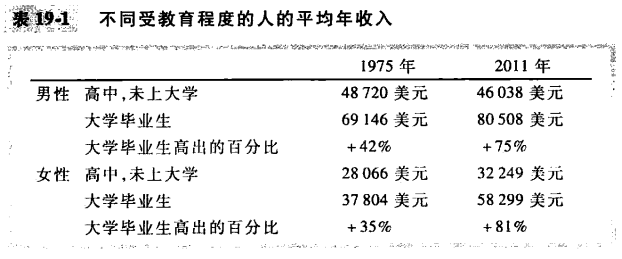
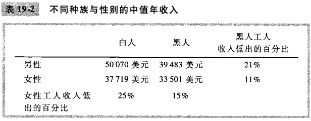

# 第19章 收入与歧视

`补偿性工资差别（compensating differential）`为抵消不同工作的非货币特性而产生的工资差别。

`人力资本（human capital）`对人的投资的积累，如教育和在职培训。

`工会（union）`与雇主谈判工资和工作条件的工人协会。

`罢工（strike）`工会有组织地从企业撤出劳动。

`效率工资（efficiency wages）`企业为了提高工人的生产率而支付的高于均衡工资的工资。

`歧视（discrimination）`对仅仅是种族，民族，性别，年龄或其他个人特征不同的相似个人提供不同的机会。

竞争市场包含了一种自发矫正雇主歧视的方法。只关心利润的企业进入市场倾向于消除歧视性工资差别。只有在顾客愿意为维持歧视性做法进行支付或政府强制歧视时，竞争市场上的这种工资差别才能持续下去。

## 内容提要

- 工人由于许多原因而赚到不同的工资。
- 人力资本多的工人得到的工资高于人力资本少的工人。
- 虽然受教育年限，经验和工作特性都像理论所预期的那样影响收入，但仍有许多收入差别不能用经济学家可以衡量的东西来解释。
- 一些经济学家提出，受教育更多的人得到更高工资并不是因为教育提高了其生产率，而是因为有更高天赋的工人把教育作为一种向雇主显示它们高能力的信号。
- 有时工资会高于使供求平衡的水平。
- 收入中的一些差别是基于种族，性别或其他因素的歧视。
- 竞争市场倾向于限制歧视对工资的影响。

