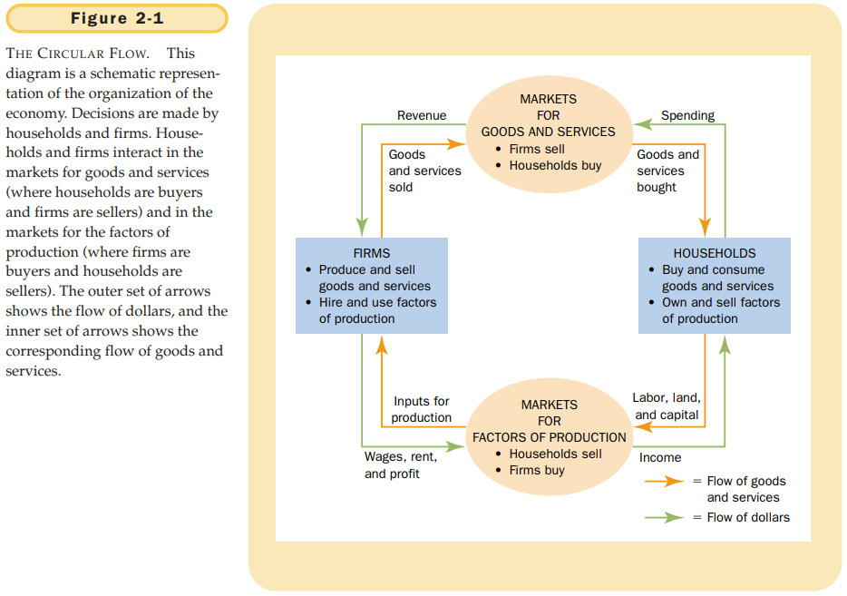
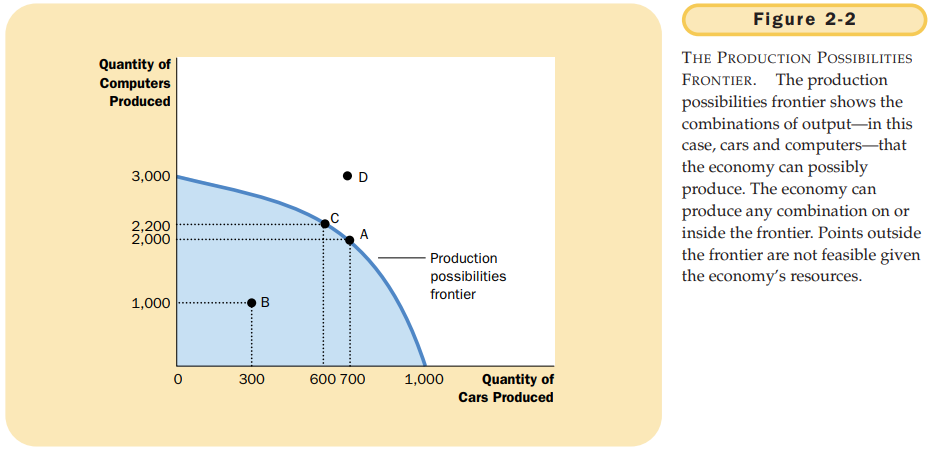

# Chapter 2 THINKING LIKE AN ECONOMIST

Economists devise theories, collect data, and then analyze these data in an attempt to verify or refute their theories.

The scientific method: observation, theory, and more observation.

MICROECONOMICS AND MACROECONOMICS:

- microeconomics: the study of how households and firms make decisions and how they interact in markets.
- macroeconomics: the study of economy-wide phenomena, including inflation, unemployment, and economic growth.

POSITIVE VERSUS NORMATIVE ANALYSIS:

- positive statements: claims that attempt to describe the world as it is.
- normative statements: claims that attempt to prescribe how the world should be.

WHY ECONOMISTS DISAGREE:

- Economists may disagree about the validity of alternative positive theories about how the world works.
- Economists may have different values and, therefore, different normative views about what policy should try to accomplish.

## Summary

- Economists try to address their subject with a scientist's objectivity. Like all scientists, they make appropriate assumptions and build simplified models in order to understand the world around them. Two simple economic models are the circular-flow diagram and the production possibil;ities frontier.
- The field of economics is divided into two subfields: microeconomics and macroeconomics. Microeconomists study decisionmaking by households and firms and the interaction among households and firms in the marketplace. Macroeconomists study the forces and trends that affect the economy as a whole.
- A positive statement is an assertion about how the world is. A normative statement is an assertion about how the world `ought to be`. When economists make normative statements, they are acting more as policy advisers than scientists.
- Economists who advise policymakers offer conflicting advice either because of differences in scientific judgments or because of differences in values. At other times, economists are united in the advice they offer, but policymakers may choose to ignore it.
