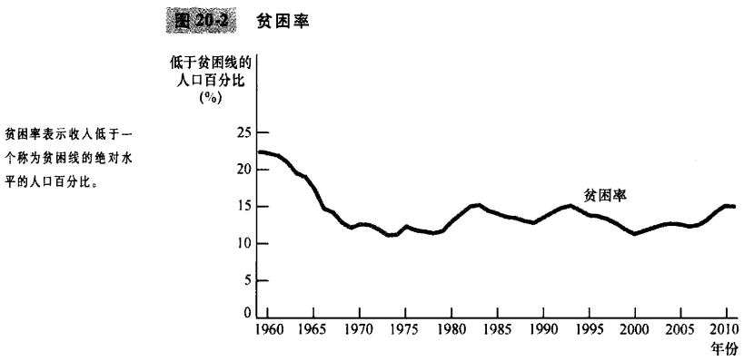

# 第20章 收入不平等与贫困

`贫困率（poverty rate）`家庭收入低于一个称为贫困线的绝对水平的人口百分比。

`贫困线（poverty line）`由联邦政府根据每个家庭规模确定的一种收入绝对水平，低于这一水平的家庭被认为处于贫困状态。

`实物转移支付（in-kind transfers）`以物品和服务而不是以现金形式给与穷人的转移支付。

`生命周期（life cycle）`在人的一生中有规律的收入变动形式。

`持久收入（permanent income）`一个人的正常收入。

`功利主义（utilitarianism）`一种政治哲学，根据这种政治哲学，政府应该选择使社会上所有人总效用最大化的政策。

`效用（utility）`衡量幸福或满足程序的指标。

`自由主义（liberalism）`一种政治哲学，根据这种政治哲学，政府应该选择被认为是公正的政策，这种公正要由一位在“无知面纱”背后的无偏见观察者来评价。

`最大最小准则（maximin criterion）`一种主张，认为政府的目标应该是使社会上状况最差的人的福利最大化。

`社会保险（social insurance）`旨在保护人们避免负面事件风险的政府政策。

`自由至上主义（libertarianism）`一种政治哲学，根据这种政治哲学，政府应该惩罚犯罪并实行自愿的协议，但不应该进行收入再分配。

`福利（welfare）`补贴贫困者收入的政府计划。

`负所得税（negative income tax）`向高收入家庭征税并给低收入家庭补贴的税制。

## 内容提要

- 收入分配数据表明了美国社会中存在的巨大不平等。
- 由于实物转移支付，经济生命周期，暂时收入和经济流动性对于理解收入变动如此重要，以至于要用某一年的收入分配数据来判断我们社会中的不平等程度是很困难的。
- 政治哲学家关于政府在改变收入分配中的作用的观点并不相同。
- 有许多旨在帮助穷人的不同政策。
