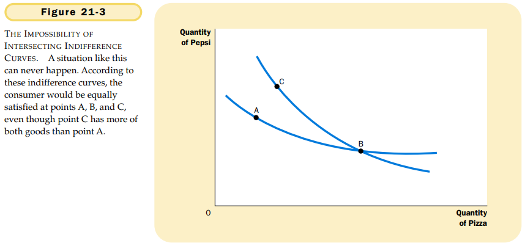

# CHAPTER 21 THE THEOR Y OF CONSUMER CHOICE

`budget constraint`. the limit on the consumption budles that a consumer can afford.

`indifference curve`. a curve that shows consumption bundles that give the consumer the same level of satisfaction.

`marginal rate of substitution`. the rate at which a consumer is willing to trade one good for another.

Here we consider four properties that describe most indifference curves:

1. Higher indifference curves are preferred to lower ones.
2. Indifference curves are downward sloping.
3. Indifference curves do not cross.
4. Indifference curves are bowed inward.

`perfect substitutes`. two goods with straight-line indifference curves.

`perfect complements`. two goods with right-angle indifference curves.

the consumer chooses consumption of the two goods so that the marginal rate of substitution equals the relative price.

`normal good`. a good for which an increase in income raise the quantity demanded.

`inferior good`. a good for which an increase in income reduces the quantity demanded.

`income effect`. the change in consumption that results when a price change moves the consumer to a higher or lower indifference curve.

`substitution effect`. the change in consumption that results when a price change moves the consumer along a given indifference curve to a point with a new marginal rate of substitution.

The income effect is the change in consumption that results from the movement to a higher indifference curve. The substitution effect is the change in consumption that results from being at a point on an indifference curve with a different marginal rate of substitution.

`Giffen good`. a good for which an increase in the price raises the quantity demanded.

## Summary

- A consumer's budget constraint shows the possible combinations of different goods he can buy given his income and the prices of the goods. The slope of the budget constraint equals the relative price of the goods.
- The consumer's indifference curves represent his preferences. An indifference curve shows the various bundles of goods that make the consumer equally happy. Points on higher indifference curves are preferred to points on lower indifference curves. The slope of an indifference curve at any point is the consumer's marginal rate of substitution--the rate at which the consumer is willing to trade one good for the other.
- The consumer optimizes by choosing the point on his budget constraint that lies on the highest indifference curve. At this point, the slope of the indifference curve (the marginal rate of substitution between the goods) equals the slope of the budget constraint (the relative price of the goods).
- When the price of a good falls, the impact on the consumer's choices can be broken down into an income effect and a substitution effect. The income effect is the change in consumption that arises because a lower price makes the consumer better off. The substitution effect is the change in consumption that arises because a price change encourages greater consumption of the good that has become relatively cheaper. The income effect is reflected in the movement from a lower to a higher indifference curve, whereas the substitution effect is reflected by a movement along an indifference curve to a point with a different slope.
- The theory of consumer choice can be applied in many situations. It can explain why demand curves can potentially slope upward, whiy higher wages could either increase or decrease the quantity of labor supplied, why higher interest rates could either increase or decrease saving, and why the poor prefer cash to in-kind transfers.

