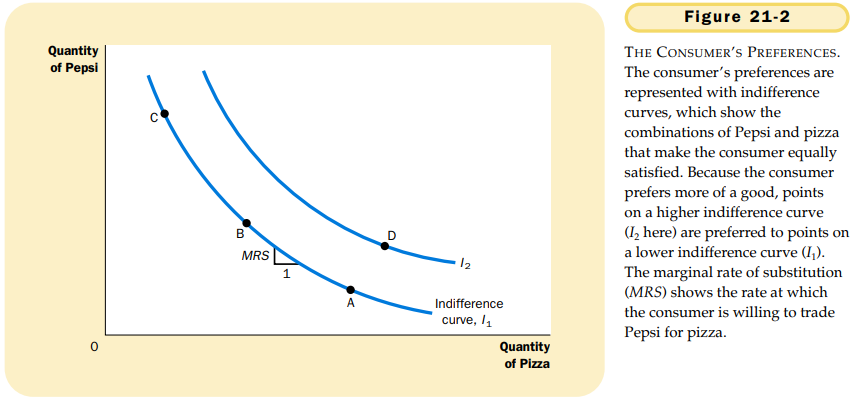
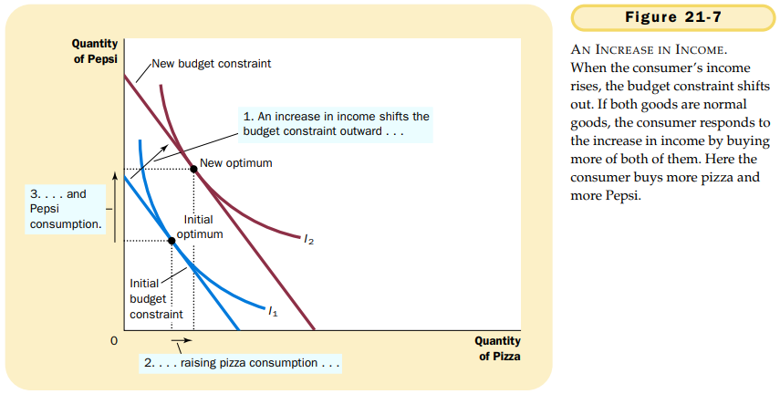

# CHAPTER 21 THE THEOR Y OF CONSUMER CHOICE

`budget constraint`. the limit on the consumption budles that a consumer can afford.

`indifference curve`. a curve that shows consumption bundles that give the consumer the same level of satisfaction.

`marginal rate of substitution`. the rate at which a consumer is willing to trade one good for another.

Here we consider four properties that describe most indifference curves:

1. Higher indifference curves are preferred to lower ones.
2. Indifference curves are downward sloping.
3. Indifference curves do not cross.
4. Indifference curves are bowed inward.

`perfect substitutes`. two goods with straight-line indifference curves.

`perfect complements`. two goods with right-angle indifference curves.

the consumer chooses consumption of the two goods so that the marginal rate of substitution equals the relative price.

`normal good`. a good for which an increase in income raise the quantity demanded.

`inferior good`. a good for which an increase in income reduces the quantity demanded.

`income effect`. the change in consumption that results when a price change moves the consumer to a higher or lower indifference curve.

`substitution effect`. the change in consumption that results when a price change moves the consumer along a give indifference curve to a point with a new marginal rate of substitution.

The income effect is the change in consumption that results from the movement to a higher indifference curve. The substitution effect is the change in consumption that results from being at a point on an indifference curve with a different marginal rate of substitution.

`Giffen good`. a good for which an increase in the price raises the quantity demanded.

## Summary

TODO

