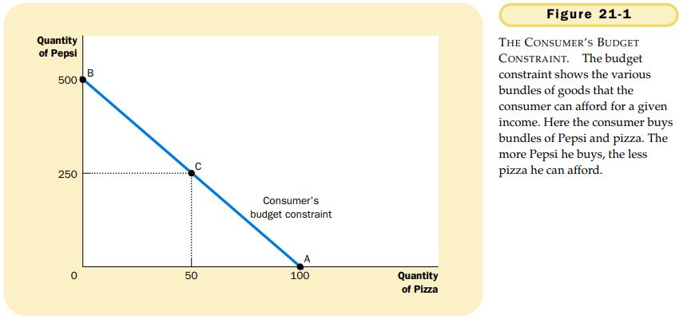
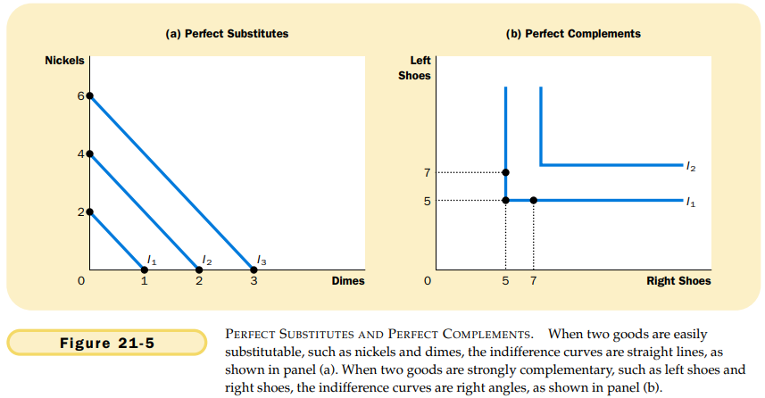
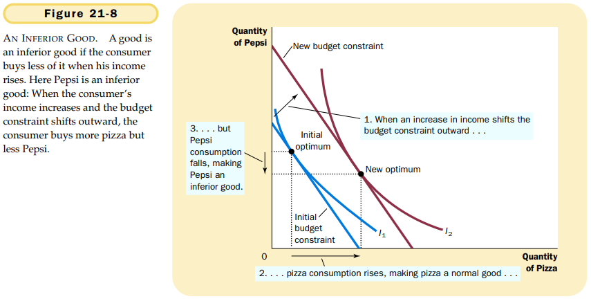
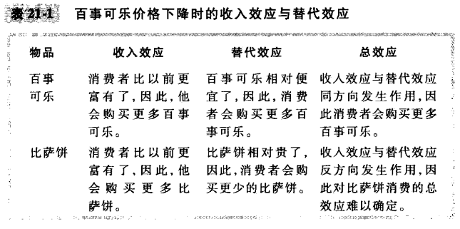
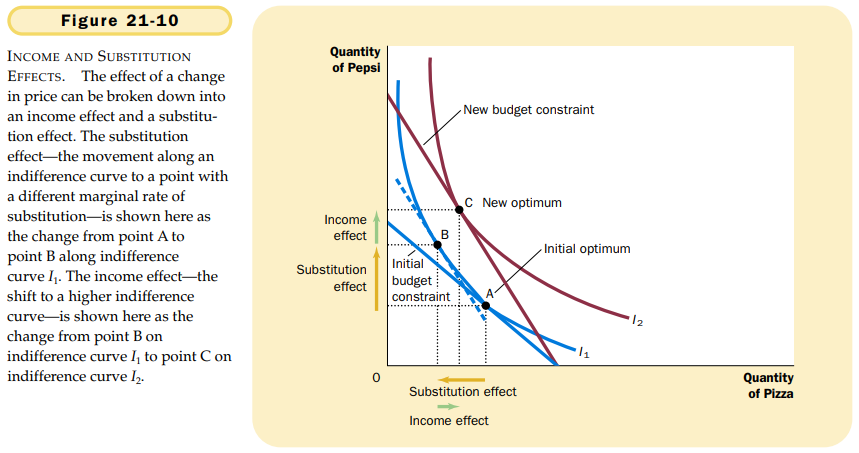

# 第21章 消费者选择理论

`预算约束线（budget constraint）`对消费者可以支付得起的消费组合的限制。

`无差异曲线（indifference curve）`一条表示给消费者带来相同满足程度的消费组合的曲线。

`边际替代率（marginal rate of substitution, MRS）`消费者愿意以一种物品交换另一种物品的比率。

无差异曲线的四个特征：

1. 消费者对较高无差异曲线的偏好大于较低无差异曲线。
2. 无差异曲线向右下方倾斜。
3. 无差异曲线不相交。
4. 无差异曲线凸向原点。

`完全替代品（perfect substitutes）`无差异曲线为直线的两种物品。

`完全互补品（perfect complements）`无差异曲线为直角形的两种物品。

消费者选择的两种物品组合要使边际替代率等于相对价格。

`正常物品（normal good）`收入增加引起需求量增加的物品。

`低档物品（inferior good）`收入增加引起需求量减少的物品。

`收入效应（income effect）`当价格的某种变动使消费者移动到更高或更低无差异曲线时所引起的消费变动。

`替代效应（substitution effect）`当价格的某中国变动使消费者沿着一条既定的无差异曲线变动到有新边际替代率的一点时所引起的消费变动。

收入效应是向更高无差异曲线移动所引起的消费变动；替代效应是沿着无差异曲线变动到有不同边际替代率的一点所引起的消费变动。

`吉芬物品（Giffen good）`价格上升引起需求量增加的物品。

## 内容提要

- 消费者预算约束线表示在其收入与物品价格为既定时，它可以购买的不同物品的可能组合。
- 消费者的无差异曲线代表其偏好。
- 消费者通过选择既在预算约束线上又在最高无差异曲线上的一点来实现最优化。
- 当一种物品价格下降时，对消费者选择的影响可以分解为收入效应和替代效应。
- 消费者选择理论适用于许多情况。

