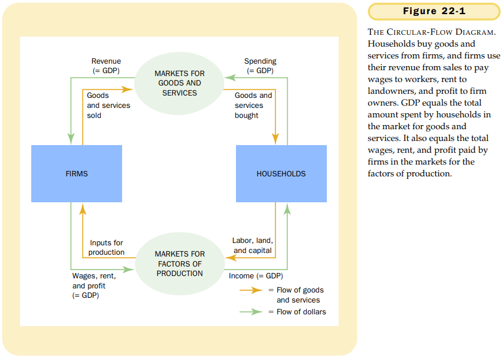

# 第22章 微观经济学前沿

`道德风险（moral hazard）`一个没有受到完全监督的人从事不诚实或不合意行为的倾向。

`代理人（agent）`一个为另一个人（称为委托人）完成某种行为的人。

`委托人（principal）`让另一个人（称为代理人）完成某种行为的人。

`逆向选择（adverse selection）`从无信息一方的角度看，无法观察到的特征组合变为不合意的倾向。

`发信号（signaling）`有信息的一方向无信息的一方披露子集私人信息所采取的行动。

`筛选（screening）`无信息的一方所采取的引起有信息的一方披露信息的行动。

`政治经济学（political economy）`用经济学的分析方法研究政府。

`康多塞悖论（Condorcet paradox）`多数原则没有产生可传递的社会偏好。

`阿罗不可能性定理（Arrow's impossibility theorem）`一个数学结论，它表明在某些假设条件之下，没有一种方案能把个人偏好加总为一组正当的社会偏好。

`中值选民定理（median voter theorem）`一个数学结论，表明如果要选民沿着一条线选一个点，而且，每个选民都想选离他最偏好的点最近的点，那么，多数原则将选出中值选民最偏好的点。

`行为经济学（behavioral economics）`经济学中将心理学的观点考虑进来的分支学科。

## 内容提要

- 在许多经济交易中，信息是不对称的。
- 虽然政府政策有时可以改善市场结果，但政府本身也是不完善的制度。
- 心理学和经济学的研究表明，人的决策比传统经济理论所假设的要复杂。

