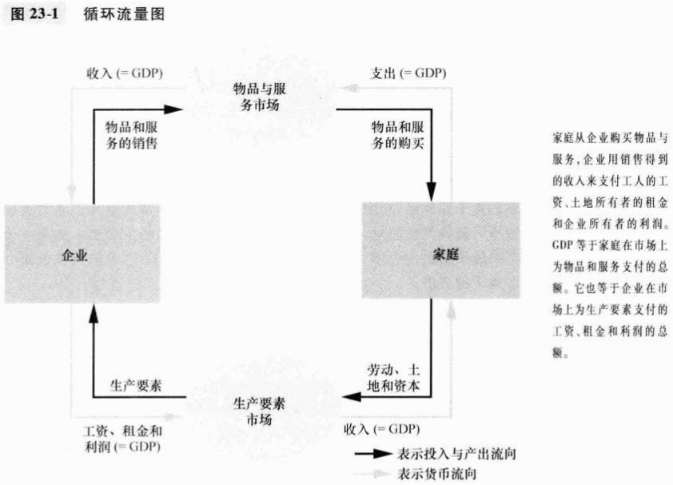
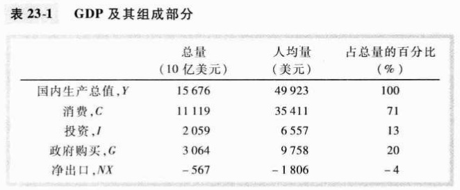
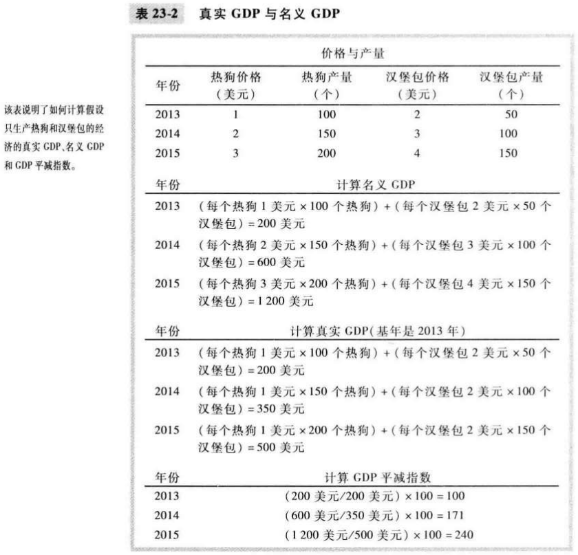
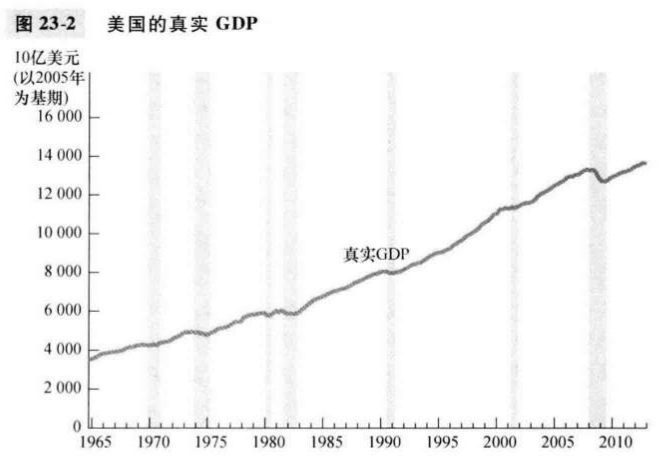

# 第23章 一国收入的衡量

`微观经济学（microeconomics）`研究家庭和企业如何做出决策，以及它们如何在市场上相互影响。

`宏观经济学（macroeconomics）`研究整体经济现象，包括通货膨胀，失业和经济增长。

GDP同时衡量两件事：

- 经济中所有人的总收入；
- 用于经济中物品与服务产出的总支出。

对一个整体经济而言，收入必定等于支出。

`国内生产总值（gross domestic product, GDP）`在某一既定时期一个国家内生产的所有最终物品与服务的市场价值。

`国民生产总值（GNP）`是一国永久居民（国民）所赚到的总收入。

`国民生产净值（NNP）`是一国居民的总收入（GNP）减折旧。

`国民收入`是一国居民在物品与服务生产中赚到的总收入。

`个人收入`是家庭和非公司制企业得到的收入。

`个人可支配收入`是家庭和非公司制企业在完成它们对政府的义务之后剩下的收入。

GDP计算公式：$Y = C + I + G + NX$。

- $C$ 消费
- $I$ 投资
- $G$ 政府购买
- $NX$ 净出口

`消费（consumption）`家庭购买新住房之外用于物品与服务的支出。

`投资（investment）`用于资本设备，存货和建筑物的支出，包括家庭用于购买新住房的支出。

`政府购买（government purchase）`地方，州和联邦政府用于物品与服务的支出。

`名义GDP（nominal GDP）`按现期价格评价的物品与服务的生产。

`正式GDP（real GDP）`按不变价格评价的物品与服务的生产。

名义GDP是用当年价格来评价经济中物品与服务生产的价值；真实GDP是用不变的基年价格来评价经济中物品与服务生产的价值。

`GDP平减指数`用名义GDP与真实GDP的比率乘以100计算的物价水平衡量指标；计算公式如下：$GDP平减指数=\frac{名义GDP}{真实GDP} \times 100$。

## 内容提要

- 由于每一次交易都有买者与卖者，所以经济中的总支出必定等于经济中的总收入。
- 国内生产总值（GDP）衡量经济用于新生产的物品与服务的总支出，以及生产这些物品与服务所赚到的总收入。
- GDP分为四个组成部分：消费，投资，政府购买和净出口。
- 名义GDP用现期价格来评价经济中物品与服务的生产。
- GDP是经济福利的一个良好衡量指标，因为人们对高收入的偏好大于低收入。

