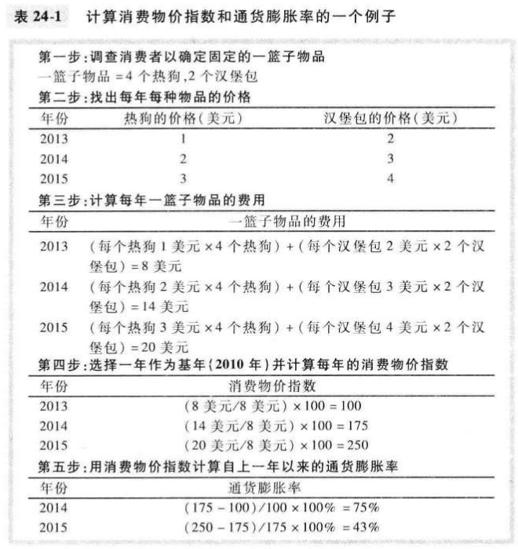
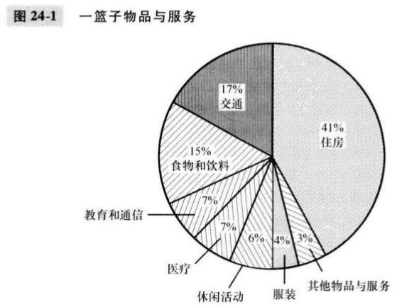
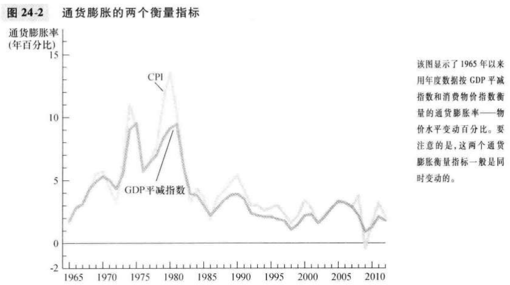
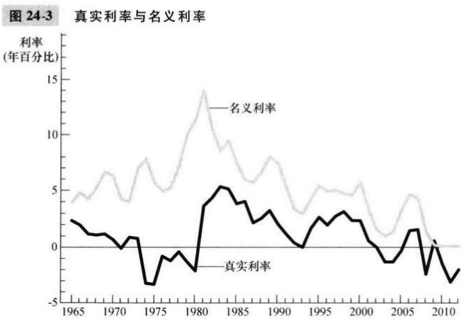

# 第24章 生活费用的衡量

`消费物价指数（consumer price index, CPI）`普通消费者所购买的物品与服务的总费用的衡量指标。

`通货膨胀率（inflation rate）`从前一个时期依赖物价指数变动的百分比。
$$
第二年的通货膨胀率 = \frac{第二年CPI - 第一年CPI}{第一年CPI} \times 100%
$$

`生产物价指数（producer price index, PPI）`企业所购买的一篮子物品与服务的费用的衡量指标。

GDP平减指数反映国内生产的所有物品与服务的价格，而消费物价指数反映消费者购买的所有物品与服务的价格。

消费物价指数比较的是固定的一篮子物品与服务的价格和基年这一篮子物品与服务的价格，GDP平减指数比较的是现期生产的物品与服务的价格和基年同样物品与服务的价格。

$T$年的美元换算成今天美元的公式：
$$
今天美元的数量 = T年美元的数量 \times \frac{今天的物价水平}{T年的物价水平}
$$
消费物价指数之类的物价指数可以衡量物价水平，从而决定了通货膨胀校正的大小。

`指数化（indexation）`根据法律或合同按照通货膨胀的影响对货币数量的自动调整。

`生活费用津贴（cost-of-living allowance, COLA）`。

`名义利率（ominal interest rate）`通常公布的，未根据通货膨胀的影响校正的利率。

`真实利率（real interest rate）`根据通货膨转的影响校正过的利率。
$$
真实利率 = 名义利率 - 通货膨胀率
$$

## 内容提要

- 消费物价指数表示相对于基年一揽子物品与服务的费用，这一篮子物品与服务的费用是多少。
- 由于三个原因，消费物价指数并不是生活费用的一个完美衡量指标。
- 与消费物价指数一样，GDP平减指数也衡量经济的物价总水平。
- 不同时间的美元数字并不代表购买力的真实差别。
- 各种法律和私人合同用物价指数来校正通货膨胀的影响。
- 当考察利率数据时，对通货膨胀的校正特别重要。

