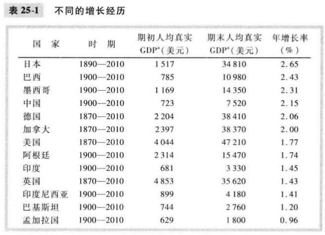
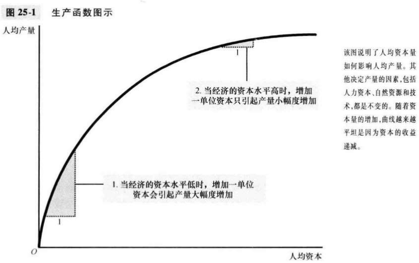

# 第25章 生产与增长

`生产率（productiveity）`每单位劳动投入所生产的物品和服务的数量

一个国家只有生产出大量物品与服务，它才能享有更高的生活水平。

资本的重要特征是，它是一种生产出来的生产要素。也就是说，资本是生产过程的投入，也是过去生产过程的产出。

`物质资本（physical capital）`用于生产物品与服务的设备和建筑物存量。

`人力资本（human capital）`工人通过教育，培训和经验而获得的知识与技能。

`自然资源（natural resources）`由自然界提供的用于生产物品与服务的投入，如土地，河流和矿藏。

`技术知识（technological knowledge）`社会对生产物品与服务的最好方法的了解。

技术知识是指社会对世界如何运行的理解，人力资本是指把这种理解传递给劳动力的资源消耗。

经济学家用生产函数来描述生产中所用的投入量与生产的产出量之间的关系：
$$
Y = AF(L, K, H, N)
$$

- $Y$产量

- $A$可得到的生产技术的变量（随着技术进步而上升）

- $F()$产出函数

  许多生产函数具有一种**规模收益不变**的特性：

  $xY = AF(xL, xK, xH, xN)$

  其中$x$为正数。例：当$x = 2$时，投入增加一倍，产出也会相应的增加一倍。

- $L$劳动量

- $K$物质资本量

- $H$人力资本量

- $N$自然资本量

`收益递减（diminishing returns）`随着投入量的增加，每一单位额外投入得到的收益减少的特征。

在长期中，高储蓄率引起高水平的生产率和收入，但在这些变量中并没有高增长。

`追赶效应（catch-up effect）`开始时贫穷的国家倾向于比开始时富裕的国家增长更快的特征。

## 内容提要

- 按人均GDP衡量的经济繁荣在世界各国差别很大。
- 一个经济的生活水平取决于该经济生产物品与服务的能力。
- 政府政策能以许多方式影响经济的增长率。
- 资本积累收益递减的限制：一个经济拥有的资本越多，该经济从新增加的一单位资本中得到的产量的增加就越少。
- 人口增长对经济增长有多种影响。