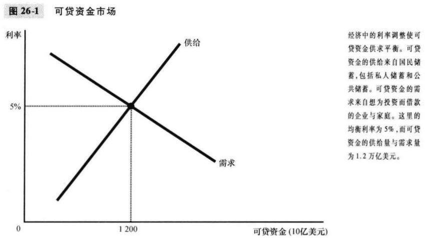
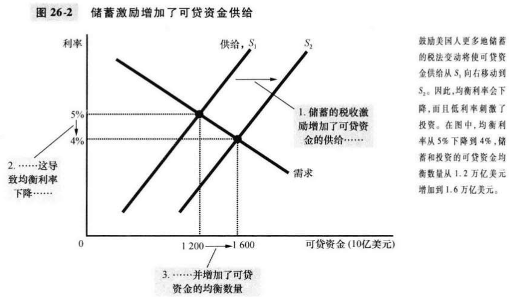
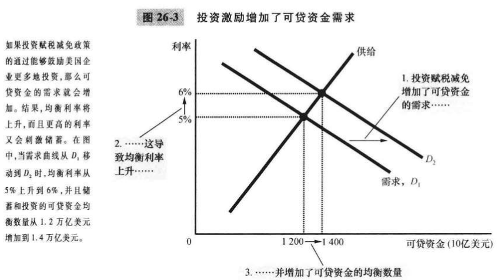
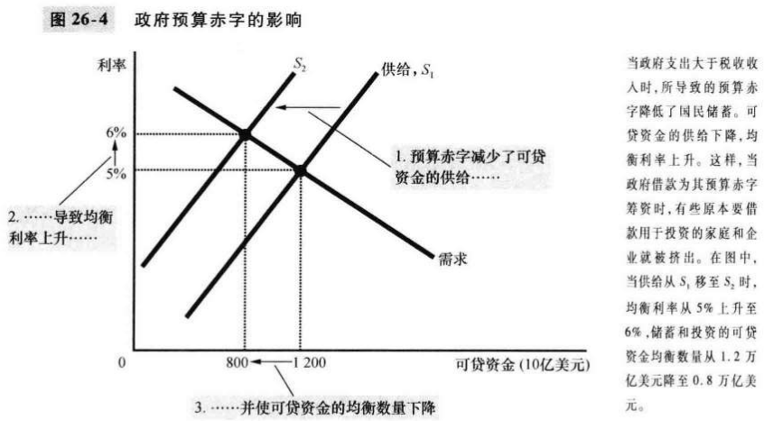
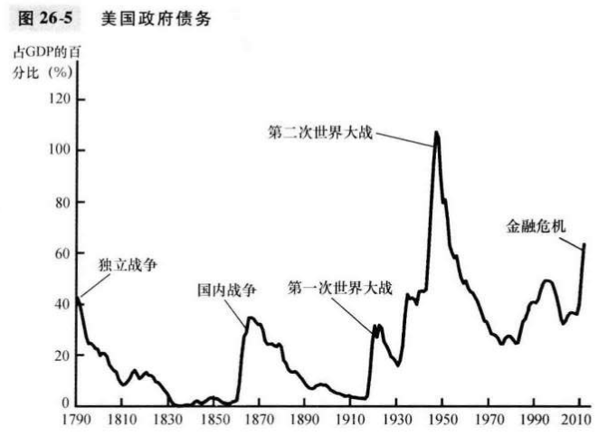

# 第26章 储蓄，投资和金融体系

`金融体系（financial system）`经济中促使一个人的储蓄与另一个人的投资相匹配的一组机构。

`金融市场（financial markets）`储蓄者可以借以直接向借款者提供资金的金融机构。‘

`债券（bond）`一种债务证明书。

`股票（stock）`企业部分所有权的索取权。

出售股票来筹集资金称为**权益融资**，而出售债券筹集资金称为**债务融资**。

`金融中介机构（financial intermediaries）`储蓄者可以借以间接地向借款者提供资金的金融机构。

`共同基金（mutual fund）`向公众出售股份，并用收入来购买股票与债券资产组合的机构。

GDP恒等式：
$$
Y = C + I + G + NX
$$

- $C$消费
- $I$投资
- $G$政府购买
- $NX$净出口

`国民储蓄（national saving）在用于消费和政府购买后剩下的一个经济中的总收入：`
$$
S = I
$$

- $S$国民储蓄
- $I$投资

`私人储蓄（private saving）`家庭在支付了税收和消费之后剩下来的收入：

`公共储蓄（public saving）`政府在支付其指出后剩下的税收收入。

`预算盈余（budget surplus）`税收收入大于政府支出的余额。

`预算赤字（budget deficit）`政府支出引起的税收收入短缺。

对整个经济而言，储蓄必定等于投资。

`可贷资金市场（market for loanable funds）`想储蓄的人借以提供资金，想借钱投资的人借以借贷资金的市场。

储蓄是可贷资金供给的来源；投资是可贷资金需求的来源。

如果税法改革鼓励更多储蓄，则利率下降且投资增加。

如果税法改革鼓励更多投资，则利率上升且储蓄增加。

`挤出（crowding out）`政府借款所引起的投资减少。

当政府通过预算赤字减少国民储蓄时，利率就会上升且投资减少。

预算盈余增加了可贷资金的供给，降低了利率，并刺激了投资。

## 内容提要

- 美国金融体系由各种金融机构组成。
- 国民收入账户恒等式说明了宏观经济变量之间的一些重要关系。
- 利率由可贷资金的供求决定。
- 国民储蓄等于私人储蓄加公共储蓄。

