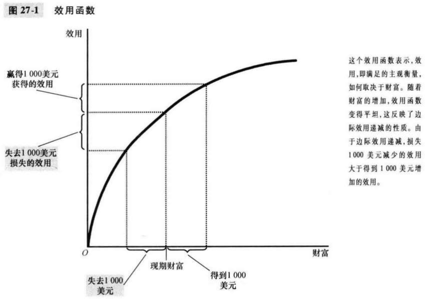
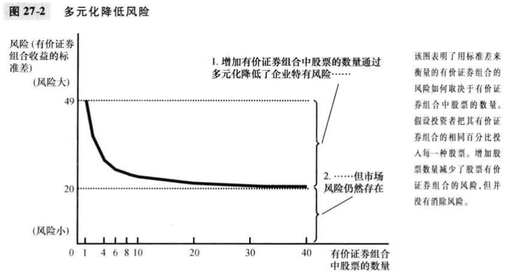
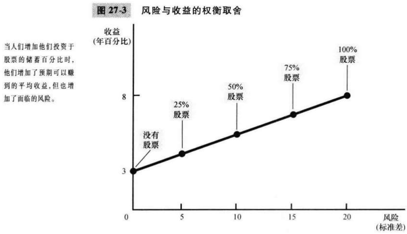

# 第27章 金融学的基本工具

`金融学（finance）`研究人们如何在某一时期内做出关于配置资源和应对风险的决策的学科。

`现值（present value）`用现行利率产生一定量未来货币所需要的现在货币量。

`终值（future value）`在线性利率既定时，现在货币量将带来的未来货币量。

`复利（compounding）`货币量的累积，比如说银行账户上货币量的累积，即赚的的利息仍留在帐户上以赚取未来更多的利息。

如果利率是$r$，那么在$N$年后将得到的$X$量的现值是$X/(1+r)^N$。由于赚到利息的可能性使现值降到$X$量之下，所以寻找一定量未来货币现值的过程称为贴现。

`风险厌恶（risk aversion）`不喜欢不确定性。

`多元化（diversification）`通过用大量不相关的小风险代替一种风险来降低风险。

`企业特有风险（firm-specific risk）`只影响一家公司的风险。

`市场风险（market risk）`影响股市上所有公司的风险。

`基本面分析（fundamental analysis）`为决定一家公司的价值而对其会计报表和未来前景进行的研究。

`有效市场假说（efficient markets hypothesis）`认为资产价格反映了关于一种资产价值的所有公开的，可获得的信息的理论。

`信息有效（informational efficiency）`以理性方式反映所有可获得的信息的有关资产价格的描述。

`随机游走（random walk）`一种不可预期的变量变动的路径。

## 内容提要

- 由于储蓄可以赚到利息，所以今天的货币量比未来相同的货币量更有价值。
- 由于边际效用递减，大多数人是风险厌恶者。
- 一种资产的价格等于所有者将得到的现金流的现值。

