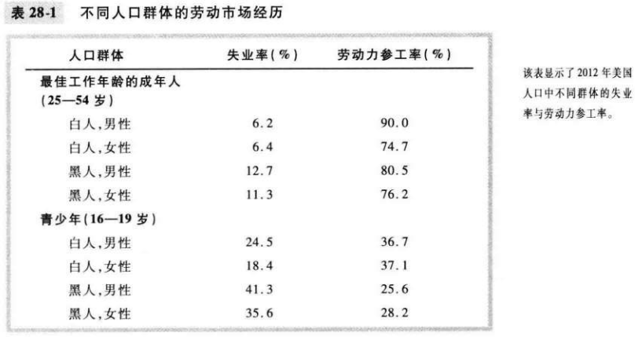

# 第28章 失业

`劳动力（labor force）`既包括就业者又包括失业者的工人总数；计算公式：
$$
劳动力 = 就业者人数 + 失业者人数
$$
`失业率`劳动力中失业者所占的百分比；计算公式：
$$
失业率 = \frac{失业者人数}{劳动力} \times 100%
$$
`劳动力参工率（labor-force participation rate）`劳动力占成年人口的百分比；计算公式：
$$
劳动力参工率 = \frac{劳动力}{成年人口} \times 100%
$$

`自然失业率(natural rate of unemployment)`失业率围绕它而波动的正常失业率。

`周期性失业（cyclical unemployment）`失业率对自然失业率的背离。

`丧失信心的工人（discouraged workers）`想工作但已放弃寻找工作的人。

大多数失业是短期的，而在任何一个既定时间段所观察到的大多数失业又是长期的。

`摩擦性失业（frictional unemployment）`由于工人寻找最适合自己嗜好和技能的工作需要时间而引起的失业。

`结构性失业（structural unemployment）`由于某些劳动市场上可提供的工作岗位数量不足以为每个想工作的人提供工作而引起的失业。

`寻找工作（job search）`在工人的嗜好于技能既定时工人寻找适当工作的过程。

`失业保险（unemployment insurance）`当工人失业时为它们提供部分收入保障的政府计划。

如果工资由于任何一种原因高于均衡水平，就会导致失业。

`工会（union）`与雇主就工资，津贴和工作条件进行谈判的工人协会。

`集体谈判（collective bargaining）`工会和企业就就业条件达成一致的过程。

`罢工（strike）`工会组织工人从企业撤出劳动。

`效率工资（efficieney wages）`企业为了提高工人的生产率而支付的高于均衡水平的工资。

## 内容提要

- 失业率是那些想要工作但又没有工作的人所占的百分比。
- 失业率是对失去工作者的一个不完善的衡量指标。
- 在美国经济中，大多数成为失业者的人在短期内找到了工作。
- 失业的一个原因是工人寻找最适合它们嗜好与技能的工作需要时间。
- 经济中总是存在某种失业的第二个原因是最低工资法。
- 失业的第三个原因是工会的市场势力。
- 效率工资理论提出了事业的第四个原因。

