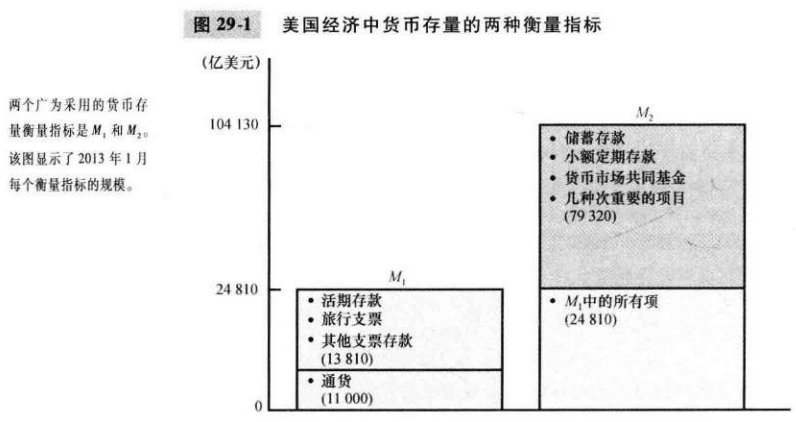

# 第29章 货币制度

`货币（money）`经济中人们经常用于想其他人购买物品与服务的一组资产。

货币在经济中有三种职能：

- 交换媒介（medium of exchange）：买者在购买物品与服务时给与卖者的东西。
- 计价单位（unit of account）：人们用来表示价格和记录债务的标准。
- 价值储藏手段（store of value）：人们可以用来把现在的购买力转变为未来的购买力的东西。

`流动性（liquidity）`一种资产兑换为经济中交换媒介的容易程度。

`商品货币（commodity money）`以有内在价值的商品为形式的货币。

`法定货币（fiat money）`没有内在价值，由政府法令确定作为通货使用的货币。

`通货（currency）`公众手中持有的纸币钞票和铸币。

`活期存款（demand deposits）`储户可以通过开支票而随时支取的银行账户余额。

`联邦储备（Federal Reserve）`美国的中央银行。

`中央银行（central bank）`为了监管银行体系和调节经济中的货币量而设计的机构。

`货币供给（money supply）`经济中可得到的货币量。

`货币政策（monetary policy）`中央银行的决策者对货币供给的安排。

`准备金（reserves）`银行得到但没有贷出去的存款。

如果银行以准备金形式持有所有存款，银行就不影响货币供给。

`部分准备金银行（fractional-reserve banking）`只把部分存款作为准备金的银行制度。

`准备金率（reserve ratio）`银行作为准备金持有的存款比例。

当银行只把部分存款作为准备金时，银行创造了货币。

`货币乘数（money multiplier）`银行体系用1美元准备金所产生的货币量。

货币乘数是准备金率的倒数。

准备金率越高，每个存款银行贷出的款越少，货币乘数越小。

`银行资本（bank capital）`银行的所有者投入机构的资源。

`杠杆（leverage）`将借到的货币追加到用于投资的现有资金上。

`杠杆率（leverage ratio）`资产与银行资本的比率。

`资本需要量（capital requirement）`政府管制确定的最低银行资本量。

`公开市场操作（open_market operations）`美联储买卖美国政府债券。

`贴现率（discount rate）`美联储向银行发放贷款的利率。

`法定准备金（reserve requirements）`关于银行必须根据其存款持有的最低准备金量的规定。

`联邦基金利率（federal funds rate）`银行向另一家银行进行隔夜贷款时的利率。

## 内容提要

- 货币这个词指人们经常用来购买物品与服务的资产。
- 货币有三种职能：作为交换媒介，作为计价单位，作为价值储藏手段。
- 像黄金这样的商品货币是有其内在价值的货币：即使它不作为货币也有其价值；像纸币这样的法定货币是没有内在价值的货币：如果它不作为货币就没有价值。
- 在美国经济中，货币以通货和其他各类银行存款的形式存在。
- 联邦储备，负责管理美国的货币体系。
- 银行储户通过把它们的钱存到银行账户向银行提供资源。
- 美联储主要通过公开市场操作来控制货币供给。
- 当个人在银行有存款货币，并且银行把一些存款贷出去时，经济中的货币量就增加了。
- 美联储近年来确定了选择联邦基金利率作为目标的货币政策，联邦基金利率是银行向另一家银行贷款的短期利率。

