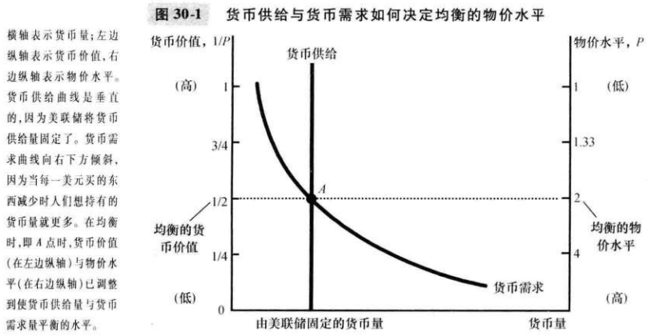
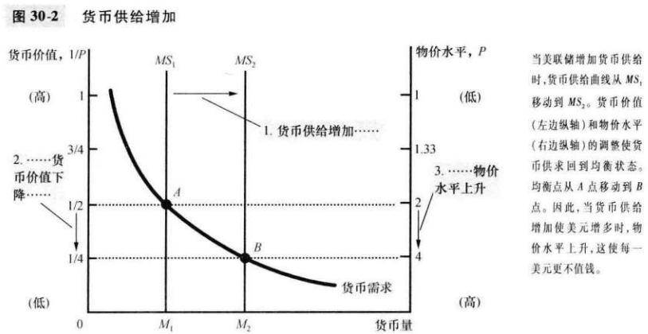
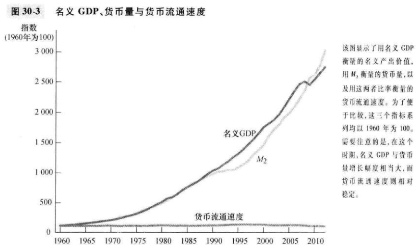
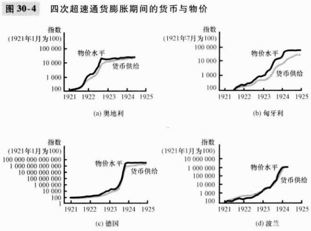
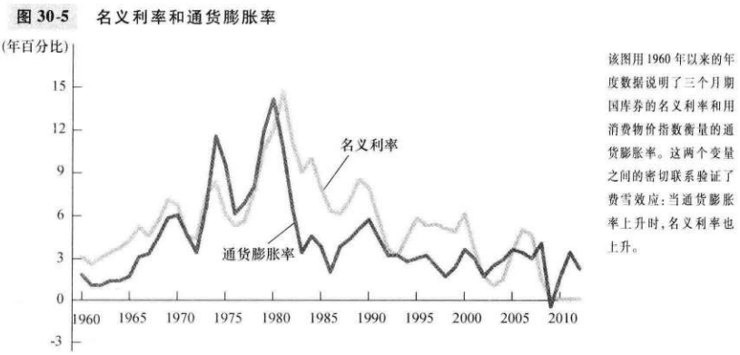
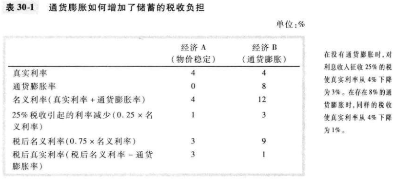

# 第30章 货币增长与通货膨胀

在长期中，物价总水平会调整到使货币需求等于供给的水平。

`货币数量论（quantity theory of money）`一种认为可得到的货币量决定物价水平，可得到的货币量的增长率决定通货膨胀的理论。

`古典二分法`认为所有经济变量分为两类：

- `名义变量（nominal variables）`按货币单位衡量的变量。
- `真实变量（real variables）`按实物单位衡量的变量。

`货币中性（monelary neutrality）`认为货币供给变动并不影响真实变量的观点。

`货币流通速度（velocity of money）`货币易手的速度，计算公式为：
$$
V = (P \times Y) / M
$$

- $V$ 货币流通速度
- $P$ 物价水平（GDP平减指数）
- $Y$ 产量（真实GDP）
- $M$ 货币量

`数量方程式（quantity equation）`把货币量，货币流通速度和经济中物品与服务产出的美元价值联系在一起的公式：
$$
M \times V = P \times Y
$$

- $V$ 货币流通速度
- $P$ 物价水平（GDP平减指数）
- $Y$ 产量（真实GDP）
- $M$ 货币量

`通货膨胀税（inflation tax）`政府通过创造货币而筹集的收入。

通货膨胀税就像是一种向每个持有货币的人征收的税。

当美联储提高货币增长率时，长期的结果是更高的通货膨胀率和更高的名义利率。

`费雪效应（Fisher effect）`名义利率对通货膨胀率所进行的一对一的调整。

通货膨胀本身并没有降低人们的实际购买力。

`皮鞋成本（shoeleather cost）`当通货膨胀鼓励人们减少货币持有量时所浪费的资源。

`菜单成本（menu costs）`改变价格的成本。

## 内容提要

- 经济中物价总水平的调整使货币供给与货币需求平衡。
- 货币中性原理断言，货币量变动只影响名义变量而不影响真实变量。
- 政府可以简单地通过印发货币来为自己的一些支出付款。
- 货币中性原理的一个应用是费雪效应：当通货膨胀率上升时，名义利率等量上升，因此，真实利率任然不变。
- 许多人认为，通货膨胀使它们变穷了，因为通货膨胀提高了他们所买东西的成本。
- 经济学家确定了通货膨胀的六种成本。
