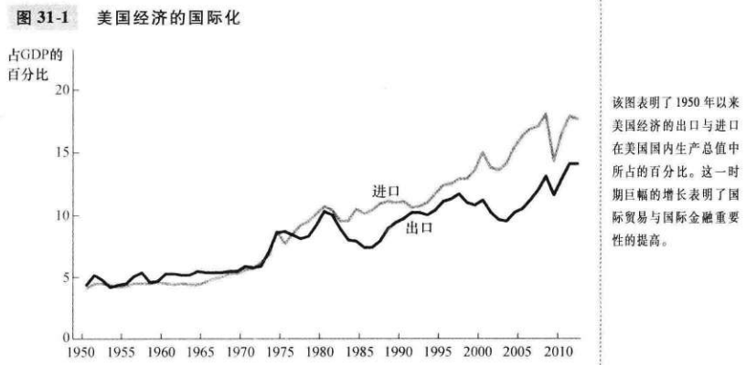
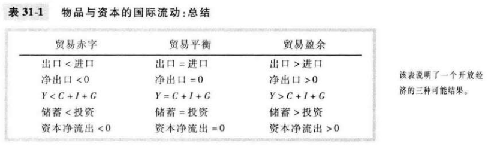
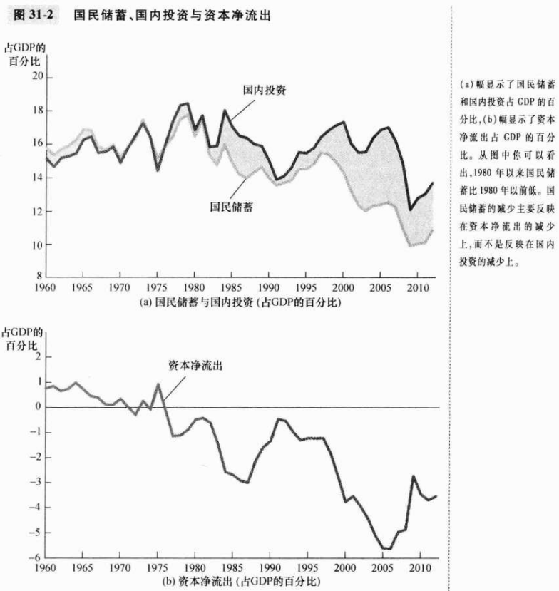
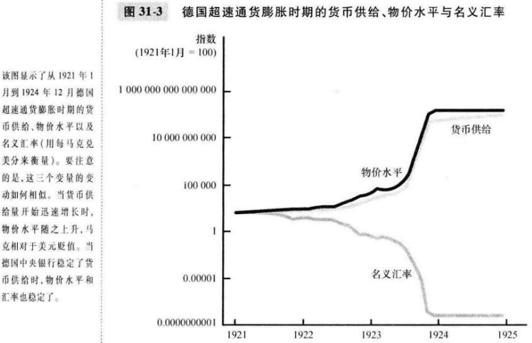

# 第31章 开放经济的宏观经济学：基本概念

`封闭经济（closed economy）`不与世界上其他经济相互交易的经济。

`开放经济（open economy）`与世界上其他经济自由交易的经济。

`出口（exports）`在国内生产而在国外销售的物品与服务。

`进口（imports）`在国外生产而在国内销售的物品与服务。

`净出口（net exports）`一国的出口值减进口值，又称贸易余额；计算公式为：
$$
净出口 = 出口值 - 进口值
$$
`贸易余额（trade balance）`一国的出口值减进口值，又称为净出口。

`贸易盈余（trade surplus）`出口大于进口的部分。

`贸易赤字（trade deficit）`进口大于出口的部分。

`贸易平衡（balanced trade）`出口等于进口的状况。

`资本净流出（net capital outflow）`本国居民购买的外国资产减外国人购买的本国资产：
$$
资本净流出 = 本国居民购买的外国资产 - 外国人购买的本国资产
$$
影响资本净流出的因素：

- 国外资产得到的真实利率；
- 国内资产得到的真实利率；
- 持有国外资产可以觉察到的经济与政治风险；
- 影响国外对国内资产所有权的政府政策。

对于整个经济而言，资本净流出（NCO）必然总是等于净出口（NX）：
$$
NCO = NX
$$
当一国有贸易盈余时（NX > 0），它出售给外国人的物品与服务多余外国人购买的。当一国有贸易赤字时（NX < 0），它从外国人那里购买的物品与服务多于向外购人出售的。

一个经济的国内生产总值由四个部分组成：
$$
\begin{equation}\begin{split}
Y &= C + I + G + NX \\
Y - C - G &= I + NX \\
S &= I + NX \\
S &= I + NCO
\end{split}\end{equation}
$$

- $Y$国内生产总值
- $C$消费
- $I$投资
- $G$政府购买
- $NX$净出口
- $S$国民储蓄
- $NCO$资本净流出

`名义汇率（nominal exchange rate）`一个人可以用一国通货交换另一国通货的比率。

`升值（appreciation）`按所能购买到的外国通货量衡量的一国通货的价值增加。

`贬值（depreciation）`按所能购买到的外国通货量衡量的一国通货的价值减少。

`真实汇率（real exchange rate）`一个人可以用一国的物品与服务交换另一国的物品与服务的比率；用以下公式总结真实汇率的计算：
$$
\begin{equation}\begin{split}
真实汇率 &= \frac{名义汇率 \times 国内价格}{国外价格} \\
\end{split}\end{equation}
$$
`购买力平价（purchasing-power parity）`一种认为任何一单位通货应该能在所有国家买到等量物品的汇率理论。

`套利`利用不同市场上同一种东西的价格差的过程。

如果1美元的购买力在国内和国外总是相同的，那么，真实汇率--国内物品和国外物品的相对价格--就不会改变。

根据购买力平价理论，两国通货之间的名义汇率必然反映这两个国家的物价水平。

当中央银行印发了大量货币时，无论根据它能买到的物品与服务，还是根据它能买到的其他通货，这种货币的价值都减少了。

## 内容提要

- 净出口是在国外销售的国内生产的物品与服务的价值（出口）减去在国内销售的国外物品与服务的价值（进口）。
- 一个经济的储蓄既可以用于为国内投资筹资，又可以用于购买国外资产。因此，国民储蓄等于国内投资加资本净流出。
- 名义汇率是两国通货的相对价格，而真实汇率是两国物品与服务的相对价格。
- 根据购买力平价理论，一美元（或者一单位任何一种其他通货）应该能在所有国家购买等量的物品。

