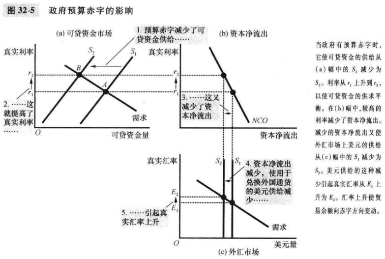

# 第32章 开放经济的宏观经济理论

在均衡利率时，人们想储蓄的量正好与合意的国内投资和资本净流出量平衡。

在均衡的真实汇率下，由美国物品与服务净出口所引起的外国人对美元的需求正好与由美国资本净流出所引起的来自美国人的美元供给相平衡。
$$
\begin{equation}\begin{split}
S &= I + NCO \\
NCO &= NX
\end{split}\end{equation}
$$

- $S$国民储蓄
- $I$国内投资
- $NCO$资本净流出
- $NX$净出口

在一个开放经济中，政府预算赤字提高了真实利率，挤出了国内投资，引起美元升值，并使贸易余额向赤字防线变动。

`贸易政策（trade policy）`直接影响一国进口或出口的物品与服务数量的政府政策。

`资本外逃（capital flight）`一国资产需求大量且突然地减少。

## 内容提要

- 两个市场是开放经济的宏观经济学的中心：可贷资金市场和外汇市场。
- 减少国民储蓄的政策，减少了可贷资金的供给，并使利率上升。
- 虽然限制性贸易政策，有时因被视为一种该百年贸易余额的方法而得到支持，但这些政策并不一定有这种效果。
- 当投资者改变他们对持有一国资产的态度时，这对该国经济的态度时，这对该国经济的后果可能是严重的。

